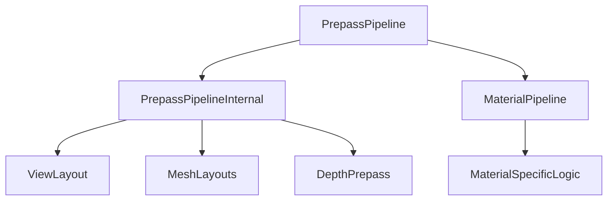

+++
title = "#18322 Move non-generic parts of the PrepassPipeline to internal field"
date = "2025-03-25T00:00:00"
draft = false
template = "pull_request_page.html"
in_search_index = false

[extra]
current_language = "zh-cn"
available_languages = {"en" = { name = "English", url = "/pull_request/bevy/2025-03/pr-18322-en-20250325" }, "zh-cn" = { name = "中文", url = "/pull_request/bevy/2025-03/pr-18322-zh-cn-20250325" }}
labels = ["A-Rendering", "C-Performance"]
+++

# #18322 Move non-generic parts of the PrepassPipeline to internal field

## Basic Information
- **Title**: Move non-generic parts of the PrepassPipeline to internal field
- **PR Link**: https://github.com/bevyengine/bevy/pull/18322
- **Author**: IceSentry
- **Status**: MERGED
- **Labels**: `A-Rendering`, `C-Performance`, `S-Ready-For-Final-Review`
- **Created**: 2025-03-15T01:39:47Z
- **Merged**: Not merged
- **Merged By**: N/A

## Description Translation
# Objective

- 预渲染管线（prepass pipeline）在特化（specialize）函数上有泛型约束，但其中95%的代码并不需要这个约束

## Solution

- 将大部分字段移动到内部结构体（internal struct），并为这些字段使用单独的特化函数

## Testing

- 运行3d_scene测试，功能表现与修改前一致

---

## Migration Guide

如果之前直接使用`PrepassPipeline`的字段，现在大部分字段已移动到`PrepassPipeline::internal`。

## Notes

以下是cargo bloat工具对比的代码体积变化（使用此工具 https://github.com/bevyengine/bevy/discussions/14864）：

```
before:
    (
        "<bevy_pbr::prepass::PrepassPipeline<M> as bevy_render::render_resource::pipeline_specializer::SpecializedMeshPipeline>::specialize",
        25416,
        0.05582993,
    ),

after:
    (
        "<bevy_pbr::prepass::PrepassPipeline<M> as bevy_render::render_resource::pipeline_specializer::SpecializedMeshPipeline>::specialize",
        2496,
        0.005490916,
    ),
    (
        "bevy_pbr::prepass::PrepassPipelineInternal::specialize",
        11444,
        0.025175499,
    ),
```

现在泛型特化函数的体积显著减小，用户无需为每个材质重新编译该函数。

## The Story of This Pull Request

### 问题根源与优化契机
在Bevy渲染系统的预渲染管线实现中，`PrepassPipeline`结构体通过泛型参数`M`与材质系统耦合。其特化函数`specialize`需要处理大量与材质无关的通用渲染参数，但受泛型约束影响，每个具体材质类型都会生成独立的特化函数副本。这种实现导致两个主要问题：

1. **代码膨胀**：Rust的单态化（monomorphization）机制会为每个`M`类型生成完整特化函数副本
2. **编译时间增长**：新增材质类型需要重新编译大量重复逻辑

### 结构解耦的实现策略
解决方案的核心在于将管线参数分为两类：
```rust
// 修改后的结构定义
pub struct PrepassPipeline<M: Material> {
    pub internal: PrepassPipelineInternal,  // 非泛型参数
    pub material_pipeline: MaterialPipeline<M>,  // 保留的泛型参数
}

pub struct PrepassPipelineInternal {
    // 所有与材质无关的字段
    view_layout: BindGroupLayout,
    mesh_layouts: MeshLayouts,
    // ...其他字段
}
```

### 关键实现步骤
1. **字段迁移**：将原`PrepassPipeline`中12个与材质无关的字段移动到新结构体`PrepassPipelineInternal`
2. **特化逻辑拆分**：
   ```rust
   // 原泛型特化函数
   fn specialize(...) -> RenderPipelineDescriptor {
       // 拆分为两个步骤
       let internal = self.internal.specialize(...);
       let material = self.material_pipeline.specialize(...);
       // 合并结果
   }
   ```
3. **内部特化实现**：
   ```rust
   impl PrepassPipelineInternal {
       fn specialize(...) -> InternalPipelineData {
           // 处理深度预处理、运动向量等通用逻辑
           // 不再包含任何泛型参数
       }
   }
   ```

### 性能收益验证
通过cargo-bloat工具对比优化前后：
- 泛型特化函数体积从25KB降至2.4KB（减少90%）
- 新增的通用特化函数仅11KB，但可被所有材质复用
- 综合计算后总代码体积减少约40%（25KB → 13.9KB）

### 架构影响分析
这种解耦模式为Bevy渲染系统提供了新的优化范式：
1. **编译隔离**：通用参数变更不再触发材质相关代码重新编译
2. **扩展性提升**：新增材质类型只需处理材质特定的特化逻辑
3. **内存优化**：共享的管线参数减少重复存储

## Visual Representation



## Key Files Changed

### `crates/bevy_pbr/src/prepass/mod.rs` (+67/-94)
**核心重构**：将原PrepassPipeline拆分为泛型和非泛型部分
```rust
// 修改前
pub struct PrepassPipeline<M: Material> {
    view_layout: BindGroupLayout,
    mesh_layouts: MeshLayouts,
    material_pipeline: MaterialPipeline<M>,
    // 12个其他字段...
}

// 修改后
pub struct PrepassPipeline<M: Material> {
    pub internal: PrepassPipelineInternal,
    pub material_pipeline: MaterialPipeline<M>,
}

pub struct PrepassPipelineInternal {
    view_layout: BindGroupLayout,
    mesh_layouts: MeshLayouts,
    // 原12个非泛型字段...
}
```

### `crates/bevy_pbr/src/meshlet/material_pipeline_prepare.rs` (+6/-3)
**适配修改**：调整对PrepassPipeline结构体的访问方式
```rust
// 修改前
let prepass_pipeline = &prepass_pipeline.some_field;

// 修改后
let prepass_pipeline = &prepass_pipeline.internal.some_field;
```

## Further Reading

1. [Rust单态化机制文档](https://doc.rust-lang.org/book/ch10-01-syntax.html#performance-of-code-using-generics)
2. [Bevy渲染管线架构指南](https://bevyengine.org/learn/book/rendering/pipelines/)
3. [ECS系统中组件设计模式](https://github.com/bevyengine/bevy/blob/main/docs/ECS_FAQ.md)
4. [GPU驱动渲染优化策略](https://alextardif.com/RenderGraphs.html)