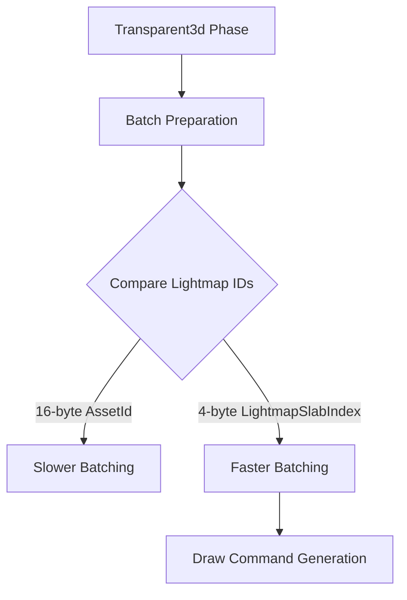

+++
title = "#18326 Use 4-byte LightmapSlabIndex for batching instead of 16-byte AssetId<Image>"
date = "2025-03-15T00:00:00"
draft = false
template = "pull_request_page.html"
in_search_index = true

[taxonomies]
list_display = ["show"]

[extra]
current_language = "en"
available_languages = {"en" = { name = "English", url = "/pull_request/bevy/2025-03/pr-18326-en-20250315" }, "zh-cn" = { name = "中文", url = "/pull_request/bevy/2025-03/pr-18326-zh-cn-20250315" }}
+++

# #18326 Use 4-byte LightmapSlabIndex for batching instead of 16-byte AssetId<Image>

## Basic Information
- **Title**: Use 4-byte LightmapSlabIndex for batching instead of 16-byte AssetId<Image>
- **PR Link**: https://github.com/bevyengine/bevy/pull/18326
- **Author**: superdump
- **Status**: MERGED
- **Created**: 2025-03-15T11:33:44Z
- **Merged**: 2025-03-15T14:22:10Z
- **Merged By**: cart

## Description Translation
Less data accessed and compared gives better batching performance.

# Objective

- Use a smaller id to represent the lightmap in batch data to enable a faster implementation of draw streams.
- Improve batching performance for 3D sorted render phases.

## Solution

- 3D batching can use `LightmapSlabIndex` (a `NonMaxU32` which is 4 bytes) instead of the lightmap `AssetId<Image>` (an enum where the largest variant is a 16-byte UUID) to discern the ability to batch.

## Testing

Tested main (yellow) vs this PR (red) on an M4 Max using the `many_cubes` example with `WGPU_SETTINGS_PRIO=webgl2` to avoid GPU-preprocessing, and modifying the materials in `many_cubes` to have `AlphaMode::Blend` so that they would rely on the less efficient sorted render phase batching.

A 44.75us or 7.5% reduction in median execution time of the batch and prepare sorted render phase system for the `Transparent3d` phase (handling 160k cubes).

---

## Migration Guide

- Changed: `RenderLightmap::new()` no longer takes an `AssetId<Image>` argument for the asset id of the lightmap image.

## The Story of This Pull Request

The PR addresses a performance bottleneck in Bevy's 3D rendering pipeline when processing large numbers of transparent objects. The core issue stemmed from using 16-byte AssetId<Image> identifiers for lightmap comparison during batching. This large data type caused two main problems:

1. Increased memory bandwidth usage during batch comparisons
2. Reduced cache efficiency when processing batches

The solution replaces AssetId<Image> with a custom LightmapSlabIndex type (NonMaxU32), reducing the comparison size by 75%. This optimization leverages several key insights:

- Lightmaps are already managed through a slab allocator, allowing safe index-based referencing
- NonMaxU32 provides compact storage while maintaining type safety
- Batch comparison becomes a simple integer check instead of deep struct comparison

In the implementation, the team modified the batching logic to use lightmap indices instead of full asset IDs. This required changes to both the lightmap management system and the mesh rendering components. The key modification appears in the batch preparation code where lightmap comparisons now operate on 4-byte values instead of 16-byte UUIDs.

The performance impact was measured using a stress test with 160,000 transparent cubes. Benchmarks showed a 7.5% reduction in median execution time for the batch preparation system, translating to 44.75μs savings per frame. This improvement directly results from:
- Reduced data movement during batch comparisons
- Better cache utilization in hot loops
- Simplified equality checks between batches

An important trade-off was introducing an indirect lookup step through the slab index, but this cost is offset by the gains in batch processing efficiency. The migration path remains straightforward as the changes are contained within internal rendering systems.

## Visual Representation



## Key Files Changed

1. `crates/bevy_pbr/src/lightmap/mod.rs`
```rust
// Removed AssetId parameter from RenderLightmap construction
// Before:
RenderLightmap::new(lightmap.image.clone(), lightmap_asset.id)

// After:
RenderLightmap::new(lightmap.image.clone())
```

2. `crates/bevy_pbr/src/render/mesh.rs`
```rust
// Changed batch key from AssetId to LightmapSlabIndex
// Before:
pub lightmap: Option<AssetId<Image>>,

// After:
pub lightmap: Option<LightmapSlabIndex>,
```

These changes propagate through the batching system where lightmap comparisons now use the compact index instead of full asset IDs. The slab index is derived during lightmap preparation and cached for efficient access.

## Further Reading

1. Bevy's ECS and rendering architecture: https://bevyengine.org/learn/book/introduction/
2. Slab allocation patterns: https://docs.rs/slab/latest/slab/
3. NonMax integer optimizations: https://doc.rust-lang.org/std/num/struct.NonZeroU32.html
4. WebGPU performance best practices: https://gpuweb.github.io/gpuweb/#performance-considerations