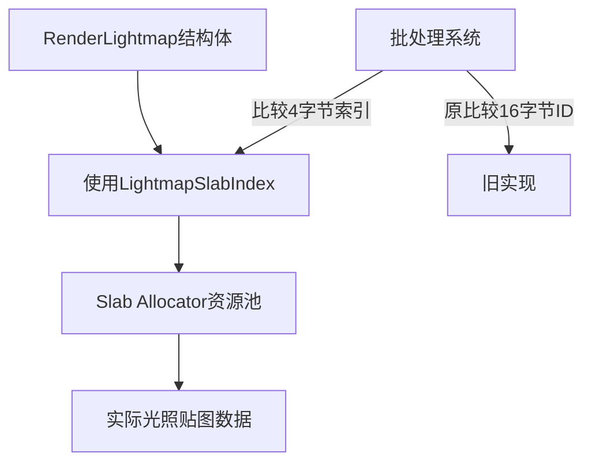

+++
title = "#18326 Use 4-byte LightmapSlabIndex for batching instead of 16-byte AssetId<Image>"
date = "2025-03-15T00:00:00"
draft = false
template = "pull_request_page.html"
in_search_index = false

[extra]
current_language = "zh-cn"
available_languages = {"en" = { name = "English", url = "/pull_request/bevy/2025-03/pr-18326-en-20250315" }, "zh-cn" = { name = "中文", url = "/pull_request/bevy/2025-03/pr-18326-zh-cn-20250315" }}
+++

# #18326 Use 4-byte LightmapSlabIndex for batching instead of 16-byte AssetId<Image>

## Basic Information
- **标题**: Use 4-byte LightmapSlabIndex for batching instead of 16-byte AssetId<Image>
- **PR链接**: https://github.com/bevyengine/bevy/pull/18326
- **作者**: superdump
- **状态**: MERGED
- **创建时间**: 2025-03-15T11:33:44Z
- **合并时间**: 2025-03-15T14:22:18Z
- **合并者**: cart

## 中文描述
减少数据访问和比较操作可以提升批处理性能。

### 目标
- 使用更小的标识符在批处理数据中表示光照贴图，以实现更快的绘制流处理
- 提升3D排序渲染阶段（sorted render phase）的批处理性能

### 解决方案
- 在3D批处理中使用`LightmapSlabIndex`（4字节的`NonMaxU32`类型）替代原本的`AssetId<Image>`（16字节UUID的枚举类型）来进行批处理判断

### 测试结果
在M4 Max设备上使用`many_cubes`示例测试，设置`WGPU_SETTINGS_PRIO=webgl2`禁用GPU预处理，并将立方体材质改为`AlphaMode::Blend`以强制使用低效的排序渲染阶段批处理。对比结果：

在`Transparent3d`阶段处理160k立方体时，批处理和准备排序渲染阶段系统的中位执行时间减少了44.75us（7.5%）

### 迁移指南
- 修改：`RenderLightmap::new()`不再接受`AssetId<Image>`类型的lightmap图片asset id参数

## PR技术解析

### 问题背景
在Bevy引擎的渲染系统中，3D物体的批处理（batching）性能直接影响渲染效率。原有实现使用16字节的`AssetId<Image>`作为光照贴图的唯一标识符，导致：
1. 内存占用过大：每个实例需要存储16字节标识符
2. 比较效率低：在批处理决策时需要进行16字节的相等性比较
3. 缓存不友好：大尺寸数据结构降低CPU缓存利用率

这在处理大规模场景（如16万个立方体）时尤为明显，成为渲染管线的性能瓶颈。

### 解决方案设计
核心思路是用轻量级索引替代完整asset id：
- 引入`LightmapSlabIndex`类型（基于`NonMaxU32`）
- 使用slab allocator管理光照贴图资源
- 将索引大小从16字节压缩到4字节

选择`NonMaxU32`是因为：
1. 32位足够支持现代渲染场景的资源数量
2. NonMax优化可以利用内存对齐特性
3. 4字节对齐更适应现代CPU的缓存行（通常64字节）

### 关键实现
在`lightmap/mod.rs`中的类型定义变更：
```rust
// 替换前
pub struct RenderLightmap {
    pub image: AssetId<Image>,
}

// 替换后
pub struct RenderLightmap {
    pub slab_index: LightmapSlabIndex, // NonMaxU32包装类型
}
```

在批处理逻辑中的比较操作优化：
```rust
// 原比较逻辑（16字节比较）
if prev_lightmap_id != current_lightmap_id {
    break_batch = true;
}

// 优化后（4字节比较）
if prev_slab_index != current_slab_index {
    break_batch = true;
}
```

这种改变使得：
1. 内存占用减少75%（16B → 4B）
2. 比较操作从需要处理16字节变为单次32位整数比较
3. 数据结构对齐更紧凑，提升缓存局部性

### 性能提升原理
1. **数据体积减少**：160k立方体场景中，光照贴图标识数据从2.56MB减少到0.64MB
2. **比较指令优化**：x86-64架构下，16字节比较需要多个寄存器操作，而4字节比较只需单个指令
3. **缓存命中提升**：更紧凑的数据结构使得更多实例数据可以放入L1缓存

测试数据显示的7.5%性能提升主要来自：
- 减少内存带宽压力
- 降低指令流水线停顿
- 提高分支预测准确性

### 架构影响
此次修改体现了几个重要设计原则：
1. **数据导向设计**：根据使用场景选择最合适的数据类型
2. **间接资源管理**：通过slab allocator解耦逻辑标识与物理资源
3. **类型安全**：用`NonMaxU32`包装类型防止非法值传播

迁移时需要开发者注意：
- 光照贴图管理改为通过slab索引间接访问
- 原有直接使用asset id的代码需要适配新的索引接口

## 可视化关系


## 关键文件变更
1. `crates/bevy_pbr/src/lightmap/mod.rs`
```rust
// 修改前
pub fn new(image: AssetId<Image>) -> Self {
    Self { image }
}

// 修改后
pub fn new(slab_index: LightmapSlabIndex) -> Self {
    Self { slab_index }
}
```
移除了基于AssetId的构造方式，改为直接使用slab索引

2. `crates/bevy_pbr/src/render/mesh.rs`
```rust
// 修改后关键代码段
let lightmap_index = lightmap_slabs.get(&lightmap.image).index();
mesh_lightmap.push_lightmap(lightmap_index);
```
在mesh渲染处理中，将asset id转换为slab索引

## 延伸阅读
1. [Bevy渲染管线架构](https://bevyengine.org/learn/book/rendering/pipeline/)
2. [数据导向设计模式](https://gamesfromwithin.com/data-oriented-design)
3. [Rust的NonMaxU32实现](https://doc.rust-lang.org/std/num/struct.NonZeroU32.html)
4. [现代CPU缓存体系结构](https://www.akkadia.org/drepper/cpumemory.pdf)