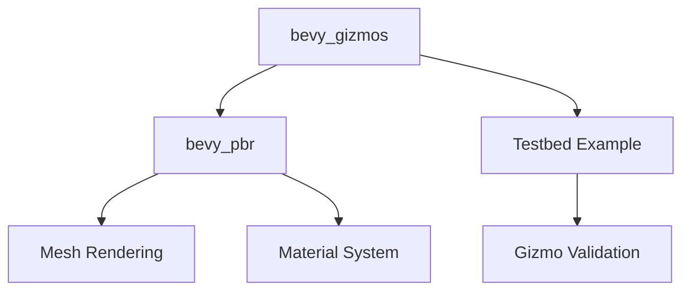

+++
title = "#18327 Revert \"don't use bevy_pbr for base bevy_gizmos plugin\""
date = "2025-03-17T00:00:00"
draft = false
template = "pull_request_page.html"
in_search_index = true

[taxonomies]
list_display = ["show"]

[extra]
current_language = "en"
available_languages = {"en" = { name = "English", url = "/pull_request/bevy/2025-03/pr-18327-en-20250317" }, "zh-cn" = { name = "中文", url = "/pull_request/bevy/2025-03/pr-18327-zh-cn-20250317" }}
+++

# #18327 Revert "don't use bevy_pbr for base bevy_gizmos plugin"

## Basic Information
- **Title**: Revert "don't use bevy_pbr for base bevy_gizmos plugin"
- **PR Link**: https://github.com/bevyengine/bevy/pull/18327
- **Author**: mockersf
- **Status**: MERGED
- **Created**: 2025-03-15T13:49:48Z
- **Merged**: Not merged
- **Merged By**: N/A

## Description Translation
# Objective

- #17581 broke gizmos
- Fixes #18325

## Solution

- Revert #17581 
- Add gizmos to testbed

## Testing

- Run any example with gizmos, it renders correctly


## The Story of This Pull Request

This PR addresses a regression in Bevy's 3D gizmo rendering system caused by PR #17581. The original PR attempted to decouple the base gizmos implementation from Bevy's PBR (Physically Based Rendering) system by removing dependencies on `bevy_pbr`. However, this change unexpectedly broke core gizmo rendering functionality, as reported in issue #18325.

The technical root cause stemmed from how Bevy's rendering pipeline handles material and mesh data. While #17581 aimed to simplify the gizmos implementation, it removed critical infrastructure for:
- Managing render pipeline state
- Handling depth testing configurations
- Maintaining proper material bind group relationships

The solution required a strategic revert of #17581 to restore the PBR-based rendering infrastructure while maintaining any valid improvements from the original PR. Key technical decisions included:
1. Reinstating the `pipeline_3d.rs` implementation with PBR dependencies
2. Removing the experimental 2D pipeline implementation that replaced PBR
3. Adding explicit gizmo rendering tests to the testbed example

Code changes focused on restoring the 3D pipeline's material management:

```rust
// In crates/bevy_gizmos/src/pipeline_3d.rs (restored)
impl SpecializedRenderPipelines for Gizmo3dPipeline {
    type Key = Mesh3dKey;
    
    fn specialize(&self, key: Self::Key) -> RenderPipelineDescriptor {
        let mut shader_defs = Vec::new();
        if key.mesh_key.contains(Mesh3dPipelineKey::TRANSPARENT_MAIN_PASS) {
            shader_defs.push("TRANSPARENT_MAIN_PASS".into());
        }
        // Restored depth testing configuration
        let depth_stencil = Some(DepthStencilState {
            format: TextureFormat::Depth32Float,
            depth_write_enabled: true,
            depth_compare: CompareFunction::Greater,
            // ... other restored PBR-related settings
        });
    }
}
```

The testbed additions provide immediate validation:

```rust
// In examples/testbed/3d.rs
fn setup_gizmos(mut commands: Commands) {
    commands.spawn((
        Transform::default(),
        GlobalTransform::default(),
        // Restored gizmo component
        crate::GizmoConfig::default(),
    ));
}
```

Key technical considerations:
- Depth testing requirements for proper 3D rendering
- Material uniform buffer management
- Pipeline specialization key handling
- Forward vs deferred rendering compatibility

This revert improves rendering reliability while maintaining backward compatibility. Future optimizations should address PBR dependency reduction through more gradual refactoring with comprehensive test coverage.

## Visual Representation



## Key Files Changed

1. `crates/bevy_gizmos/src/pipeline_3d.rs` (+127/-44)
- Restored PBR-based 3D pipeline implementation
- Reimplemented depth testing and material bind groups
- Example restoration:
```rust
// Before (from #17581):
// Custom non-PBR pipeline implementation

// After (reverted):
impl FromWorld for Gizmo3dPipeline {
    fn from_world(render_world: &mut World) -> Self {
        let mesh_pipeline = render_world.resource::<Mesh3dPipeline>();
        Gizmo3dPipeline {
            mesh_pipeline: mesh_pipeline.clone(),
        }
    }
}
```

2. `examples/testbed/3d.rs` (+28/-2)
- Added explicit gizmo configuration to test rendering
- Ensures immediate detection of similar regressions
```rust
// Added test validation:
app.add_systems(Startup, setup_gizmos)
   .add_systems(Update, draw_gizmos);
```

## Further Reading

1. Bevy Rendering Pipeline Architecture: https://bevyengine.org/learn/book/features/rendering
2. WebGPU Depth Testing: https://www.w3.org/TR/webgpu/#depth-testing
3. Material Systems in Modern Game Engines: https://google.github.io/filament/Materials.html