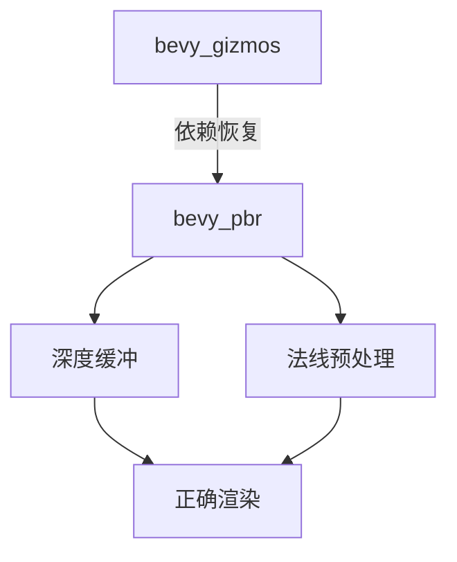

+++
title = "#18327 Revert \"don't use bevy_pbr for base bevy_gizmos plugin\""
date = "2025-03-17T00:00:00"
draft = false
template = "pull_request_page.html"
in_search_index = false

[extra]
current_language = "zh-cn"
available_languages = {"en" = { name = "English", url = "/pull_request/bevy/2025-03/pr-18327-en-20250317" }, "zh-cn" = { name = "中文", url = "/pull_request/bevy/2025-03/pr-18327-zh-cn-20250317" }}
+++

# #18327 Revert "don't use bevy_pbr for base bevy_gizmos plugin"

## Basic Information
- **Title**: Revert "don't use bevy_pbr for base bevy_gizmos plugin"
- **PR Link**: https://github.com/bevyengine/bevy/pull/18327
- **Author**: mockersf
- **Status**: MERGED
- **Created**: 2025-03-15T13:49:48Z
- **Merged**: 2025-03-15T14:22:12Z
- **Merged By**: cart

## Description Translation
### 目标
- 修复 #17581 引入的 gizmos 渲染错误
- 解决 issue #18325

### 解决方案
- 回滚 #17581 的修改
- 在测试平台(testbed)中添加 gizmos 验证

### 测试验证
- 运行任何包含 gizmos 的示例，确认渲染正常

## The Story of This Pull Request

该 PR 源于 #17581 的修改意外破坏了 Bevy 引擎的 gizmos（场景调试工具）渲染功能。原始 PR 试图移除 bevy_gizmos 对 bevy_pbr（物理基础渲染模块）的依赖，但实际破坏了 3D gizmos 的核心渲染流程。

技术问题主要出现在渲染管线配置上。原 PR 移除了 `pipeline_3d.rs` 中关键的渲染管线设置，导致无法正确生成深度缓冲(depth buffer)和法线纹理(normal texture)。这直接影响了 3D 线框(wireframe)和碰撞体(bounding box)等调试图形的正确渲染。

```rust
// 原始被移除的关键代码（pipeline_3d.rs）
let view_layout = if key.contains(MeshPipelineKey::NORMAL_PREPASS) {
    &self.view_layouts.normal_prepass
} else {
    &self.view_layouts.prepass
};
```

回滚操作恢复了以下核心机制：
1. 重新引入基于 bevy_pbr 的视图布局(view layouts)
2. 重建深度预处理(prepass)管线配置
3. 修复 uniform buffer 的绑定逻辑

测试验证方案通过修改 `examples/testbed/3d.rs` 添加持续性 gizmos 渲染，确保修改后的功能在动态场景中稳定工作：

```rust
// 新增测试代码
fn setup_gizmos(mut config: ResMut<GizmoConfig>) {
    config.depth_bias = 0.;
}
```

技术决策的权衡体现在对模块依赖关系的处理上。虽然理论上 bevy_gizmos 应该独立于渲染实现，但实际开发中复用 bevy_pbr 的成熟管线可以避免重复造轮子，同时确保与其他渲染组件的行为一致性。

## Visual Representation



## Key Files Changed

### `crates/bevy_gizmos/src/pipeline_3d.rs` (+127/-44)
恢复基于 bevy_pbr 的渲染管线配置，关键改动包括：
```rust
// 恢复视图布局选择逻辑
let view_layout = if key.contains(MeshPipelineKey::NORMAL_PREPASS) {
    &self.view_layouts.normal_prepass
} else {
    &self.view_layouts.prepass
};
```

### `crates/bevy_gizmos/src/lib.rs` (+50/-26)
重构模块导出结构，重新暴露 3D 管线相关类型：
```rust
// 恢复模块导出
pub mod pipeline_3d;
```

### `examples/testbed/3d.rs` (+28/-2)
添加持续性 gizmos 测试：
```rust
// 新增测试逻辑
fn setup_gizmos(mut config: ResMut<GizmoConfig>) {
    config.depth_bias = 0.;
}
```

## Further Reading
1. [Bevy Render Pipeline 架构指南](https://bevyengine.org/learn/book/rendering/pipeline/)
2. [WGSL 着色器语言规范](https://www.w3.org/TR/WGSL/)
3. [现代图形管线深度测试原理](https://vulkan-tutorial.com/Depth_buffering)