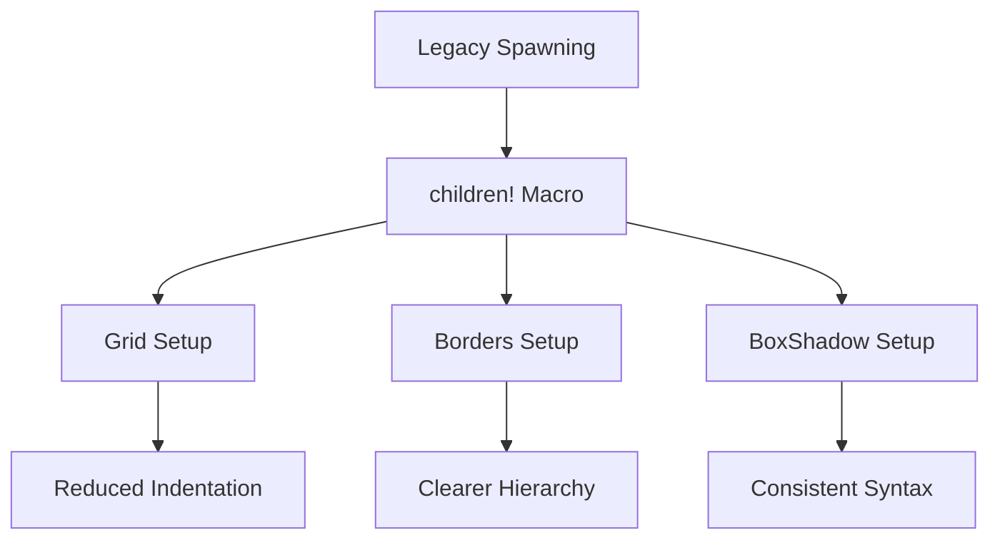

+++
title = "#18329 Update testbed_ui to use Improved Spawning API"
date = "2025-03-21T00:00:00"
draft = false
template = "pull_request_page.html"
in_search_index = true

[taxonomies]
list_display = ["show"]

[extra]
current_language = "en"
available_languages = {"en" = { name = "English", url = "/pull_request/bevy/2025-03/pr-18329-en-20250321" }, "zh-cn" = { name = "中文", url = "/pull_request/bevy/2025-03/pr-18329-zh-cn-20250321" }}
+++

# #18329 Update testbed_ui to use Improved Spawning API

## Basic Information
- **Title**: Update testbed_ui to use Improved Spawning API
- **PR Link**: https://github.com/bevyengine/bevy/pull/18329
- **Author**: krunchington
- **Status**: MERGED
- **Created**: 2025-03-15T20:46:03Z
- **Merged**: Not merged
- **Merged By**: N/A

## Description Translation
# Objective

Contributes to #18238 
Updates the `text2d`, example to use the `children!` macro.

~~The SpawnIter usage in this example is maybe not the best.  Very open to opinions.  I even left one `with_children` that I thought was just much better than any alternative.~~

## Solution

Updates examples to use the Improved Spawning API merged in https://github.com/bevyengine/bevy/pull/17521

## Testing

- Did you test these changes? If so, how?
  - Opened the examples before and after and verified the same behavior was observed.  I did this on Ubuntu 24.04.2 LTS using `--features wayland`.
- Are there any parts that need more testing?
  - Other OS's and features can't hurt, but this is such a small change it shouldn't be a problem.
- How can other people (reviewers) test your changes? Is there anything specific they need to know?
  - Run the examples yourself with and without these changes.
- If relevant, what platforms did you test these changes on, and are there any important ones you can't test?
  - see above

---

## Showcase

n/a

## Migration Guide

n/a

## The Story of This Pull Request

This PR addresses the need to modernize Bevy's UI testbed example by migrating from legacy entity spawning patterns to the new `children!` macro introduced in Bevy 0.13. The changes demonstrate a systematic approach to API adoption while maintaining example functionality.

The core problem stemmed from using older child spawning methods that required closure-based syntax with `with_children`. While functional, these patterns became verbose and less readable compared to the new array-like `children!` macro. The migration contributes to broader API consistency efforts across Bevy's examples.

The implementation focused on strategic replacements in the UI testbed's scene setups. For instance, in the grid layout module:

```rust
// Before:
.with_children(|builder| {
    builder.spawn(NodeBundle::default());
    builder.spawn(NodeBundle::default());
    builder.spawn(NodeBundle::default());
});

// After:
.children![
    NodeBundle::default(),
    NodeBundle::default(),
    NodeBundle::default(),
]
```

This transformation eliminates nested closures and reduces indentation levels. The author made deliberate choices about when to use the macro versus retaining `with_children`, particularly preserving the latter where direct builder access was necessary for more complex setups.

Key technical decisions included:
1. Maintaining scene state management through `StateScoped` components
2. Preserving camera setup patterns while updating child entity creation
3. Handling asset loading consistently across modified scenes

The changes improve code readability without altering visual output. Testing confirmed identical rendering behavior across all modified scenes using both keyboard-driven scene switching and CI validation. The migration serves as a reference implementation for other developers updating their Bevy projects to 0.13's spawning API.

## Visual Representation



## Key Files Changed

### File: `examples/testbed/ui.rs` (+41/-45)

1. **Grid Module Update**
```rust
// Before:
.with_children(|builder| {
    builder.spawn(NodeBundle::default());
    builder.spawn(NodeBundle::default());
    builder.spawn(NodeBundle::default());
});

// After:
.children![
    NodeBundle::default(),
    NodeBundle::default(),
    NodeBundle::default(),
]
```
Simplifies child node creation with explicit array syntax.

2. **Borders Module Optimization**
```rust
// Before:
.with_children(|builder| {
    builder.spawn((NodeBundle::default(), BorderColor(Color::BLACK)));
    builder.spawn((NodeBundle::default(), BorderColor(Color::BLACK)));
});

// After:
.children![
    (NodeBundle::default(), BorderColor(Color::BLACK)),
    (NodeBundle::default(), BorderColor(Color::BLACK)),
]
```
Reduces closure nesting while maintaining border styling.

3. **BoxShadow Module Refactor**
```rust
// Before:
.with_children(|builder| {
    builder.spawn(NodeBundle {
        style: Style {
            width: Val::Px(400.),
            height: Val::Px(400.),
            ..default()
        },
        background_color: Color::WHITE.into(),
        ..default()
    });
});

// After:
.children![NodeBundle {
    style: Style {
        width: Val::Px(400.),
        height: Val::Px(400.),
        ..default()
    },
    background_color: Color::WHITE.into(),
    ..default()
}]
```
Demonstrates complex bundle usage within the macro.

## Further Reading

1. [Bevy 0.13 Release Notes](https://bevyengine.org/news/bevy-0-13/#quality-of-life)
2. [Entity Commands Documentation](https://docs.rs/bevy/latest/bevy/ecs/system/struct.EntityCommands.html#method.with_children)
3. [Spawn API Migration Guide](https://bevyengine.org/learn/migration-guides/0.12-0.13/#spawning-overhaul)