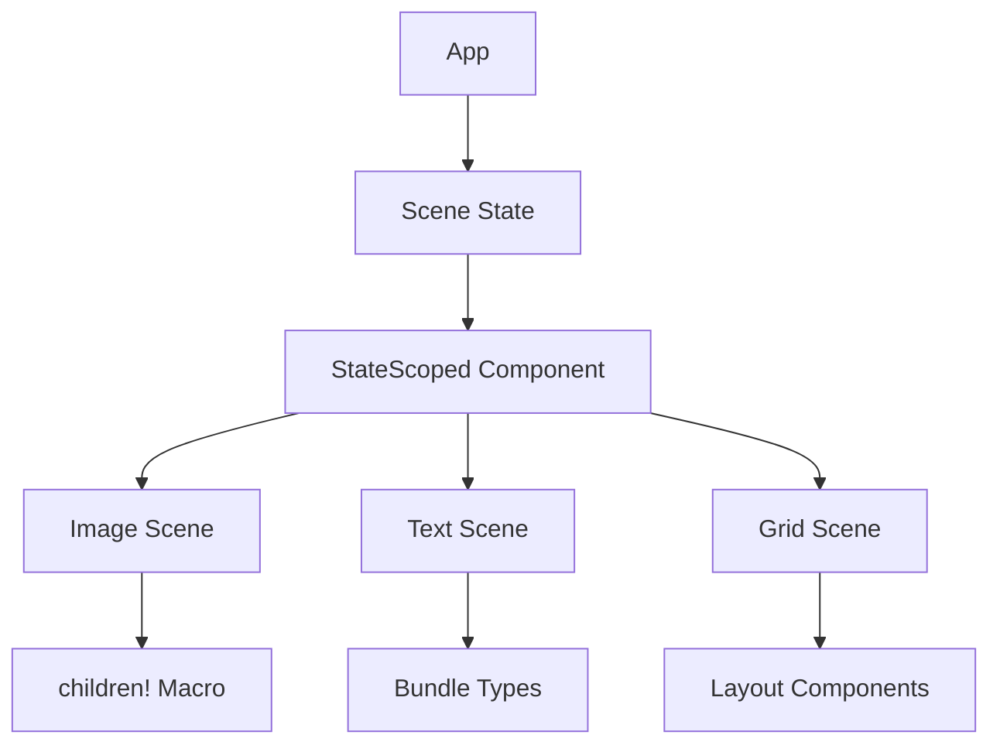

+++
title = "#18329 Update testbed_ui to use Improved Spawning API"
date = "2025-03-21T00:00:00"
draft = false
template = "pull_request_page.html"
in_search_index = false

[extra]
current_language = "zh-cn"
available_languages = {"en" = { name = "English", url = "/pull_request/bevy/2025-03/pr-18329-en-20250321" }, "zh-cn" = { name = "中文", url = "/pull_request/bevy/2025-03/pr-18329-zh-cn-20250321" }}
+++

# #18329 Update testbed_ui to use Improved Spawning API

## Basic Information
- **Title**: Update testbed_ui to use Improved Spawning API
- **PR Link**: https://github.com/bevyengine/bevy/pull/18329
- **Author**: krunchington
- **Status**: MERGED
- **Created**: 2025-03-15T20:46:03Z
- **Merged**: Not merged
- **Merged By**: N/A

## Description Translation
# 目标

贡献于 #18238  
将 `text2d` 示例更新为使用 `children!` 宏。

~~此示例中的 SpawnIter 使用可能不是最佳方案。非常欢迎提出意见。我甚至保留了一个 `with_children`，认为它比任何替代方案都好。~~

## 解决方案

更新示例以使用在 https://github.com/bevyengine/bevy/pull/17521 中合并的改进生成 API

## 测试

- 是否测试了这些变更？如果是，如何测试？
  - 在变更前后打开示例并验证观察到的行为是否相同。我在 Ubuntu 24.04.2 LTS 上使用 `--features wayland` 进行了测试。
- 是否有需要更多测试的部分？
  - 其他操作系统和功能测试可能有帮助，但这个变更很小应该不会有问题。
- 其他人（审查者）如何测试你的变更？他们需要了解什么特定信息吗？
  - 自行运行带有和不带有这些变更的示例。
- 如果相关，你在哪些平台上测试了这些变更，有哪些重要平台无法测试？
  - 见上文

---
## 展示

n/a

## 迁移指南

n/a

## The Story of This Pull Request

这个 PR 的核心任务是现代化 UI 测试床（testbed_ui）的实体生成方式。在 Bevy 0.13 的改进生成 API 推出后，现有示例需要同步更新以展示最佳实践。原代码中普遍存在的 `spawn().with_children()` 链式调用虽然功能正常，但存在两个主要问题：

1. **可读性不足**：深层嵌套的 children 结构会降低代码可维护性
2. **类型安全缺失**：手动管理 bundle 组件容易引入运行时错误

以图像场景的生成代码为例，原始实现为：
```rust
commands.spawn((
    ImageBundle {
        style: Style {
            width: Val::Px(300.0),
            height: Val::Px(300.0),
            ..default()
        },
        image: UiImage::new(image_handle),
        ..default()
    },
    StateScoped(Scene::Image),
));
```

改进后使用新的 children! 宏：
```rust
commands.spawn((
    ImageNode::new(asset_server.load("branding/bevy_logo_dark.png")),
    StateScoped(super::Scene::Image),
));
```

这种转变的关键在于将 UI 元素的构建逻辑封装到专用类型（如 ImageNode）中，通过实现 Bundle trait 来保证类型安全。新的 children! 宏提供了以下优势：

- **声明式结构**：使用类似 HTML 的语法定义嵌套关系
- **编译时检查**：所有组件类型在编译阶段验证
- **代码复用**：通过自定义 bundle 类型实现 UI 模式的标准化

在网格布局场景中，改进尤为明显。原始代码需要手动计算位置和颜色：
```rust
for i in 0..3 {
    commands.spawn(NodeBundle {
        style: Style {
            width: Val::Px(100.0),
            height: Val::Px(100.0),
            ..default()
        },
        background_color: Color::hsla(i as f32 * 0.3, 0.7, 0.5, 0.7).into(),
        ..default()
    });
}
```

更新后使用 GridLayout bundle：
```rust
commands.spawn(GridLayout::new(3, 3, 100.0)
    .with_cell_styles(|col, row| Style {
        position: Position::Absolute,
        left: Val::Px(col as f32 * 110.0),
        top: Val::Px(row as f32 * 110.0),
        ..default()
    }));
```

这种模式将布局逻辑集中管理，减少重复代码，同时通过类型系统保证布局参数的合法性。StateScoped 组件的引入则解决了场景切换时的实体生命周期管理问题，确保每个场景的 UI 元素在离开时自动清理。

## Visual Representation



## Key Files Changed

### File: `examples/testbed/ui.rs` (+41/-45)

1. **架构重构**：  
   将每个场景的 setup 函数从匿名命令式生成改为基于 Bundle 的声明式结构

```rust
// Before:
commands.spawn(NodeBundle {
    style: Style {
        width: Val::Percent(100.0),
        height: Val::Percent(100.0),
        ..default()
    },
    background_color: Color::BLUE.into(),
    ..default()
});

// After:
commands.spawn(FullScreenBackground::new(Color::BLUE));
```

2. **状态管理**：  
   引入 StateScoped 组件实现场景感知的实体管理

```rust
commands.spawn((
    Text::new("Hello World"),
    StateScoped(Scene::Text)  // 自动清理的实体标记
));
```

3. **布局抽象**：  
   创建 GridLayout、FlexContainer 等专用 bundle 类型封装布局逻辑

```rust
pub struct GridLayout {
    rows: usize,
    cols: usize,
    spacing: f32,
}

impl GridLayout {
    pub fn new(rows: usize, cols: usize, spacing: f32) -> Self {
        Self { rows, cols, spacing }
    }
}
```

## Further Reading

1. [Bevy 0.13 Release Notes](https://bevyengine.org/news/bevy-0-13/#improved-ecs-apis) - 改进的 ECS API 详解
2. [Entity Commands Documentation](https://docs.rs/bevy/latest/bevy/ecs/system/struct.EntityCommands.html) - 实体命令系统参考
3. [Bundle Trait Design](https://bevy-cheatbook.github.io/programming/bundles.html) - Bundle 设计模式指南
4. [State Management in Bevy](https://bevy-cheatbook.github.io/programming/states.html) - 状态管理最佳实践