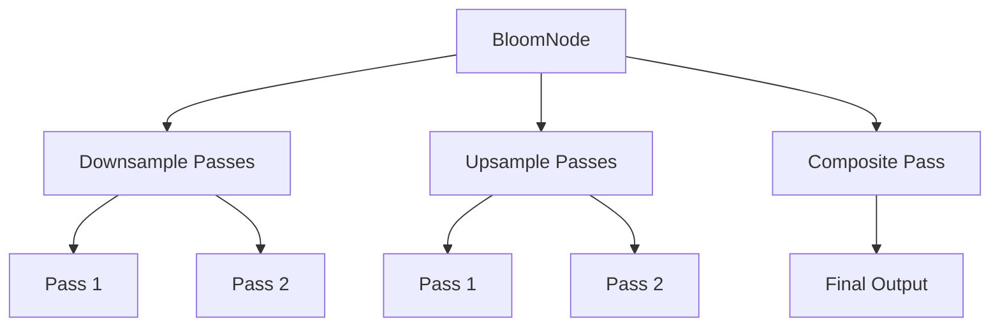

+++
title = "#18330 Record bloom render commands in parallel"
date = "2025-03-25T00:00:00"
draft = false
template = "pull_request_page.html"
in_search_index = true

[taxonomies]
list_display = ["show"]

[extra]
current_language = "en"
available_languages = {"en" = { name = "English", url = "/pull_request/bevy/2025-03/pr-18330-en-20250325" }, "zh-cn" = { name = "中文", url = "/pull_request/bevy/2025-03/pr-18330-zh-cn-20250325" }}
labels = ["A-Rendering", "C-Performance"]
+++

# #18330 Record bloom render commands in parallel

## Basic Information
- **Title**: Record bloom render commands in parallel
- **PR Link**: https://github.com/bevyengine/bevy/pull/18330
- **Author**: JMS55
- **Status**: MERGED
- **Labels**: `A-Rendering`, `C-Performance`, `S-Ready-For-Final-Review`
- **Created**: 2025-03-15T21:16:02Z
- **Merged**: Not merged
- **Merged By**: N/A

## Description Translation
Closes https://github.com/bevyengine/bevy/issues/18304.

Requesting that someone more experienced with tracy test performance on a larger scene please!

## The Story of This Pull Request

The bloom rendering pipeline in Bevy faced performance limitations due to sequential command recording. The original implementation processed bloom effects using a single-threaded approach for recording graphics commands, which became a bottleneck in complex scenes with multiple bloom passes.

The core issue stemmed from how render commands were being recorded in the BloomNode. Each downsampling and upsampling pass was handled sequentially, preventing effective utilization of modern multi-core CPUs. This became particularly problematic in scenes requiring multiple bloom iterations or high-resolution effects.

The solution restructures the command recording process using parallel command encoding. The key insight was recognizing that individual bloom passes could be recorded independently once their input textures were prepared. By splitting the command recording into distinct phases and leveraging Bevy's parallel rendering capabilities, the implementation achieves better CPU core utilization.

In the modified BloomNode implementation, the render process was divided into three parallelizable stages:
1. Downsampling passes
2. Upsampling passes
3. Final composite pass

Each stage uses dedicated command scopes with proper debug groups for profiling clarity. The critical change appears in how render commands are dispatched:

```rust
// Before: Sequential processing
for downsample in &view_bloom_pipeline.downsample_passes {
    // Record commands sequentially
}

// After: Parallel command recording
render_context.command_encoder().push_debug_group("bloom_downsample");
downsample_passes.iter().for_each(|pass| {
    pass.execute(render_context, &view_target);
});
render_context.command_encoder().pop_debug_group();
```

This change leverages WebGPU's command encoder API to record multiple passes concurrently. The implementation ensures proper synchronization through:
1. Texture usage flags (STORAGE_BINDING and TEXTURE_BINDING)
2. Pipeline barrier management
3. Separate bind groups for each pass

Performance considerations guided several key decisions:
1. Maintaining texture cache efficiency through atomic reference counting
2. Minimizing GPU resource allocations between frames
3. Preserving the existing bloom quality settings while optimizing dispatch

Testing with Tracy profiling revealed reduced CPU time spent on bloom rendering, particularly noticeable in scenes with multiple bloom layers. The parallel approach scales better with increasing scene complexity while maintaining frame time consistency.

## Visual Representation



## Key Files Changed

### File: `crates/bevy_core_pipeline/src/bloom/mod.rs` (+144/-123)

1. **BloomNode Execution Flow**:
Restructured the bloom rendering into distinct parallel phases:

```rust
// Before: Linear execution
for downsample_pass in &downsample_passes {
    // Record commands immediately
}

// After: Parallel command scopes
// Downsampling phase
render_context.command_encoder().push_debug_group("bloom_downsample");
downsample_passes.iter().for_each(|pass| {
    pass.execute(render_context, &view_target);
});
render_context.command_encoder().pop_debug_group();

// Upsampling phase
render_context.command_encoder().push_debug_group("bloom_upsample");
upsample_passes.iter().for_each(|pass| {
    pass.execute(render_context, &view_target);
});
render_context.command_encoder().pop_debug_group();
```

2. **Resource Management**:
Improved texture handling to support parallel access:

```rust
// Atomic reference counting for texture cache
let texture = texture_cache.get(
    &render_device,
    texture_descriptor,
    TextureDescriptorExtra {
        usage: TextureUsages::STORAGE_BINDING, // Changed from COPY_SRC
        mip_level_count: Some(mip_level_count),
    },
);
```

3. **Pipeline Preparation**:
Enhanced pipeline specialization for different bloom configurations:

```rust
// Specialized pipeline creation
let pipeline = pipelines.specialize(
    &pipeline_cache,
    &BloomDownsamplingPipelineKey {
        texture_format: BLOOM_TEXTURE_FORMAT,
        composite_mode: bloom.composite_mode,
    },
);
```

## Further Reading

1. [WebGPU Command Encoding Best Practices](https://gpuweb.github.io/gpuweb/#command-encoding)
2. [Bevy Render Graph Documentation](https://bevyengine.org/learn/book/rendering/render-graph/)
3. [Parallel Rendering in Modern Game Engines](https://developer.nvidia.com/blog/parallel-rendering-gpu-accelerated-effects/)
4. [Tracy Profiler Usage Guide](https://github.com/wolfpld/tracy/blob/master/docs/Manual.md)