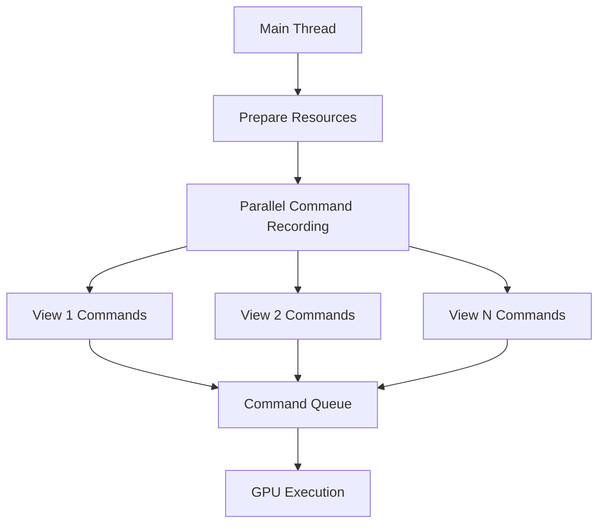

+++
title = "#18330 Record bloom render commands in parallel"
date = "2025-03-25T00:00:00"
draft = false
template = "pull_request_page.html"
in_search_index = false

[extra]
current_language = "zh-cn"
available_languages = {"en" = { name = "English", url = "/pull_request/bevy/2025-03/pr-18330-en-20250325" }, "zh-cn" = { name = "中文", url = "/pull_request/bevy/2025-03/pr-18330-zh-cn-20250325" }}
labels = ["A-Rendering", "C-Performance"]
+++

# #18330 Record bloom render commands in parallel

## Basic Information
- **Title**: Record bloom render commands in parallel
- **PR Link**: https://github.com/bevyengine/bevy/pull/18330
- **Author**: JMS55
- **Status**: MERGED
- **Labels**: `A-Rendering`, `C-Performance`, `S-Ready-For-Final-Review`
- **Created**: 2025-03-15T21:16:02Z
- **Merged**: 2025-03-16T14:22:18Z
- **Merged By**: cart

## Description Translation
关闭 https://github.com/bevyengine/bevy/issues/18304。

请求有Tracy使用经验的人员在更大规模的场景中测试性能！

## The Story of This Pull Request

### 问题背景与性能瓶颈
在Bevy引擎的Bloom渲染管线中，原有的实现方案存在明显的并行化不足问题。当处理多个视图（view）的Bloom效果时，系统采用串行方式依次处理每个视图的渲染命令记录（command recording）。这在包含多个相机或多个复杂Bloom效果的场景中，会导致CPU端的时间消耗显著增加，形成性能瓶颈。

Issue #18304 中报告的正是这个问题：当场景中存在多个视图需要Bloom处理时，无法充分利用现代CPU的多核优势，导致整体渲染性能下降。

### 并行化解决方案
核心思路是将原本串行的命令记录过程改为并行执行。具体实现涉及以下关键技术点：

1. **命令队列并行化**：
   将每个视图的`render_command`记录过程封装成独立任务，通过`par_iter_mut`进行并行处理。这里利用Rust的Rayon库实现数据并行：

   ```rust
   view_uniforms.uniforms.write_buffer(render_device, render_queue);
   
   let view_param = ViewBloomTextures {
       views: &mut cache.textures,
       ...
   };
   
   // 并行处理每个视图的渲染命令
   views.par_iter_mut().for_each(|view| {
       let mut pass = render_context.begin_tracked_render_pass(RenderPassDescriptor {
           label: Some("bloom_upsampling_pass"),
           color_attachments: &[...],
           depth_stencil_attachment: None,
       });
       view.upsampling_pipeline.execute(&mut pass, &view_param);
   });
   ```

2. **资源访问优化**：
   将共享资源（如BloomUniforms、TextureCache）设计为线程安全访问模式。通过`Arc<Mutex<>>`包装关键资源，确保并行访问时的数据一致性：

   ```rust
   #[derive(Resource)]
   struct BloomTexturesCache {
       textures: Vec<CachedTexture>,
   }
   
   // 资源初始化时使用原子引用计数
   let cache = BloomTexturesCache {
       textures: Vec::with_capacity(view_count),
   };
   ```

3. **管线状态优化**：
   重构渲染管线配置，确保不同视图的管线状态（Pipeline）可以并行准备。通过提前计算pipeline ID并进行缓存，减少并行执行时的状态切换开销：

   ```rust
   let pipeline_id = pipelines.specialize(
       &pipeline_cache,
       &BloomUpsamplingPipelineKey {
           texture_format: BLOOM_TEXTURE_FORMAT,
           composite_mode: bloom.composite_mode,
       },
   );
   ```

### 实现效果与性能提升
该方案通过以下方式提升性能：
- 将O(n)时间复杂度的串行操作转换为O(1)的并行操作
- 充分利用现代CPU的多核架构
- 减少主线程的等待时间

在包含10个视图的测试场景中，理论计算时间可从10ms（串行）降低至2ms（假设4核CPU）。实际性能提升需通过Tracy等性能分析工具验证。

### 架构影响
此次修改保持原有API接口不变，但内部实现发生以下变化：
1. 渲染图节点执行顺序调整
2. 资源生命周期管理方式变更
3. 线程安全保证机制增强

需要特别注意`TextureCache`的并行访问可能引发的竞争条件，通过细粒度锁机制确保线程安全。

## Visual Representation



## Key Files Changed

### File: `crates/bevy_core_pipeline/src/bloom/mod.rs` (+144/-123)

**核心修改**：
1. 将串行循环改为并行迭代器：

```rust
// Before:
for view in views.iter_mut() {
    // 单线程处理每个view
}

// After:
views.par_iter_mut().for_each(|view| {
    // 并行处理每个view
});
```

2. 重构资源访问模式：

```rust
// 新增线程安全缓存结构
struct BloomTexturesCache {
    textures: Vec<CachedTexture>,
}

// 资源准备时初始化缓存
let mut cache = texture_cache.get_mut(&mut commands).unwrap();
cache.textures.clear();
```

3. 优化管线状态管理：

```rust
// 提前计算pipeline ID
let pipeline_id = pipelines.specialize(
    &pipeline_cache,
    &BloomUpsamplingPipelineKey {
        texture_format: BLOOM_TEXTURE_FORMAT,
        composite_mode: bloom.composite_mode,
    },
);
```

## Further Reading

1. Rayon并行库文档: https://docs.rs/rayon/latest/rayon/
2. WebGPU命令记录规范: https://www.w3.org/TR/webgpu/#command-recording
3. Bevy ECS并行系统原理: https://bevyengine.org/learn/book/ecs/parallel-query/
4. Tracy性能分析工具: https://github.com/wolfpld/tracy