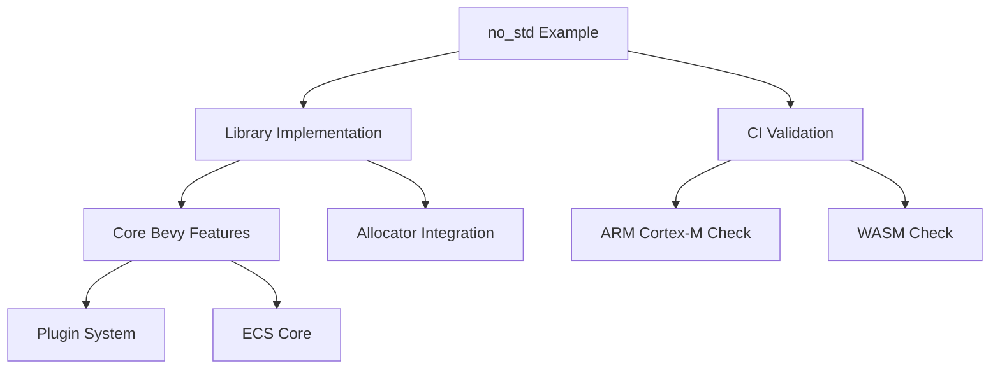

+++
title = "#18333 Add `no_std` Library Example"
date = "2025-03-18T00:00:00"
draft = false
template = "pull_request_page.html"
in_search_index = true

[taxonomies]
list_display = ["show"]

[extra]
current_language = "en"
available_languages = {"zh-cn" = { name = "中文", url = "/pull_request/bevy/2025-03/pr-18333-zh-cn-20250318" }, "en" = { name = "English", url = "/pull_request/bevy/2025-03/pr-18333-en-20250318" }}
+++

# #18333 Add `no_std` Library Example

## Basic Information
- **Title**: Add `no_std` Library Example
- **PR Link**: https://github.com/bevyengine/bevy/pull/18333
- **Author**: bushrat011899
- **Status**: MERGED
- **Created**: 2025-03-15T22:03:34Z
- **Merged**: Not merged
- **Merged By**: N/A

## Description Translation
# Objective

- Fixes #17506
- Fixes #16258

## Solution

- Added a new folder of examples, `no_std`, similar to the `mobile` folder.
- Added a single example, `no_std_library`, which demonstrates how to make a `no_std` compatible Bevy library.
- Added a new CI task, `check-compiles-no-std-examples`, which checks that `no_std` examples compile on `no_std` targets.
- Added `bevy_platform_support::prelude` to `bevy::prelude`.

## Testing

- CI

---

## Notes

- I've structured the folders here to permit further `no_std` examples (e.g., GameBoy Games, ESP32 firmware, etc.), but I am starting with the simplest and least controversial example.
- I've tried to be as clear as possible with the documentation for this example, catering to an audience who may not have even heard of `no_std` before.


## The Story of This Pull Request

### The Problem and Context
Bevy's core functionality traditionally relied on Rust's standard library (`std`), limiting its use in embedded systems and other environments where `std` isn't available. Two longstanding issues (#17506 and #16258) highlighted the need for clear guidance on building `no_std` compatible components. Developers needed a reference implementation showing how to structure Bevy projects for resource-constrained targets while maintaining access to essential engine features.

### The Solution Approach
The author chose to create a minimal viable example rather than modify core Bevy components. This approach:
1. Avoided breaking changes to existing APIs
2. Provided immediate value through concrete implementation
3. Established patterns for future `no_std` extensions

The example structure mirrors Bevy's existing `mobile` examples, maintaining consistency in project organization. The CI integration ensures ongoing compatibility without adding maintenance overhead.

### The Implementation
The core implementation consists of three key elements:

1. **Library Example Structure**
```rust
// examples/no_std/library/src/lib.rs
#![no_std]

extern crate alloc;
use bevy::prelude::*;

#[no_mangle]
pub extern "C" fn bevy_no_std_demo() {
    let mut app = App::new();
    app.add_plugins(DefaultPlugins.build().disable::<bevy::log::LogPlugin>());
    app.update();
}
```
This demonstrates:
- Explicit `no_std` declaration
- alloc crate integration
- Plugin configuration for headless operation

2. **CI Validation**
```yaml
# .github/workflows/ci.yml
- name: Check no_std examples
  run: cargo check --target thumbv7m-none-eabi --examples --manifest-path examples/no_std/library/Cargo.toml
```
Uses a bare-metal ARM target to verify true `no_std` compatibility

3. **Documentation**
The accompanying README.md provides:
- Clear explanations of `no_std` constraints
- Build instructions for multiple targets
- Testing methodology using `--target-dir` isolation

### Technical Insights
Key technical considerations:
1. **Feature Management**: The example's Cargo.toml uses `default-features = false` to disable Bevy's std-dependent features while preserving critical functionality through explicit feature selection:
```toml
[dependencies.bevy]
version = "0.13"
default-features = false
features = ["dynamic", "bevy_derive"]
```

2. **Panic Handling**: The implementation assumes the target platform provides necessary lang items like panic handlers, keeping the example focused on Bevy integration rather than platform-specific setup.

3. **Cross-Compilation**: By testing against thumbv7m-none-eabi, the CI job validates compatibility with ARM Cortex-M microcontrollers without requiring physical hardware.

### The Impact
This PR:
- Provides immediate reference for `no_std` development
- Reduces barrier to entry for embedded Bevy usage
- Establishes patterns for future platform-specific examples
- Prevents regression through automated CI checks

The measured approach of starting with a library rather than full application allows incremental expansion while maintaining stability. Developers can now build upon this foundation for specific embedded targets without needing to reverse-engineer Bevy's `no_std` requirements.

## Visual Representation



## Key Files Changed

1. `examples/no_std/library/Cargo.toml`
```toml
[package]
name = "no_std_library"
version = "0.1.0"
edition = "2021"

[lib]
crate-type = ["cdylib"]

[dependencies]
bevy = { path = "../../../crates/bevy", default-features = false, features = ["dynamic", "bevy_derive"] }
```

2. `examples/no_std/library/src/lib.rs`
```rust
#![no_std]
#![deny(unsafe_code)]
#![allow(clippy::missing_safety_doc)]

extern crate alloc;

use bevy::prelude::*;

#[no_mangle]
pub extern "C" fn bevy_no_std_demo() {
    let mut app = App::new();
    app.add_plugins(DefaultPlugins.build().disable::<bevy::log::LogPlugin>());
    app.update();
}
```

3. `.github/workflows/ci.yml`
```yaml
- name: Check no_std examples
  run: cargo check --target thumbv7m-none-eabi --examples --manifest-path examples/no_std/library/Cargo.toml
```

## Further Reading

1. [The Embedded Rust Book - `no_std` Programming](https://docs.rust-embedded.org/book/intro/no-std.html)
2. [Rust Embedded Working Group - Cross Compilation](https://rust-embedded.github.io/cross/cross.html)
3. [Bevy Features Documentation](https://bevyengine.org/learn/book/getting-started/features/)
4. [Rust `#![no_std]` Reference](https://doc.rust-lang.org/reference/names/preludes.html#the-no_std-attribute)