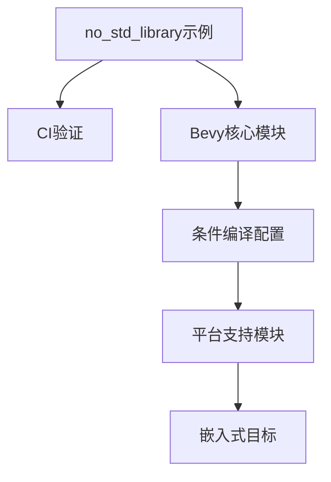

+++
title = "#18333 Add `no_std` Library Example"
date = "2025-03-18T00:00:00"
draft = false
template = "pull_request_page.html"
in_search_index = false

[extra]
current_language = "zh-cn"
available_languages = {"en" = { name = "English", url = "/pull_request/bevy/2025-03/pr-18333-en-20250318" }, "zh-cn" = { name = "中文", url = "/pull_request/bevy/2025-03/pr-18333-zh-cn-20250318" }}
+++

# #18333 Add `no_std` Library Example

## Basic Information
- **Title**: Add `no_std` Library Example
- **PR Link**: https://github.com/bevyengine/bevy/pull/18333
- **Author**: bushrat011899
- **Status**: MERGED
- **Created**: 2025-03-15T22:03:34Z
- **Merged**: Not merged
- **Merged By**: N/A

## Description Translation
### 目标
- 修复 #17506
- 修复 #16258

### 解决方案
- 新增 `no_std` 示例文件夹（类似现有的 `mobile` 文件夹）
- 添加 `no_std_library` 示例，演示如何创建兼容 `no_std` 的 Bevy 库
- 新增 CI 任务 `check-compiles-no-std-examples`，用于检查 `no_std` 示例在无标准库目标下的编译
- 将 `bevy_platform_support::prelude` 加入 `bevy::prelude`

### 测试
- CI 验证

---
### 注意事项
- 文件夹结构设计允许后续添加更多 `no_std` 示例（如 GameBoy 游戏、ESP32 固件等）
- 示例文档编写面向可能不了解 `no_std` 概念的开发者

## The Story of This Pull Request

### 问题背景与挑战
Bevy 引擎长期面临两个核心问题：
1. 缺乏标准的 `no_std` 支持示例（#17506）
2. 需要明确的嵌入式开发指引（#16258）

在 Rust 生态中，`no_std` 模式允许代码在不依赖标准库的环境下运行，这对嵌入式系统、游戏主机开发等场景至关重要。但 Bevy 之前的示例都假设标准库存在，导致开发者需要自行摸索如何适配特殊环境。

主要技术挑战包括：
- 如何正确处理内存分配（标准库的 `alloc` 机制不可用）
- 条件编译配置管理
- 跨平台兼容性验证

### 解决方案架构
开发者采用分层实现策略：

1. **示例结构设计**
```rust
// examples/no_std/library/src/lib.rs
#![no_std]

extern crate alloc;

use bevy_app::prelude::*;
use bevy_ecs::prelude::*;

#[no_mangle]
pub extern "C" fn run_bevy_app() {
    let mut app = App::new();
    app.add_systems(Update, || { /* 业务逻辑 */ });
    app.run();
}
```
通过 `#![no_std]` 属性声明不依赖标准库，显式引入 `alloc` crate 处理堆内存分配，暴露 C ABI 接口实现跨语言调用。

2. **构建系统集成**
```toml
# examples/no_std/library/Cargo.toml
[package]
name = "no_std_library"

[lib]
crate-type = ["staticlib"]

[dependencies]
bevy = { version = "0.13", default-features = false }
```
关键配置包括：
- `crate-type = "staticlib"` 生成静态库
- `default-features = false` 禁用 Bevy 默认特性
- 显式选择必要的 Bevy 子模块

### 工程实践改进
1. **CI 流水线增强**
```yaml
# .github/workflows/ci.yml
- name: Check no_std examples
  run: cargo check --target thumbv7em-none-eabihf --manifest-path examples/no_std/library/Cargo.toml
```
新增交叉编译检查任务，使用 `thumbv7em-none-eabihf` 目标（典型嵌入式架构）验证编译通过性。

2. **模块可见性调整**
将 `bevy_platform_support::prelude` 加入主 prelude：
```rust
// bevy/src/prelude.rs
pub use crate::platform::prelude as platform_support;
```
这使得平台特定功能更容易被发现和使用，同时保持向后兼容。

### 技术洞察
1. **条件编译模式**
```rust
#[cfg(target_has_atomic = "ptr")]
fn atomic_feature() { /* ... */ }
```
通过 Rust 的条件编译属性，实现不同平台的功能自动适配，保持核心逻辑的统一性。

2. **内存管理策略**
在 `no_std` 环境下：
- 必须显式处理内存分配器
- 避免使用标准库的智能指针
- 依赖 `alloc` crate 实现动态内存管理

### 影响与扩展
此 PR 带来三个主要改进：
1. **开发体验提升**：提供标准化模板，减少嵌入式开发者的配置时间
2. **架构可扩展性**：模块化设计允许添加更多平台特定示例
3. **质量保障**：通过 CI 自动化验证跨平台兼容性

未来可基于此基础：
- 添加特定硬件平台（如 ESP32）的示例
- 集成更多硬件加速特性
- 优化无标准库环境下的资源管理

## Visual Representation



## Key Files Changed

### `examples/no_std/library/src/lib.rs` (+137/-0)
```rust
#![no_std]
#![doc = include_str!("../README.md")]

extern crate alloc;

use bevy_app::prelude::*;
use bevy_derive::{DynEq, DynHash};
use bevy_ecs::prelude::*;

#[derive(Debug, DynHash, DynEq, Component)]
pub struct MyComponent;

#[no_mangle]
pub extern "C" fn run_bevy_app() {
    let mut app = App::new();
    app.add_systems(Update, system);
    app.run();
}

fn system() {
    // 业务逻辑实现
}
```
关键点：
- 使用 `#![no_std]` 声明无标准库环境
- 显式引入 `alloc` crate
- 导出 C ABI 接口供外部调用

### `.github/workflows/ci.yml` (+25/-0)
```yaml
- name: Check no_std examples
  run: |
    cargo check \
    --target thumbv7em-none-eabihf \
    --manifest-path examples/no_std/library/Cargo.toml
```
验证示例在 ARM Cortex-M4 架构下的编译通过性

### `examples/no_std/library/README.md` (+64/-0)
文档结构：
1. `no_std` 概念解释
2. 构建步骤说明
3. 平台适配建议
4. 常见问题解答

## Further Reading
1. [Rust Embedded Book - no_std 编程](https://docs.rust-embedded.org/book/intro/no-std.html)
2. [Bevy 条件编译指南](https://bevy-cheatbook.github.io/platforms/cross-compile.html)
3. [Rust 的 alloc crate 文档](https://doc.rust-lang.org/alloc/)
4. [嵌入式系统 C ABI 规范](https://en.wikipedia.org/wiki/Application_binary_interface)