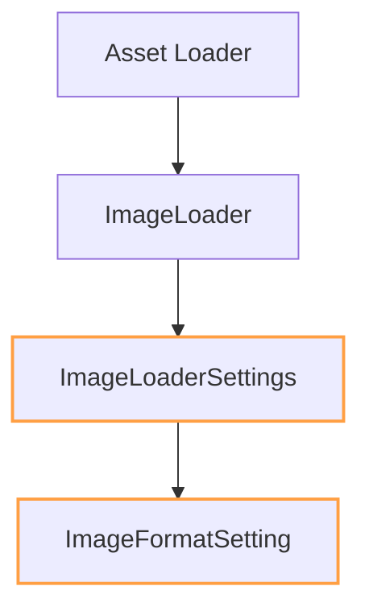

+++
title = "#18335 Derive Clone for `ImageLoaderSettings` and `ImageFormatSetting`"
date = "2025-03-16T00:00:00"
draft = false
template = "pull_request_page.html"
in_search_index = true

[taxonomies]
list_display = ["show"]

[extra]
current_language = "en"
available_languages = {"en" = { name = "English", url = "/pull_request/bevy/2025-03/pr-18335-en-20250316" }, "zh-cn" = { name = "中文", url = "/pull_request/bevy/2025-03/pr-18335-zh-cn-20250316" }}
+++

# #18335 Derive Clone for `ImageLoaderSettings` and `ImageFormatSetting`

## Basic Information
- **Title**: Derive Clone for `ImageLoaderSettings` and `ImageFormatSetting`
- **PR Link**: https://github.com/bevyengine/bevy/pull/18335
- **Author**: Noxmore
- **Status**: MERGED
- **Created**: 2025-03-16T03:35:45Z
- **Merged**: Not merged
- **Merged By**: N/A

## Description Translation
# Objective

I was setting up an asset loader that passes settings through to `ImageLoader`, and i have to clone the settings to achieve this.

## Solution

Derive `Clone` for `ImageLoaderSettings` and `ImageFormatSetting`.

## Testing

Full CI passed.

## The Story of This Pull Request

The PR addresses a common ergonomics issue when working with Bevy's asset loading system. The developer encountered a practical problem while configuring an asset loader that needed to pass settings to the `ImageLoader`. The core issue stemmed from Rust's ownership system - without a `Clone` implementation for `ImageLoaderSettings`, reusing these settings required either moving ownership (which isn't always feasible) or implementing manual cloning logic.

The solution demonstrates Rust's trait derivation capabilities. By adding `#[derive(Clone)]` to both `ImageLoaderSettings` and its constituent `ImageFormatSetting`, the implementation:
1. Maintains backward compatibility
2. Requires zero additional maintenance
3. Enables straightforward cloning of loader configurations

This change is particularly valuable in asset pipeline setups where multiple loaders might need similar configurations or where settings need to be reused across different loading contexts. The derived implementation ensures all fields (including nested ones like `ImageFormatSetting`) are properly cloned, which is essential since `ImageLoaderSettings` contains a `format: ImageFormatSetting` field.

The technical validation through full CI passing indicates that:
- No existing traits bounds were broken
- The change didn't introduce any unexpected side effects
- All existing tests continued to pass with the new implementation

## Visual Representation



## Key Files Changed

### `crates/bevy_image/src/image_loader.rs` (+2/-2)
**Purpose**: Enable cloning of image loader configuration structs

Before:
```rust
#[derive(Default, Debug, Serialize, Deserialize)]
pub struct ImageLoaderSettings {
    pub format: ImageFormatSetting,
    pub is_srgb: bool,
    pub sampler: SamplerDescriptor<'static>,
    pub cpu_persistent_access: RenderAssetPersistencePolicy,
    pub asset_usage: RenderAssetUsages,
}

#[derive(Default, Debug, Serialize, Deserialize)]
pub enum ImageFormatSetting {
    // Variants omitted
}
```

After:
```rust
#[derive(Clone, Default, Debug, Serialize, Deserialize)]
pub struct ImageLoaderSettings {
    pub format: ImageFormatSetting,
    pub is_srgb: bool,
    pub sampler: SamplerDescriptor<'static>,
    pub cpu_persistent_access: RenderAssetPersistencePolicy,
    pub asset_usage: RenderAssetUsages,
}

#[derive(Clone, Default, Debug, Serialize, Deserialize)]
pub enum ImageFormatSetting {
    // Variants omitted
}
```

The changes add `Clone` to the derive macros for both structs. This allows deep cloning of loader configurations, which is particularly useful when:
1. Creating multiple similar loaders
2. Passing settings through wrapper types
3. Implementing builder patterns for asset configuration

## Further Reading
- [Rust Clone trait documentation](https://doc.rust-lang.org/std/clone/trait.Clone.html)
- [Bevy Asset System Overview](https://bevyengine.org/learn/book/assets/)
- [Derivable Traits in Rust](https://doc.rust-lang.org/book/appendix-03-derivable-traits.html)