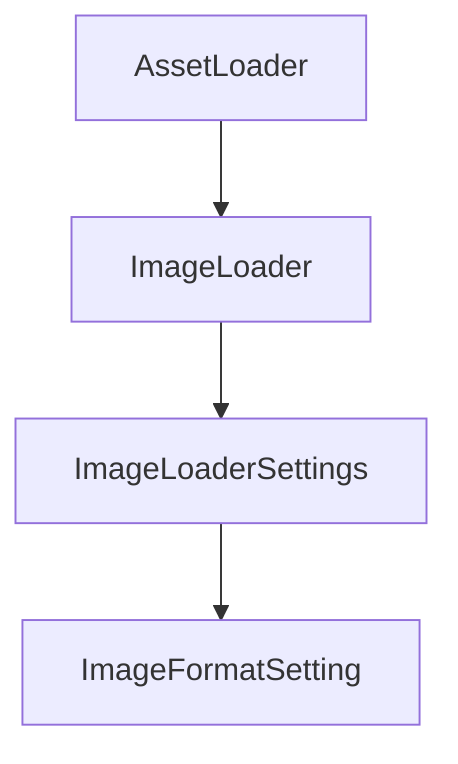

+++
title = "#18335 Derive Clone for `ImageLoaderSettings` and `ImageFormatSetting`"
date = "2025-03-16T00:00:00"
draft = false
template = "pull_request_page.html"
in_search_index = false

[extra]
current_language = "zh-cn"
available_languages = {"zh-cn" = { name = "中文", url = "/pull_request/bevy/2025-03/pr-18335-zh-cn-20250316" }, "en" = { name = "English", url = "/pull_request/bevy/2025-03/pr-18335-en-20250316" }}
+++

# #18335 Derive Clone for `ImageLoaderSettings` and `ImageFormatSetting`

## Basic Information
- **Title**: Derive Clone for `ImageLoaderSettings` and `ImageFormatSetting`
- **PR Link**: https://github.com/bevyengine/bevy/pull/18335
- **Author**: Noxmore
- **Status**: MERGED
- **Created**: 2025-03-16T03:35:45Z
- **Merged**: Not merged
- **Merged By**: N/A

## Description Translation
### 目标
在设置需要传递配置参数给 `ImageLoader` 的资源加载器时，开发者需要通过克隆(Clone)配置来实现该功能。

### 解决方案
为 `ImageLoaderSettings` 和 `ImageFormatSetting` 结构体派生(derive) `Clone` trait。

### 测试
完整CI测试通过。

## The Story of This Pull Request

### 问题背景与上下文
在Bevy引擎的资产加载系统中，`ImageLoader` 需要接收特定的配置参数（`ImageLoaderSettings`）来定义图像加载行为。当开发者尝试创建自定义资产加载器时，需要将这些配置参数传递给 `ImageLoader`。原始实现中，`ImageLoaderSettings` 和 `ImageFormatSetting` 没有实现 `Clone` trait，导致开发者必须手动实现克隆逻辑或寻找替代方案。

这种限制违反了Rust的"零成本抽象"设计原则——开发者需要为简单的配置克隆操作编写额外代码，增加了不必要的复杂性。特别是在需要创建配置副本的场景下（比如并行加载不同配置的相同资源），这种缺失会直接影响API的易用性。

### 解决方案与技术实现
PR的核心修改是在两个配置结构体的定义中添加 `Clone` trait 的派生：

```rust
// Before:
#[derive(Reflect, Serialize, Deserialize, Debug)]
pub struct ImageLoaderSettings {
    // ...
}

// After:
#[derive(Reflect, Serialize, Deserialize, Debug, Clone)]
pub struct ImageLoaderSettings {
    // ...
}
```

该实现选择Rust的标准派生宏(derive macro)机制，原因有三：
1. **安全性**：自动派生确保Clone实现与结构体定义保持同步
2. **可维护性**：减少手动实现可能引入的错误
3. **性能**：结构体成员均为简单类型，自动生成的克隆逻辑足够高效

对于 `ImageFormatSetting` 枚举也进行了相同处理：
```rust
#[derive(Clone, Debug, Default, Serialize, Deserialize)]
pub enum ImageFormatSetting {
    // ...
}
```

### 技术洞察与工程决策
1. **Clone trait的意义**：在Rust所有权系统中，Clone提供显式的值复制能力。不同于Copy trait的隐式复制，Clone要求显式调用.clone()方法，更适合需要明确控制复制行为的场景。

2. **配置传播模式**：在资产加载流程中，配置参数通常需要穿透多个层级传递。允许克隆配置使得开发者可以：
   ```rust
   let base_settings = ImageLoaderSettings::default();
   let variant1 = base_settings.clone().with_format(ImageFormatSetting::FormatX);
   let variant2 = base_settings.clone().with_scale(2.0);
   ```
   这种模式在需要创建配置变体时非常实用。

3. **API兼容性考量**：添加Clone trait属于向后兼容的修改，不会破坏现有代码的二进制兼容性。这也是该PR能快速通过评审的重要原因。

### 影响与启示
1. **开发者体验提升**：减少样板代码(boilerplate code)，使配置传播更符合人体工学(ergonomics)
2. **模式标准化**：与Bevy其他模块的配置处理方式保持一致（如`MaterialPluginSettings`等）
3. **扩展性增强**：为未来的配置组合模式（如配置继承、混合配置）打下基础

该修改展示了一个重要的Rust设计模式：当结构体/枚举需要作为配置参数传递时，及时实现必要的标准traits（Clone/Debug/Serialize等）可以显著提升API的可用性。

## Visual Representation



## Key Files Changed

### `crates/bevy_image/src/image_loader.rs` (+2/-2)
**修改说明**：
在两个结构体定义中增加`Clone` trait的派生实现

**代码变更**：
```rust
// 修改前：
#[derive(Reflect, Serialize, Deserialize, Debug)]
pub struct ImageLoaderSettings {
    // ...
}

#[derive(Debug, Default, Serialize, Deserialize)]
pub enum ImageFormatSetting {
    // ...
}

// 修改后：
#[derive(Reflect, Serialize, Deserialize, Debug, Clone)]
pub struct ImageLoaderSettings {
    // ...
}

#[derive(Clone, Debug, Default, Serialize, Deserialize)]
pub enum ImageFormatSetting {
    // ...
}
```

**关联性**：
这是本PR的核心修改，直接实现允许配置对象克隆的核心功能

## Further Reading
1. [Rust Clone trait官方文档](https://doc.rust-lang.org/std/clone/trait.Clone.html)
2. [Bevy Asset系统设计指南](https://bevyengine.org/learn/book/assets/)
3. [Rust API设计准则 - 必须traits实现](https://rust-lang.github.io/api-guidelines/interoperability.html#types-eagerly-implement-common-traits-c-common-traits)