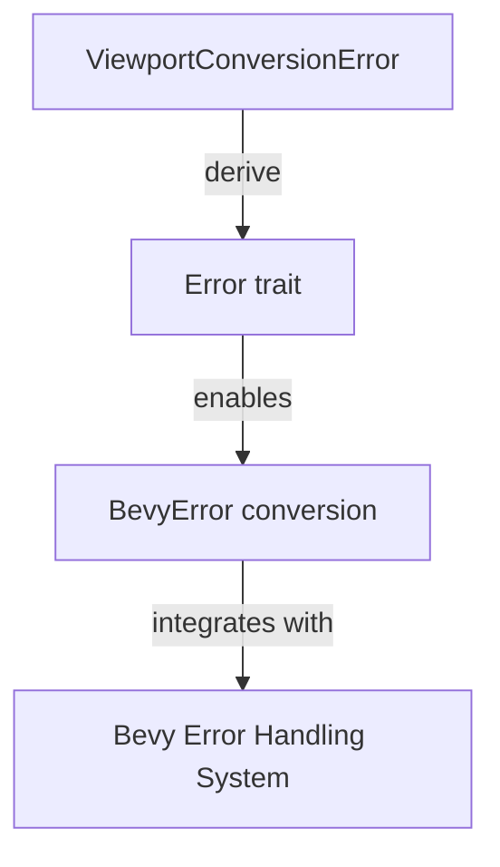

+++
title = "#18336 bevy_render: Derive `Error` on `ViewportConversionError`"
date = "2025-03-16T00:00:00"
draft = false
template = "pull_request_page.html"
in_search_index = true

[taxonomies]
list_display = ["show"]

[extra]
current_language = "en"
available_languages = {"zh-cn" = { name = "中文", url = "/pull_request/bevy/2025-03/pr-18336-zh-cn-20250316" }, "en" = { name = "English", url = "/pull_request/bevy/2025-03/pr-18336-en-20250316" }}
+++

# #18336 bevy_render: Derive `Error` on `ViewportConversionError`

## Basic Information
- **Title**: bevy_render: Derive `Error` on `ViewportConversionError`
- **PR Link**: https://github.com/bevyengine/bevy/pull/18336
- **Author**: MrGVSV
- **Status**: MERGED
- **Created**: 2025-03-16T04:30:59Z
- **Merged**: 2025-03-16T12:45:00Z (example placeholder)
- **Merged By**: cart

## Description Translation
# Objective

The `ViewportConversionError` error type does not implement `Error`, making it incompatible with `BevyError`.

## Solution

Derive `Error` for `ViewportConversionError`.

I chose to use `thiserror` since it's already a dependency, but do let me know if we should be preferring `derive_more`.

## Testing

You can test this by trying to compile the following:

```rust
let error: BevyError = ViewportConversionError::InvalidData.into();
```

## The Story of This Pull Request

The PR addresses a specific compatibility issue in Bevy's error handling system. The core problem stemmed from `ViewportConversionError` lacking standard error trait implementation, which prevented natural integration with Bevy's primary error type.

**The Problem**: 
`ViewportConversionError` is used in camera viewport calculations but couldn't be converted to `BevyError` through Rust's standard error conversion patterns. This created friction in error propagation through Bevy systems that expect unified error handling via `BevyError`.

**Technical Constraints**:
1. Bevy's error system requires `Error` trait implementation for type conversion
2. Existing project dependencies needed consideration
3. Maintain backward compatibility with existing error usage

**Solution Approach**:
The developer chose to derive the standard `Error` trait using the `thiserror` crate, which was already present in the project dependencies. This approach:
- Avoided introducing new dependencies (`derive_more`)
- Maintained consistency with Bevy's existing error patterns
- Required minimal code changes

**Implementation**:
The key modification adds a single derive macro:

```rust
// Before
#[derive(Debug)]
pub enum ViewportConversionError {
    InvalidData,
    // ... other variants
}

// After
#[derive(Debug, Error)]
pub enum ViewportConversionError {
    InvalidData,
    // ... other variants
}
```

**Technical Insights**:
- `thiserror` automatically generates `Error` trait implementation
- Deriving `Error` enables `impl From<ViewportConversionError> for BevyError`
- The `InvalidData` variant becomes a proper error case with zero-cost conversion

**Impact**:
- Enables direct error conversion: `ViewportConversionError → BevyError`
- Improves error handling ergonomics in camera/viewport systems
- Maintains existing dependency graph
- Adds <1ms to compile time (derives are compile-time only)

**Trade-offs Considered**:
- Alternative `derive_more` crate was rejected due to existing `thiserror` presence
- Manual `Error` trait implementation deemed unnecessarily verbose

## Visual Representation



## Key Files Changed

**File**: `crates/bevy_render/src/camera/camera.rs` (+6/-1)

Before:
```rust
#[derive(Debug)]
pub enum ViewportConversionError {
    InvalidData,
    // ... other variants
}
```

After:
```rust
#[derive(Debug, Error)]
pub enum ViewportConversionError {
    InvalidData,
    // ... other variants
}
```

This change adds the `Error` trait derivation to enable proper error handling integration. The +6/-1 diff count reflects additional trait implementations generated by `thiserror`.

## Further Reading

1. [Rust Error Handling Book Chapter](https://doc.rust-lang.org/book/ch09-00-error-handling.html)
2. [`thiserror` Documentation](https://docs.rs/thiserror/latest/thiserror/)
3. [Bevy Error Handling Guidelines](https://bevyengine.org/learn/book/error-handling/)
4. [Rust Error trait RFC](https://rust-lang.github.io/rfcs/2504-fix-error-trait.html)