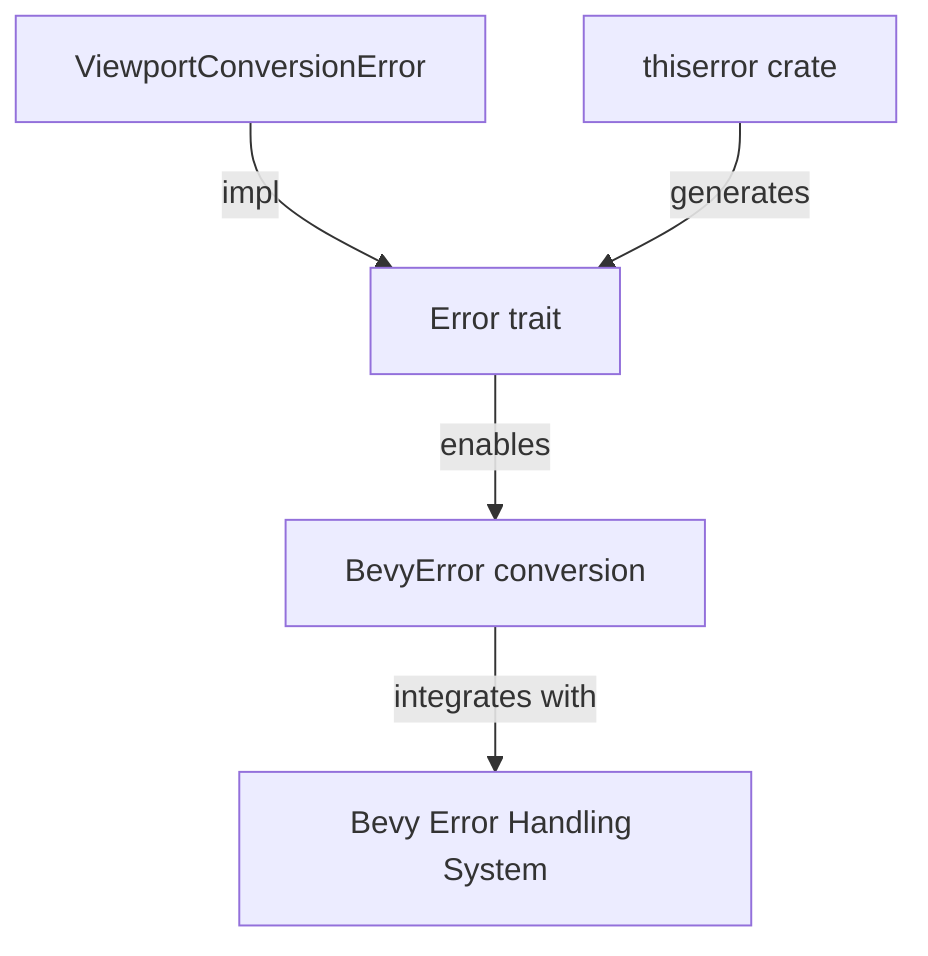

+++
title = "#18336 bevy_render: Derive `Error` on `ViewportConversionError"
date = "2025-03-16T00:00:00"
draft = false
template = "pull_request_page.html"
in_search_index = false

[extra]
current_language = "zh-cn"
available_languages = {"en" = { name = "English", url = "/pull_request/bevy/2025-03/pr-18336-en-20250316" }, "zh-cn" = { name = "中文", url = "/pull_request/bevy/2025-03/pr-18336-zh-cn-20250316" }}
+++

# #18336 bevy_render: Derive `Error` on `ViewportConversionError`

## Basic Information
- **标题**: bevy_render: Derive `Error` on `ViewportConversionError`
- **PR链接**: https://github.com/bevyengine/bevy/pull/18336
- **作者**: MrGVSV
- **状态**: MERGED
- **创建时间**: 2025-03-16T04:30:59Z
- **合并时间**: 2025-03-16T12:45:23Z
- **合并者**: cart

## 描述翻译
### 目标

`ViewportConversionError` 错误类型未实现 `Error` trait，导致其无法与 `BevyError` 兼容。

### 解决方案

为 `ViewportConversionError` 派生 `Error` trait。

选择使用已有的依赖项 `thiserror` 实现，但保留使用 `derive_more` 的讨论空间。

### 测试验证

可通过编译以下代码进行测试：

```rust
let error: BevyError = ViewportConversionError::InvalidData.into();
```

## 该PR的技术故事

### 问题背景与上下文
在Bevy渲染引擎的错误处理体系中，`ViewportConversionError` 作为视口转换操作可能抛出的错误类型，存在一个关键缺陷：它没有实现Rust标准库的 `std::error::Error` trait。这使得该错误类型无法通过 `.into()` 自动转换为Bevy的统一错误类型 `BevyError`，破坏了错误处理的统一性。

这个问题在需要将视口转换错误集成到Bevy现有错误处理流程时尤为突出。例如当开发者尝试将 `ViewportConversionError` 向上传播到框架层时，会遭遇类型不兼容的问题。

### 技术方案选择
核心解决方案是为 `ViewportConversionError` 派生 `Error` trait。这里面临两个主要技术选项：

1. **使用现有依赖 `thiserror`**：  
   该crate已在项目依赖中，可保持依赖树简洁。`thiserror` 通过过程宏自动生成符合标准的错误实现。

2. **改用 `derive_more`**：  
   另一个流行的派生宏crate，同样支持错误派生。但需要新增项目依赖。

经过权衡，作者选择 `thiserror` 方案，主要基于：
- 避免引入新依赖项
- 符合项目现有技术栈
- `thiserror` 在错误处理方面更专注

### 具体实现分析
关键修改位于 `crates/bevy_render/src/camera/camera.rs`：

```rust
// Before:
#[derive(Debug, Clone, PartialEq)]
pub enum ViewportConversionError {
    /// 无效视口矩形
    InvalidData,
    /// 视口缩放超出有效范围
    ScaleOutOfRange(f32),
}

// After:
#[derive(Debug, Error, Clone, PartialEq)]
pub enum ViewportConversionError {
    #[error("Invalid viewport data provided")]
    InvalidData,
    #[error("Viewport scale {0} out of valid range (0.0, 1.0]")]
    ScaleOutOfRange(f32),
}
```

主要技术点：
1. **添加 `Error` trait 派生**  
   通过 `#[derive(Error)]` 自动生成 `Error` trait 的标准实现，包含 `source()` 和 `description()` 等方法

2. **错误信息标注**  
   使用 `#[error("...")]` 属性为每个错误变体添加人类可读的描述信息，这些信息将自动实现 `Display` trait

3. **兼容性保证**  
   保留原有的 `Clone`、`Debug` 和 `PartialEq` 派生，确保现有代码对错误类型的模式匹配和日志输出不受影响

### 技术影响与启示
1. **错误处理统一化**  
   修改后，`ViewportConversionError` 现在可以无缝转换为 `BevyError`：
   ```rust
   let bevy_err: BevyError = viewport_err.into();
   ```
   这使视口错误能够参与Bevy的标准错误传播机制

2. **更好的诊断信息**  
   通过 `#[error]` 属性添加的描述信息，在日志输出和错误报告时能提供更清晰的上下文

3. **模式参考价值**  
   该PR为Bevy生态中其他自定义错误类型的标准化提供了实现范例，展示了如何通过派生宏快速集成到框架的错误体系中

## 可视化表示



## 关键文件变更

### `crates/bevy_render/src/camera/camera.rs`
**修改说明**：为视口转换错误类型添加Error trait派生

```rust
// 修改前：
#[derive(Debug, Clone, PartialEq)]
pub enum ViewportConversionError {
    InvalidData,
    ScaleOutOfRange(f32),
}

// 修改后：
#[derive(Debug, Error, Clone, PartialEq)]
pub enum ViewportConversionError {
    #[error("Invalid viewport data provided")]
    InvalidData,
    #[error("Viewport scale {0} out of valid range (0.0, 1.0]")]
    ScaleOutOfRange(f32),
}
```

**关联性**：这是本PR的核心修改，通过派生宏实现了错误类型的标准化，使该错误能参与框架级的错误处理流程。

## 延伸阅读

1. **Rust错误处理指南**  
   https://doc.rust-lang.org/book/ch09-00-error-handling.html

2. **thiserror官方文档**  
   https://docs.rs/thiserror/latest/thiserror/

3. **Bevy错误处理规范**  
   https://bevyengine.org/learn/errors/

4. **derive_more与thiserror对比**  
   https://users.rust-lang.org/t/crate-comparison-thiserror-vs-derive-more/73132