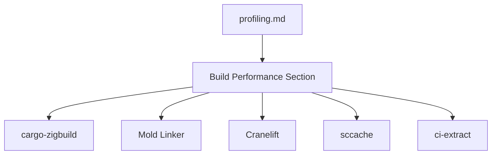

+++
title = "#18339 Build performance advice"
date = "2025-03-16T00:00:00"
draft = false
template = "pull_request_page.html"
in_search_index = true

[taxonomies]
list_display = ["show"]

[extra]
current_language = "en"
available_languages = {"en" = { name = "English", url = "/pull_request/bevy/2025-03/pr-18339-en-20250316" }, "zh-cn" = { name = "中文", url = "/pull_request/bevy/2025-03/pr-18339-zh-cn-20250316" }}
+++

# #18339 Build performance advice

## Basic Information
- **Title**: Build performance advice
- **PR Link**: https://github.com/bevyengine/bevy/pull/18339
- **Author**: mockersf
- **Status**: MERGED
- **Created**: 2025-03-16T08:57:18Z
- **Merged**: 2025-03-16T12:14:22Z
- **Merged By**: cart

## Description Translation
# Objective

- Fixes #18331 

## Solution

- Add some info on other tools that `cargo timings`


## The Story of This Pull Request

The PR addresses a documentation gap in Bevy's build performance guidance. While `cargo timings` was already mentioned as a profiling tool, users needed more comprehensive advice for optimizing compilation speeds. The author recognized that build times are a common pain point in Rust projects and expanded the documentation to include practical tool recommendations.

The core addition is a new section in `docs/profiling.md` titled "Build performance", which lists several optimization strategies:

1. **cargo-zigbuild**: Cross-compilation tool that can improve build speeds
2. **Mold linker**: Modern linker that significantly reduces linking times
3. **Cranelift backend**: Alternative codegen backend for Rust
4. **sccache**: Compilation caching system
5. **ci-extract**: Bevy-specific tool for optimizing CI pipelines

The documentation update follows a pattern of concisely presenting each tool with:
- Installation commands
- Basic usage examples
- Configuration snippets
- Visual indicators like warning icons for platform limitations

Notably, the author included platform-specific considerations, such as:
```markdown
 **The Cranelift backend requires a nightly Rust toolchain**
```

This change directly impacts developer experience by centralizing build optimization knowledge that was previously scattered or required tribal knowledge. The inclusion of both general Rust tools (like mold and sccache) and Bevy-specific utilities (ci-extract) creates a holistic reference for performance tuning.

## Visual Representation



## Key Files Changed

### `docs/profiling.md` (+34/-1)
**Purpose**: Expand build performance documentation beyond cargo timings

Before:
```markdown
## Cargo Timings

Use `cargo build --timings` to see where time is being spent during compilation.
```

After:
```markdown
## Cargo Timings

Use `cargo build --timings` to see where time is being spent during compilation.

## Build performance

### Use cargo-zigbuild
[...]

### Use the mold linker
[...]

### Use the Cranelift backend
[...]

### Use sccache
[...]

### Use ci-extract
[...]
```

The changes add five subsections with concrete instructions for each optimization tool, creating a comprehensive performance tuning guide.

## Further Reading

1. [cargo-zigbuild documentation](https://github.com/messense/cargo-zigbuild)
2. [Mold linker performance benchmarks](https://github.com/rui314/mold)
3. [sccache caching strategies](https://github.com/mozilla/sccache)
4. [Cranelift codegen backend RFC](https://github.com/rust-lang/rfcs/pull/3351)
5. [Bevy CI optimization discussion](https://github.com/bevyengine/bevy/issues/8700)