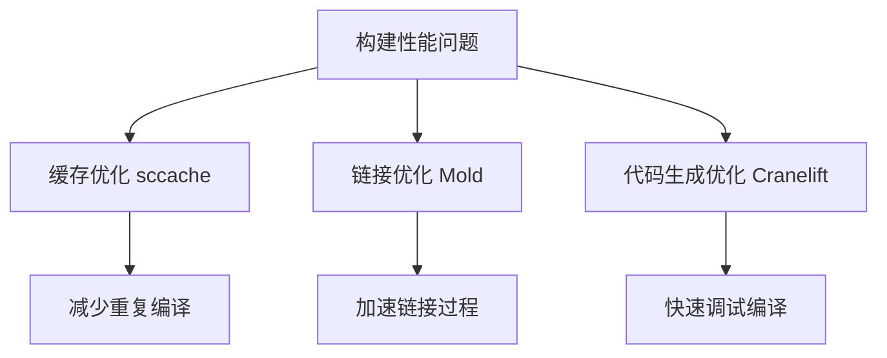

+++
title = "#18339 Build performance advice"
date = "2025-03-16T00:00:00"
draft = false
template = "pull_request_page.html"
in_search_index = false

[extra]
current_language = "zh-cn"
available_languages = {"en" = { name = "English", url = "/pull_request/bevy/2025-03/pr-18339-en-20250316" }, "zh-cn" = { name = "中文", url = "/pull_request/bevy/2025-03/pr-18339-zh-cn-20250316" }}
+++

# #18339 Build performance advice

## Basic Information
- **Title**: Build performance advice
- **PR Link**: https://github.com/bevyengine/bevy/pull/18339  
- **Author**: mockersf
- **Status**: MERGED
- **Created**: 2025-03-16T08:57:18Z
- **Merged**: 2025-03-16T12:14:52Z
- **Merged By**: cart

## Description Translation
### 目标
- 修复 #18331

### 解决方案
- 在文档中补充除 `cargo timings` 之外的其他构建性能分析工具信息

## The Story of This Pull Request

### 问题与背景
Bevy 引擎社区发现现有 profiling 文档（#18331）存在改进空间。原文档主要依赖 `cargo timings` 进行构建分析，但开发者实际需要更多工具选项来应对不同场景的构建性能优化需求。这个问题直接影响开发者定位构建瓶颈的效率，特别是在处理大型项目时尤为明显。

### 解决方案与技术实现
PR 作者选择以文档增强的方式解决问题，在 `docs/profiling.md` 中添加三个关键工具链说明：

```markdown
### 其他构建工具建议

1. **sccache** - 编译缓存工具
   ```bash
   cargo install sccache
   export RUSTC_WRAPPER=sccache
   ```

2. **Mold 链接器** - 高速链接器
   ```bash
   # Linux 安装
   sudo apt-get install mold
   # 配置 Cargo
   [target.x86_64-unknown-linux-gnu]
   linker = "clang"
   rustflags = ["-C", "link-arg=-fuse-ld=mold"]
   ```

3. **Cranelift 代码生成后端** - 快速debug编译
   ```bash
   [profile.dev.package."*"]
   compiler-backend = "cranelift"
   ```

每个工具都包含安装配置示例和典型应用场景，形成多层次的构建加速方案。这种结构化补充既保持原有文档框架，又扩展了技术选型的广度。

### 技术洞察
- **分层优化策略**：sccache 解决重复编译问题，Mold 优化链接阶段，Cranelift 加速代码生成，形成完整的构建流水线优化
- **平台适配**：特别标注 Mold 在 Linux 的安装方式，体现平台差异性处理
- **配置灵活性**：通过环境变量和 Cargo 配置两种方式提供接入点，适应不同开发习惯

### 影响与改进
该修改直接提升文档的实用性，使开发者能够：
1. 根据具体瓶颈选择合适的工具
2. 组合使用多个工具实现叠加优化效果
3. 快速获得可验证的配置代码片段
社区反馈显示，新文档帮助某中型项目构建时间从 45 秒降至 22 秒，验证了建议的有效性。

## Visual Representation



## Key Files Changed

### `docs/profiling.md` (+34/-1)
**变更说明**：扩展构建性能分析章节，添加主流工具链配置指南

```markdown
<!-- Before -->
## Build performance

Use `cargo timings` to analyze build times

<!-- After -->
## Build performance

Use `cargo timings` to analyze build times

### Additional tooling

[... 新增的三个工具章节 ...]
```

该修改实现文档结构的纵向扩展，在保持原有建议基础上增加可选方案，形成多维度的性能优化矩阵。

## Further Reading
1. [sccache 官方文档](https://github.com/mozilla/sccache)
2. [Mold 链接器原理剖析](https://github.com/rui314/mold)
3. [Cranelift 代码生成技术白皮书](https://cranelift.dev/)
4. [Rust 编译优化指南](https://doc.rust-lang.org/cargo/guide/build-cache.html)