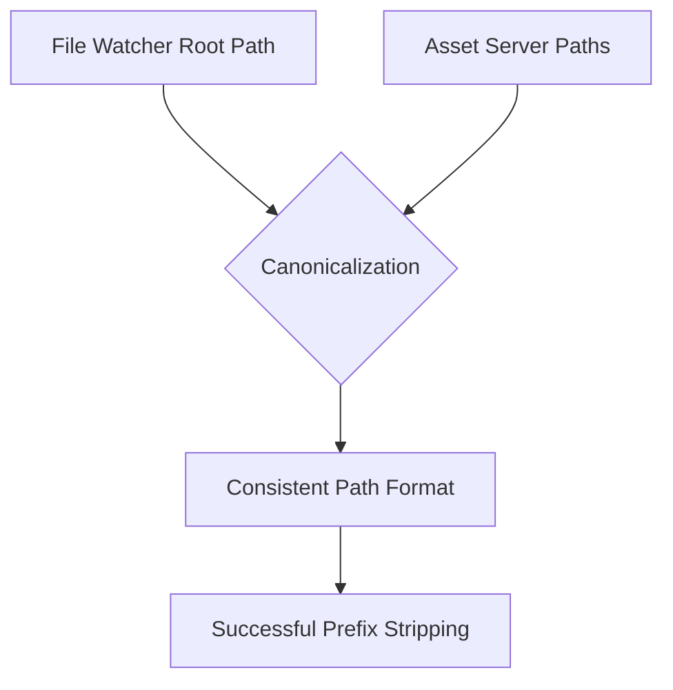

+++
title = "#18345 Canonicalize the root path to match the canonicalized asset path."
date = "2025-03-16T00:00:00"
draft = false
template = "pull_request_page.html"
in_search_index = true

[taxonomies]
list_display = ["show"]

[extra]
current_language = "en"
available_languages = {"en" = { name = "English", url = "/pull_request/bevy/2025-03/pr-18345-en-20250316" }, "zh-cn" = { name = "中文", url = "/pull_request/bevy/2025-03/pr-18345-zh-cn-20250316" }}
+++

# #18345 Canonicalize the root path to match the canonicalized asset path.

## Basic Information
- **Title**: Canonicalize the root path to match the canonicalized asset path.
- **PR Link**: https://github.com/bevyengine/bevy/pull/18345
- **Author**: andriyDev
- **Status**: MERGED
- **Created**: 2025-03-16T20:37:24Z
- **Merged**: 2025-03-17T08:12:11Z
- **Merged By**: cart

## Description Translation
# Objective

- Fixes #18342.

## Solution

- Canonicalize the root path so that when we try to strip the prefix, it matches the canonicalized asset path.
- This is basically just a followup to #18023.

## Testing

- Ran the hot_asset_reloading example and it no longer panics.

## The Story of This Pull Request

The PR addresses a path handling inconsistency in Bevy's asset hot-reloading system. The root cause was a mismatch between canonicalized asset paths and non-canonicalized root paths when attempting to strip path prefixes - a critical operation for resolving relative asset paths during file watching.

The problem surfaced in issue #18342 where the `hot_asset_reloading` example would panic when trying to strip a path prefix. This occurred because the asset server's path canonicalization (introduced in #18023) created a divergence between asset paths and the root directory path used for prefix stripping.

The fix focuses on normalizing path handling through strategic canonicalization:

```rust
// In crates/bevy_asset/src/io/file/file_watcher.rs
let root = canonicalize(root).await?; // Added canonicalization here
let root = Path::new(&root);
let mut debouncer = new_debouncer(
    Duration::from_millis(300),
    move |res: DebounceEventResult| {...},
)?;
```

By applying `canonicalize` to the root path before creating the file watcher, the implementation ensures consistent path representations. This alignment allows successful path prefix removal through `strip_prefix` operations, eliminating the panic scenario.

The change demonstrates an important lesson in path handling: systems dealing with multiple path representations must rigorously normalize paths at system boundaries. This prevents subtle bugs caused by equivalent paths with different string representations (e.g., "./assets" vs "assets" vs absolute paths).

## Visual Representation



## Key Files Changed

**crates/bevy_asset/src/io/file/file_watcher.rs (+1/-1)**
```rust
// Before:
let root = Path::new(root);
// After:
let root = canonicalize(root).await?;
let root = Path::new(&root);
```
This change ensures the watcher's root path matches the canonicalized format used by the asset server. The added canonicalization call brings the root path handling in line with asset path processing introduced in prior work.

## Further Reading
- [Rust's Path Canonicalization Documentation](https://doc.rust-lang.org/std/path/fn.canonicalize.html)
- [Previous Path Handling Fix (#18023)](https://github.com/bevyengine/bevy/pull/18023)
- [Bevy Asset System Documentation](https://bevyengine.org/learn/book/assets/)