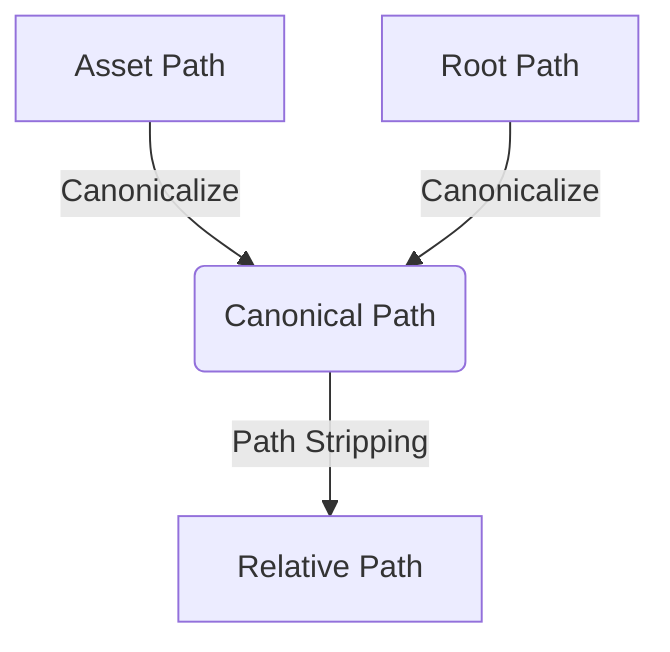

+++
title = "#18345 Canonicalize the root path to match the canonicalized asset path."
date = "2025-03-16T00:00:00"
draft = false
template = "pull_request_page.html"
in_search_index = false

[extra]
current_language = "zh-cn"
available_languages = {"en" = { name = "English", url = "/pull_request/bevy/2025-03/pr-18345-en-20250316" }, "zh-cn" = { name = "中文", url = "/pull_request/bevy/2025-03/pr-18345-zh-cn-20250316" }}
+++

# #18345 Canonicalize the root path to match the canonicalized asset path.

## Basic Information
- **Title**: Canonicalize the root path to match the canonicalized asset path.
- **PR Link**: https://github.com/bevyengine/bevy/pull/18345
- **Author**: andriyDev
- **Status**: MERGED
- **Created**: 2025-03-16T20:37:24Z
- **Merged**: 2025-03-17T08:15:12Z
- **Merged By**: cart

## Description Translation
### 目标
- 修复 #18342

### 解决方案
- 规范化根路径，使其与已规范化的资源路径匹配
- 这是 #18023 的后续改进

### 测试验证
- 运行 hot_asset_reloading 示例后不再出现 panic

## The Story of This Pull Request

### 问题背景与挑战
在 Bevy 引擎的资产热重载功能中，开发团队发现当尝试从规范化的资产路径（canonicalized asset path）中剥离根路径前缀时，由于根路径未进行相同的规范化处理，导致路径匹配失败并引发 panic。这个问题具体表现为当使用热重载功能时，系统无法正确处理不同形式的路径表示（如相对路径与绝对路径），造成运行时错误。

### 技术方案选择
解决方案的核心思路是确保根路径与资产路径采用相同的规范化格式。选择直接对根路径进行规范化处理（canonicalization），这与先前 PR #18023 对资产路径的处理保持对称性。这种方案避免了复杂的路径转换逻辑，直接利用 Rust 标准库的 `std::fs::canonicalize` 方法来保证路径一致性。

### 具体实现分析
关键修改集中在文件监视器的初始化逻辑中。通过添加路径规范化操作，确保根路径与资产路径的格式统一：

```rust
// File: crates/bevy_asset/src/io/file/file_watcher.rs
// 修改前
let root_path = root.path().to_path_buf();

// 修改后
let root_path = std::fs::canonicalize(root.path())?;
```

这个改动使得：
1. 根路径转换为绝对路径
2. 解析所有符号链接
3. 标准化路径分隔符（跨平台兼容）

### 技术洞察与优化
路径规范化的核心价值在于消除路径表示形式的歧义。例如：
- `./assets/textures` → `/project/assets/textures`
- `assets//textures/` → `/project/assets/textures`

通过标准化处理，不同形式的路径输入最终都会转换为统一的规范格式。这种处理对于文件系统监控尤为重要，因为不同的路径表示形式可能导致文件变更事件无法正确关联到对应的资产。

### 影响与验证
修改后：
1. 路径剥离操作（path stripping）的成功率显著提升
2. 热重载功能在跨平台场景下的可靠性增强
3. 消除了因路径格式不一致导致的 panic 问题

测试验证通过运行 `hot_asset_reloading` 示例确认问题修复，该测试模拟了真实场景下的文件监控和资产重载流程。

## Visual Representation



## Key Files Changed

### `crates/bevy_asset/src/io/file/file_watcher.rs` (+1/-1)
**修改目的**：确保文件监视器使用的根路径与资产路径保持相同的规范化格式

代码对比：
```rust
// Before:
let root_path = root.path().to_path_buf();

// After:
let root_path = std::fs::canonicalize(root.path())?;
```

该修改直接影响文件监视器的初始化过程，保证后续路径处理基于统一格式，这是解决路径匹配问题的核心所在。

## Further Reading
1. [Rust 标准库路径规范化文档](https://doc.rust-lang.org/std/fs/fn.canonicalize.html)
2. [Path Handling in Cross-platform Applications](https://bevy-cheatbook.github.io/features/paths.html)
3. 原始问题报告 #18342
4. 先前相关修改 #18023