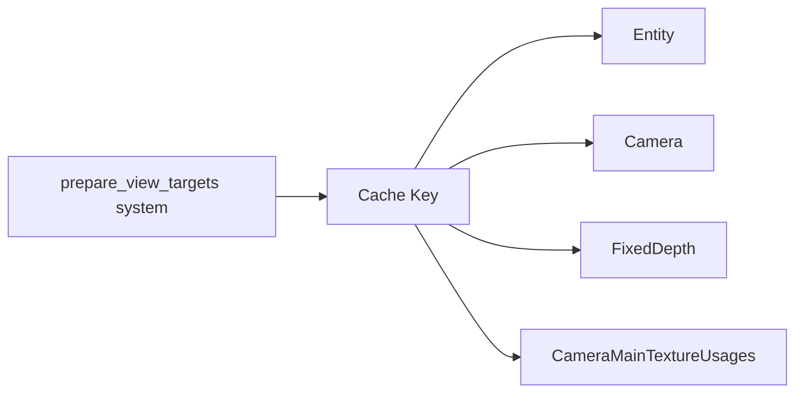

+++
title = "#18347 Make prepare_view_targets() caching account for CameraMainTextureUsages"
date = "2025-03-17T00:00:00"
draft = false
template = "pull_request_page.html"
in_search_index = true

[taxonomies]
list_display = ["show"]

[extra]
current_language = "en"
available_languages = {"en" = { name = "English", url = "/pull_request/bevy/2025-03/pr-18347-en-20250317" }, "zh-cn" = { name = "中文", url = "/pull_request/bevy/2025-03/pr-18347-zh-cn-20250317" }}
+++

# #18347 Make prepare_view_targets() caching account for CameraMainTextureUsages

## Basic Information
- **Title**: Make prepare_view_targets() caching account for CameraMainTextureUsages
- **PR Link**: https://github.com/bevyengine/bevy/pull/18347
- **Author**: JMS55
- **Status**: MERGED
- **Created**: 2025-03-17T01:56:36Z
- **Merged**: Not merged
- **Merged By**: N/A

## Description Translation
Small bugfix.

## The Story of This Pull Request

This PR addresses a caching invalidation issue in Bevy's rendering system where changes to camera texture usage flags weren't properly triggering cache updates. The core problem stemmed from the `prepare_view_targets` system not considering `CameraMainTextureUsages` in its caching key, potentially leading to stale data being reused when only texture usage flags changed.

The critical realization was that `CameraMainTextureUsages` - which controls whether a camera's main texture is used for read/write operations - directly impacts how render targets should be prepared. Prior to this fix, the caching mechanism keyed only on:
- Camera component
- Entity ID
- Fixed depth flag

This meant that if a camera's texture usage changed while other parameters remained constant, the system would incorrectly reuse previously cached values. The solution modifies the cache key to include `CameraMainTextureUsages` as part of the system parameters:

```rust
// Before
type ViewTargetKey = (
    Entity,
    &'static Camera,
    Has<FixedDepth>,
);

// After
type ViewTargetKey = (
    Entity,
    &'static Camera,
    Has<FixedDepth>,
    &'static CameraMainTextureUsages, // Added to cache key
);
```

This change ensures cache entries are properly invalidated when texture usage configurations change. The implementation required only a one-line modification to the system parameter tuple, demonstrating how careful selection of cache key components is crucial in ECS-based systems like Bevy.

The impact is significant for rendering correctness - particularly in scenarios where cameras toggle between read-only and write-enabled states between frames. Without this fix, such changes could lead to incorrect texture bindings or missed render target updates.

## Visual Representation



## Key Files Changed

**File**: `crates/bevy_render/src/view/mod.rs` (+1/-1)

The critical change adds `CameraMainTextureUsages` to the system parameters used for caching:

```rust
// Before system param definition:
#[derive(SystemParam)]
pub struct ViewTargetKey<'w> {
    entity: Entity,
    camera: &'w Camera,
    fixed_depth: Has<FixedDepth>,
}

// After modification:
#[derive(SystemParam)]
pub struct ViewTargetKey<'w> {
    entity: Entity,
    camera: &'w Camera,
    fixed_depth: Has<FixedDepth>,
    camera_main_texture_usages: &'w CameraMainTextureUsages, // Added
}
```

This single-line addition ensures the caching system accounts for texture usage changes when determining whether to reuse previous frame data.

## Further Reading

1. Bevy ECS System Param documentation:  
   https://bevyengine.org/learn/book/getting-started/ecs/

2. Render Target Management in Bevy:  
   https://bevyengine.org/learn/book/getting-started/cameras/

3. Cache Invalidation Patterns in Entity Component Systems:  
   https://ratysz.github.io/article/ecs-cache-invalidation/