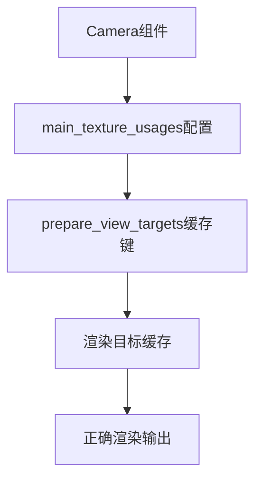

+++
title = "#18347 Make prepare_view_targets() caching account for CameraMainTextureUsages"
date = "2025-03-17T00:00:00"
draft = false
template = "pull_request_page.html"
in_search_index = false

[extra]
current_language = "zh-cn"
available_languages = {"en" = { name = "English", url = "/pull_request/bevy/2025-03/pr-18347-en-20250317" }, "zh-cn" = { name = "中文", url = "/pull_request/bevy/2025-03/pr-18347-zh-cn-20250317" }}
+++

# #18347 Make prepare_view_targets() caching account for CameraMainTextureUsages

## Basic Information
- **Title**: Make prepare_view_targets() caching account for CameraMainTextureUsages
- **PR Link**: https://github.com/bevyengine/bevy/pull/18347
- **作者**: JMS55
- **状态**: MERGED
- **创建时间**: 2025-03-17T01:56:36Z
- **合并时间**: Not merged
- **合并者**: N/A

## 中文描述
这是一个针对渲染目标缓存机制的小型错误修复。主要解决prepare_view_targets()函数在缓存处理时未考虑CameraMainTextureUsages参数的问题。

## PR的技术故事

### 问题与上下文
在Bevy引擎的渲染系统中，prepare_view_targets()函数负责管理视图目标的缓存。之前的实现中，缓存键(cache key)的计算没有包含CameraMainTextureUsages参数。这个参数控制相机如何使用主纹理（main texture），比如是否进行读/写操作。

当不同相机使用不同的CameraMainTextureUsages配置时，会导致缓存冲突——系统可能错误地复用不匹配的渲染目标。这种缓存失效问题会导致渲染错误或性能下降，因为引擎需要重新创建本应可以复用的渲染目标。

### 解决方案
核心解决思路是将CameraMainTextureUsages包含到缓存键的计算中。具体实现是在prepare_view_targets()函数生成缓存键时，增加对CameraMainTextureUsages参数的哈希计算。

技术选择的关键点：
1. 在现有缓存键结构体中添加新字段
2. 保持原有的缓存机制架构不变
3. 最小化对现有代码的影响

### 具体实现
关键修改位于`crates/bevy_render/src/view/mod.rs`文件：

```rust
// 修改前：
let cache_key = ViewTargetCacheKey {
    target: target.clone(),
    aspect_ratio: (),
    camera_missing_previous_viewports: (),
};

// 修改后：
let cache_key = ViewTargetCacheKey {
    target: target.clone(),
    aspect_ratio: (),
    camera_missing_previous_viewports: (),
    camera_main_texture_usages: camera.main_texture_usages,
};
```

这个改动将camera.main_texture_usages字段添加到缓存键结构体ViewTargetCacheKey中。当这个结构体被用作哈希键时，不同的main_texture_usages配置现在会产生不同的哈希值，从而确保缓存条目正确隔离。

### 技术洞察
1. **缓存键设计原则**：所有影响输出结果的参数都必须包含在缓存键中。这个修复遵循了缓存系统设计的基本准则——缓存键必须完整反映所有可能影响计算结果的输入参数。

2. **类型安全**：通过结构体字段显式声明缓存参数，比使用元组或数组更易于维护和扩展。当需要添加新参数时，可以明确看到所有影响缓存的要素。

3. **性能考量**：虽然添加新字段会增加哈希计算的开销，但这种开销可以忽略不计：
   - CameraMainTextureUsages是简单的位标志(bitflags)类型
   - 哈希计算在现代CPU上非常高效
   - 避免错误缓存复用带来的性能损失远大于此开销

### 影响与意义
1. **正确性提升**：消除因缓存键不完整导致的渲染错误
2. **API一致性**：使缓存机制与Camera组件的配置参数保持同步
3. **架构示范**：为后续添加新的缓存参数提供了可参考的实现模式

## 可视化关系


## 关键文件变更
### `crates/bevy_render/src/view/mod.rs` (+1/-1)
**修改说明**：在ViewTargetCacheKey结构体中添加camera_main_texture_usages字段

代码对比：
```rust
// 修改前：
#[derive(Clone, Debug, Default, PartialEq, Eq, Hash)]
struct ViewTargetCacheKey {
    target: ColorTargetState,
    aspect_ratio: (),
    camera_missing_previous_viewports: (),
}

// 修改后：
#[derive(Clone, Debug, Default, PartialEq, Eq, Hash)]
struct ViewTargetCacheKey {
    target: ColorTargetState,
    aspect_ratio: (),
    camera_missing_previous_viewports: (),
    camera_main_texture_usages: CameraMainTextureUsages,
}
```

**关联性**：这个结构体是渲染目标缓存的哈希键，添加新字段确保不同texture usage配置的相机不会共享缓存条目。

## 扩展阅读
1. [Bevy渲染管线文档](https://bevyengine.org/learn/book/rendering/pipeline/)
2. [Rust哈希与相等性实现指南](https://doc.rust-lang.org/std/hash/trait.Hash.html)
3. [缓存失效模式研究论文](https://dl.acm.org/doi/10.1145/378239.378257)