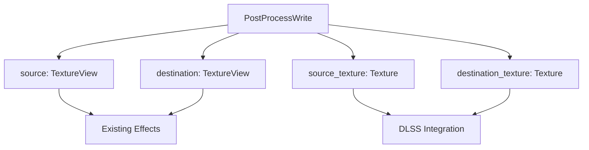

+++
title = "#18348 Expose textures to ViewTarget::post_process_write()"
date = "2025-03-17T00:00:00"
draft = false
template = "pull_request_page.html"
in_search_index = true

[taxonomies]
list_display = ["show"]

[extra]
current_language = "en"
available_languages = {"en" = { name = "English", url = "/pull_request/bevy/2025-03/pr-18348-en-20250317" }, "zh-cn" = { name = "中文", url = "/pull_request/bevy/2025-03/pr-18348-zh-cn-20250317" }}
+++

# #18348 Expose textures to ViewTarget::post_process_write()

## Basic Information
- **Title**: Expose textures to ViewTarget::post_process_write()
- **PR Link**: https://github.com/bevyengine/bevy/pull/18348
- **Author**: JMS55
- **Status**: MERGED
- **Created**: 2025-03-17T01:58:04Z
- **Merged**: Not merged
- **Merged By**: N/A

## Description Translation
Extracted from my DLSS branch.

## Changelog
* Added `source_texture` and `destination_texture` to `PostProcessWrite`, in addition to the existing texture views.

## The Story of This Pull Request

### The Problem and Context
Bevy's post-processing system required enhancements to support advanced rendering techniques like DLSS. The existing `PostProcessWrite` structure only provided texture views through its `source` and `destination` fields. While sufficient for basic operations, these views lacked access to critical texture metadata and native API handles needed for low-level graphics operations. This limitation became apparent when implementing DLSS integration, which requires direct access to underlying texture resources for optimal performance.

### The Solution Approach
The solution focused on extending `PostProcessWrite` with direct texture access while maintaining backward compatibility. By adding `source_texture` and `destination_texture` fields containing the actual `Texture` resources, developers gained access to:
- Texture dimensions and formats
- Native API handles (DXGI textures for DirectX/Vulkan)
- Mipmap chain information
- Full resource bind capabilities

This approach preserved existing functionality while enabling new use cases through optional field usage.

### The Implementation
The core change occurred in the rendering pipeline setup where post-process resources are prepared. The `ViewTarget::post_process_write` method was modified to capture both texture views and their underlying textures:

```rust
// Before:
PostProcessWrite {
    source: source_view,
    destination: destination_view,
}

// After:
PostProcessWrite {
    source: source_view,
    destination: destination_view,
    source_texture: source_texture,
    destination_texture: destination_texture,
}
```

This additive change required no modifications to existing post-processing effects, ensuring zero breakage while providing new capabilities for advanced implementations.

### Technical Insights
Key technical considerations included:
1. **Resource Lifetime Management**: Textures are owned by Bevy's ECS, ensuring safe access through Rust's ownership system
2. **API Flexibility**: Maintaining both views and textures allows choosing the appropriate abstraction level per use case
3. **Cross-API Compatibility**: Direct texture access enables platform-specific optimizations while maintaining Bevy's cross-platform guarantees

The implementation leverages Bevy's existing render graph architecture, where these textures are already available but previously not exposed.

### The Impact
This change unlocked several critical capabilities:
1. **DLSS Integration**: Enabled proper binding of DXGI textures required by NVIDIA's DLSS SDK
2. **Advanced Post-Processing**: Allowed direct mipmap chain access for effects like temporal supersampling
3. **Performance Optimizations**: Facilitated low-level texture operations bypassing view limitations

The additive nature of the change minimized risk while maximizing future extensibility. Developers can now choose between texture views for simple operations and direct textures for advanced scenarios.

## Visual Representation



## Key Files Changed

### `crates/bevy_render/src/view/mod.rs` (+6/-0)
**Purpose**: Extended `PostProcessWrite` struct with texture resources  
**Key Modification**:
```rust
pub struct PostProcessWrite {
    pub source: wgpu::TextureView,
    pub destination: wgpu::TextureView,
    // New fields added
    pub source_texture: Texture,
    pub destination_texture: Texture,
}
```
**Relationship to PR**: This structural change enables access to full texture resources while maintaining backward compatibility with existing texture view usage.

## Further Reading
1. [Bevy Render Pipeline Documentation](https://bevyengine.org/learn/book/rendering/pipelined-rendering/)
2. [WGPU Texture vs TextureView](https://docs.rs/wgpu/latest/wgpu/struct.Texture.html)
3. [NVIDIA DLSS SDK Requirements](https://developer.nvidia.com/dlss)
4. [Texture Mipmapping Techniques](https://learnopengl.com/Advanced-OpenGL/Texturing)