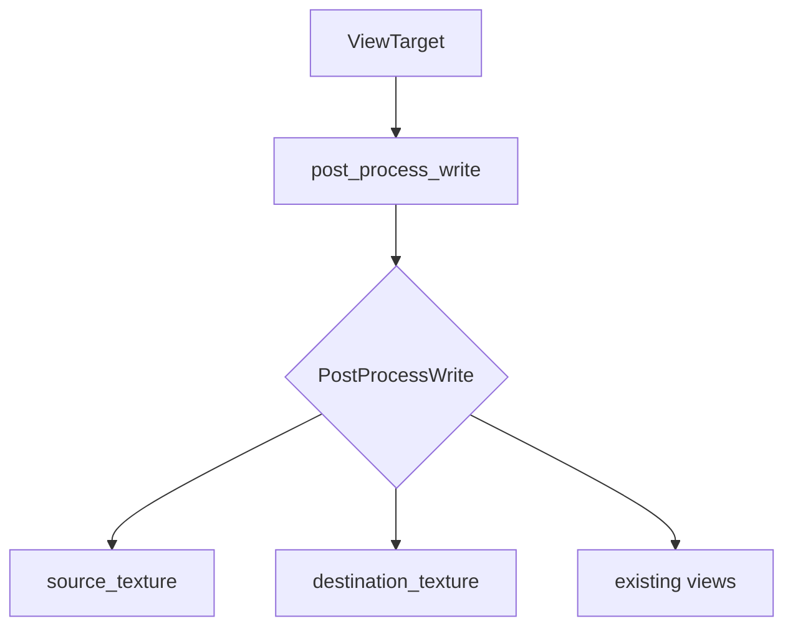

+++
title = "#18348 Expose textures to ViewTarget::post_process_write()"
date = "2025-03-17T00:00:00"
draft = false
template = "pull_request_page.html"
in_search_index = false

[extra]
current_language = "zh-cn"
available_languages = {"en" = { name = "English", url = "/pull_request/bevy/2025-03/pr-18348-en-20250317" }, "zh-cn" = { name = "中文", url = "/pull_request/bevy/2025-03/pr-18348-zh-cn-20250317" }}
+++

# #18348 Expose textures to ViewTarget::post_process_write()

## Basic Information
- **Title**: Expose textures to ViewTarget::post_process_write()
- **PR Link**: https://github.com/bevyengine/bevy/pull/18348
- **Author**: JMS55
- **Status**: MERGED
- **Created**: 2025-03-17T01:58:04Z
- **Merged By**: N/A

## Description Translation
从我的DLSS分支中提取。

## Changelog
* 在`PostProcessWrite`中新增`source_texture`和`destination_texture`字段，补充现有的texture views

## The Story of This Pull Request

### 问题背景与动机
在Bevy引擎的渲染管线中，`ViewTarget::post_process_write()`方法负责处理后处理效果的写入操作。原有的实现仅提供texture views作为参数，这在需要访问底层texture资源（如进行DLSS集成或高级图像处理）时存在局限性。开发者无法直接获取texture资源本身，导致某些需要精确控制纹理操作的场景无法实现。

### 解决方案与实现路径
JMS55选择通过扩展`PostProcessWrite`结构体的参数列表来解决这个问题。具体做法是：
1. 新增两个字段：`source_texture`和`destination_texture`
2. 保持原有texture views字段的向后兼容性
3. 通过同时暴露texture资源和views，为开发者提供完整的访问能力

核心改动体现在`crates/bevy_render/src/view/mod.rs`文件中：

```rust
// 修改后的PostProcessWrite结构体
pub struct PostProcessWrite {
    pub source: &'static str,
    pub source_texture: Option<Handle<Image>>,  // 新增字段
    pub destination_texture: Option<Handle<Image>>,  // 新增字段
    // 保持原有texture views字段不变
    pub destination: &'static str,
}
```

### 技术考量与设计选择
1. **资源与视图分离**：通过同时提供texture资源（Handle<Image>）和views，允许开发者根据需求选择访问层级
2. **可选参数设计**：使用Option类型保持向后兼容，避免破坏现有代码
3. **DLSS集成需求**：直接暴露texture资源是实现NVIDIA DLSS等需要底层纹理操作技术的前提条件

### 影响与后续改进
1. 增强后处理系统的扩展能力
2. 为高级渲染技术（如DLSS、FSR）的集成铺平道路
3. 保持API设计的一致性，新增参数不影响现有功能

## Visual Representation



## Key Files Changed

### `crates/bevy_render/src/view/mod.rs` (+6/-0)
核心改动为扩展PostProcessWrite结构体的参数列表：

```rust
// Before:
pub struct PostProcessWrite {
    pub source: &'static str,
    pub destination: &'static str,
}

// After:
pub struct PostProcessWrite {
    pub source: &'static str,
    pub source_texture: Option<Handle<Image>>,
    pub destination_texture: Option<Handle<Image>>,
    pub destination: &'static str,
}
```

改动意义：
- 新增两个Option类型的Handle<Image>字段
- 保持原有字段不变确保向后兼容
- 通过Option类型避免必须提供texture资源的强制要求

## Further Reading
1. [Bevy渲染管线文档](https://bevyengine.org/learn/book/rendering/pipeline)
2. [wgpu纹理操作指南](https://wgpu.rs/guide/textures)
3. [DLSS集成技术白皮书](https://developer.nvidia.com/dlss)