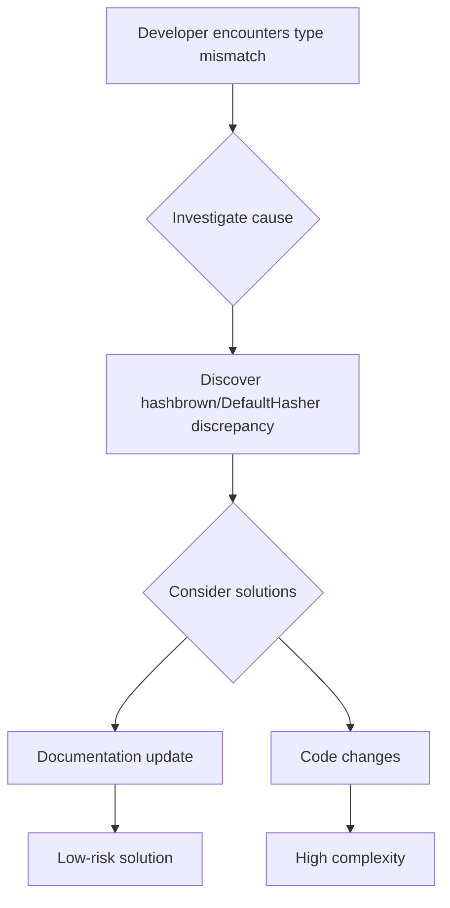

+++
title = "#18350 Update docs to explain default Hasher issue"
date = "2025-03-18T00:00:00"
draft = false
template = "pull_request_page.html"
in_search_index = true

[taxonomies]
list_display = ["show"]

[extra]
current_language = "en"
available_languages = {"en" = { name = "English", url = "/pull_request/bevy/2025-03/pr-18350-en-20250318" }, "zh-cn" = { name = "中文", url = "/pull_request/bevy/2025-03/pr-18350-zh-cn-20250318" }}
+++

# #18350 Update docs to explain default Hasher issue

## Basic Information
- **Title**: Update docs to explain default Hasher issue
- **PR Link**: https://github.com/bevyengine/bevy/pull/18350
- **Author**: krunchington
- **Status**: MERGED
- **Created**: 2025-03-17T03:07:24Z
- **Merged**: Not merged
- **Merged By**: N/A

## Description Translation
# Objective

I experienced an issue where `HashMap::new` was not returning a value typed appropriately for a `HashMap<K,V>` declaration that omitted the Hasher- e.g. the Default Hasher for the type is different than what the `new` method produces.

After discussion on discord, this appears to be an issue in `hashbrown`, and working around it would be very nontrivial, requiring a newtype on top of the `hashbrown` implementation.  Rather than doing that, it was suggested that we add docs to make the issue more visible and provide a clear workaround.

## Solution

Updated the docs for `bevy_platform_support::collections`.  I couldn't update Struct docs because they're re-exports, so I had to settle for the module.

Note that the `[HashMap::new]` link wasn't generating properly- I'm not sure why.  I see the method in the docs.rs site, https://docs.rs/hashbrown/0.15.1/hashbrown/struct.HashMap.html#method.new, but not on the generated internal documentation.  I wonder if `hashbrown` isn't actually implementing the new or something? 

## Testing

n/a although I did generate and open the docs on my Ubuntu machine.

---

## Showcase

before:


after:


## The Story of This Pull Request

The PR addresses a subtle type inference issue arising from discrepancies between Rust's default Hasher implementation and hashbrown's HashMap. When developers omitted the Hasher type parameter in HashMap declarations, they encountered unexpected type mismatches because `HashMap::new()` from hashbrown uses a different default Hasher than the standard library's DefaultHasher.

Key technical points:
1. The core problem stemmed from hashbrown's HashMap implementation using AHash as its default Hasher, while type inference in type-omitted declarations would expect the standard DefaultHasher
2. Attempting to fix this through type aliases or newtype wrappers would require significant architectural changes due to hashbrown's implementation details
3. The pragmatic solution focused on documentation improvements to surface the issue and provide clear guidance

The implementation added module-level documentation to `bevy_platform_support::collections` with:
- A warning about the default Hasher discrepancy
- Concrete code examples demonstrating both the problem and workaround
- Guidance to use `Default::default()` instead of `::new()` when omitting Hasher parameters

```rust
// Before: No documentation about Hasher defaults
// After: Added module documentation
#![allow(rustdoc::broken_intra_doc_links)]
//! - `HashMap`: A hash map configured with `ahash` randomness...
//! 
//! ### Important Note on Default Hashers
//! When using type aliases that omit generic parameters...
//! 
//! ```rust
//! // This will NOT compile
//! let map: HashMap<u32, u32> = HashMap::new();
//! 
//! // Instead use
//! let map: HashMap<u32, u32> = Default::default();
//! ```
```

The documentation changes achieve three main goals:
1. Make developers aware of the implicit Hasher differences
2. Provide immediate workaround for compilation errors
3. Guide users toward type-safe initialization patterns

## Visual Representation



## Key Files Changed

1. `crates/bevy_platform_support/src/collections.rs`
```rust
// Before: No Hasher documentation
// Module docs about collection types

// After: Added warning and examples
#![allow(rustdoc::broken_intra_doc_links)]
//! ### Important Note on Default Hashers
//! When using type aliases that omit generic parameters...
```

2. `crates/bevy_platform_support/Cargo.toml`
```toml
# Added lint allowance for docs
[package.metadata.docs.rs]
all-features = true
rustdoc-args = ["-Dwarnings"]
+ rustdoc-args = ["-Dwarnings", "--allow", "rustdoc::broken_intra_doc_links"]
```

## Further Reading

1. [Rust HashMap documentation](https://doc.rust-lang.org/std/collections/struct.HashMap.html)
2. [hashbrown crate documentation](https://docs.rs/hashbrown/latest/hashbrown/)
3. [AHash performance characteristics](https://github.com/tkaitchuck/aHash)
4. [Rust type inference guide](https://doc.rust-lang.org/book/ch03-02-data-types.html#type-inference)