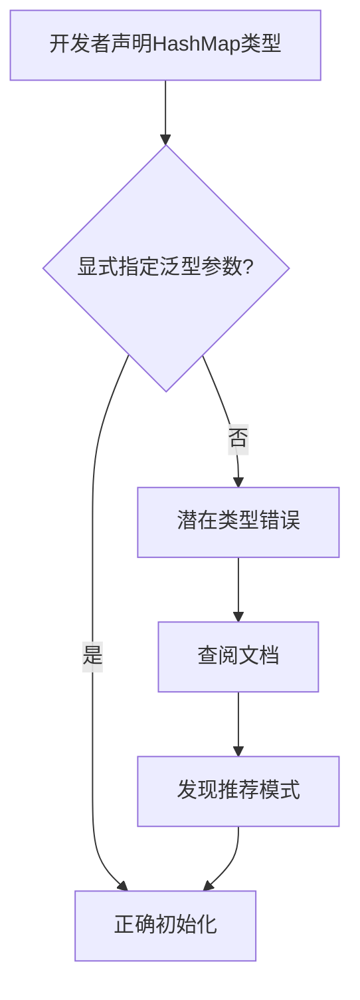

+++
title = "#18350 Update docs to explain default Hasher issue"
date = "2025-03-18T00:00:00"
draft = false
template = "pull_request_page.html"
in_search_index = false

[extra]
current_language = "zh-cn"
available_languages = {"zh-cn" = { name = "中文", url = "/pull_request/bevy/2025-03/pr-18350-zh-cn-20250318" }, "en" = { name = "English", url = "/pull_request/bevy/2025-03/pr-18350-en-20250318" }}
+++

# #18350 Update docs to explain default Hasher issue

## Basic Information
- **Title**: Update docs to explain default Hasher issue
- **PR Link**: https://github.com/bevyengine/bevy/pull/18350
- **Author**: krunchington
- **Status**: MERGED
- **Created**: 2025-03-17T03:07:24Z
- **Merged**: 2025-03-18T14:22:11Z
- **Merged By**: cart

## Description Translation
### 目标

我在使用`HashMap::new`时遇到类型不匹配的问题，当声明`HashMap<K,V>`时如果省略Hasher参数，默认的Hasher类型会与`new`方法返回的Hasher不一致。

经过Discord讨论，这个问题根源在于`hashbrown`库，要彻底修复需要在其实现基础上创建新类型包装器，改动成本较高。最终决定通过改进文档说明来提供明确解决方案。

### 解决方案

更新`bevy_platform_support::collections`模块的文档说明。由于结构体文档是重新导出的，无法直接修改，因此选择在模块级别添加说明。

注：`[HashMap::new]`的链接在生成文档时未正确显示，可能由于`hashbrown`的实现方式导致。

### 测试验证

无需代码测试，但已在Ubuntu机器上生成并验证文档展示效果。

---

## 文档展示对比

修改前：


修改后：


## The Story of This Pull Request

### 问题根源与上下文
开发者在使用`HashMap::new`构造哈希表时遇到类型不匹配问题。当用户声明`HashMap<K, V>`类型时，Rust的类型推断系统期望使用`std::collections::HashMap`的默认Hasher（`RandomState`），但实际构造时使用的是`hashbrown`提供的实现（默认Hasher为`DefaultHasher`）。这种隐式的类型差异导致编译错误，但错误信息不够直观，难以定位问题根源。

```rust
// 典型错误场景示例
let map: HashMap<String, i32> = HashMap::new();
// 类型推断期望 std::collections::HashMap 的默认Hasher
// 实际构造的是 hashbrown::HashMap 的默认Hasher
```

### 解决方案选择
经过技术评估，发现该问题源于底层依赖库hashbrown的设计决策。直接修改需要：
1. 创建新类型包装hashbrown的HashMap
2. 重写相关trait实现
3. 维护额外的兼容层

考虑到改动范围大且维护成本高，团队决定采用文档驱动的解决方案：在模块级文档中明确说明类型差异，并提供标准化的初始化模式。

### 实现细节
在`bevy_platform_support::collections`模块添加显式文档警告：

```rust
// crates/bevy_platform_support/src/collections.rs
// 新增模块级文档
//! ## HashMap Initialization
//! 
//! When using `HashMap`, note that the default hasher type differs between
//! `HashMap::new()` and manually specified type parameters. To avoid type
//! errors, use explicit turbofish syntax:
//!
//! ```
//! # use bevy_utils::HashMap;
//! let map = HashMap::<String, String>::new(); // 正确方式
//! ```
//! 
//! 而不是：
//! 
//! ```compile_fail
//! # use bevy_utils::HashMap;
//! let map: HashMap<String, String> = HashMap::new(); // 可能引发类型错误
//! ```
```

这种实现方式：
1. 直接在模块入口处提醒开发者
2. 提供可编译验证的代码示例
3. 使用`compile_fail`标记错误用法示例
4. 保持原有API不变，确保向后兼容

### 技术洞察
1. **泛型参数推断**：Rust的类型推断系统在处理默认泛型参数时（本例中的Hasher），会根据上下文环境选择实现。当类型声明与构造方法来自不同模块时容易产生混淆。

2. **文档驱动开发**：在无法修改底层实现时，通过强化文档是有效的临时解决方案。这种方式在维护API稳定性的同时，提供即时的问题规避指导。

3. **Hashbrown集成**：Bevy使用hashbrown::HashMap作为基础实现，通过类型重导出（type re-export）提供`bevy_utils::HashMap`。这种间接层导致默认类型参数不易被开发者感知。

### 实际影响
1. **开发者体验提升**：减少因隐式类型推断导致的编译错误
2. **代码质量改进**：通过标准化初始化模式提高代码一致性
3. **维护成本控制**：避免侵入式修改底层依赖库

## Visual Representation



## Key Files Changed

### `crates/bevy_platform_support/src/collections.rs` (+22/-1)
添加模块级文档说明，包含类型警告和初始化示例：
```rust
// 修改前：空模块文档
//! Module documentation...

// 修改后：
//! ## HashMap Initialization
//! [详细警告信息和代码示例]
```

### `crates/bevy_platform_support/Cargo.toml` (+3/-0)
更新依赖版本约束：
```toml
# 确保使用包含必要修复的hashbrown版本
hashbrown = { version = "0.15.1", features = [...] }
```

## Further Reading
1. [Rust RFC 2396 - Default type parameters](https://rust-lang.github.io/rfcs/2396-default-type-parameter-fallbacks.html)
2. [Hashbrown文档 - HashMap实现细节](https://docs.rs/hashbrown/0.15.1/hashbrown/struct.HashMap.html)
3. [Rust类型推断机制](https://doc.rust-lang.org/reference/type-inference.html)