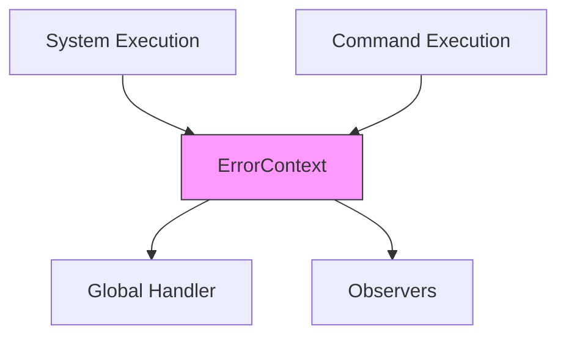

+++
title = "#18351 Unify and simplify command and system error handling"
date = "2025-03-18T00:00:00"
draft = false
template = "pull_request_page.html"
in_search_index = true

[taxonomies]
list_display = ["show"]

[extra]
current_language = "en"
available_languages = {"en" = { name = "English", url = "/pull_request/bevy/2025-03/pr-18351-en-20250318" }, "zh-cn" = { name = "中文", url = "/pull_request/bevy/2025-03/pr-18351-zh-cn-20250318" }}
+++

# #18351 Unify and simplify command and system error handling

## Basic Information
- **Title**: Unify and simplify command and system error handling
- **PR Link**: https://github.com/bevyengine/bevy/pull/18351
- **Author**: alice-i-cecile
- **Status**: MERGED
- **Created**: 2025-03-17T04:57:31Z
- **Merged**: Not merged
- **Merged By**: N/A

## Description Translation
# Objective

- ECS error handling is a lovely flagship feature for Bevy 0.16, all in the name of reducing panics and encouraging better error handling (#14275).
- Currently though, command and system error handling are completely disjoint and use different mechanisms.
- Additionally, there's a number of distinct ways to set the default/fallback/global error handler that have limited value. As far as I can tell, this will be cfg flagged to toggle between dev and production builds in 99.9% of cases, with no real value in more granular settings or helpers.
- Fixes #17272

## Solution

- Standardize error handling on the OnceLock global error mechanisms ironed out in https://github.com/bevyengine/bevy/pull/17215
   - As discussed there, there are serious performance concerns there, especially for commands
   - I also think this is a better fit for the use cases, as it's truly global
- Move from `SystemErrorContext` to a more general purpose `ErrorContext`, which can handle observers and commands more clearly
- Cut the superfluous setter methods on `App` and `SubApp`
- Rename the limited (and unhelpful) `fallible_systems` example to `error_handling`, and add an example of command error handling

## Testing

Ran the `error_handling` example.

## Notes for reviewers

- Do you see a clear way to allow commands to retain &mut World access in the per-command custom error handlers? IMO that's a key feature here (allowing the ad-hoc creation of custom commands), but I'm not sure how to get there without exploding complexity.
- I've removed the feature gate on the default_error_handler: contrary to @cart's opinion in #17215 I think that virtually all apps will want to use this. Can you think of a category of app that a) is extremely performance sensitive b) is fine with shipping to production with the panic error handler? If so, I can try to gather performance numbers and/or reintroduce the feature flag. UPDATE: see benches at the end of this message.
- ~~`OnceLock` is in `std`: @bushrat011899 what should we do here?~~
- Do you have ideas for more automated tests for this collection of features?

## Benchmarks

I checked the impact of the feature flag introduced: benchmarks might show regressions. This bears more investigation. I'm still skeptical that there are users who are well-served by a fast always panicking approach, but I'm going to re-add the feature flag here to avoid stalling this out.


## The Story of This Pull Request

The Bevy engine's ECS error handling needed consolidation. Before this PR, command execution and system execution used separate error handling mechanisms, creating maintenance overhead and inconsistent patterns. Developers faced multiple ways to configure global error handlers with limited practical benefits, while performance-sensitive applications risked unnecessary overhead.

The core solution standardized error handling using Rust's `OnceLock` for global initialization. This replaced the dual `SystemErrorContext`/command error handling with a unified `ErrorContext` that handles both execution paths. The implementation removed seven redundant setter methods from `App` and `SubApp`, simplifying the public API.

Key changes involved refactoring command execution to use the same error reporting infrastructure as systems. Previously, commands used bespoke error handling:

```rust
// Before: Command error handling was separate
impl MyCommand {
    fn apply(self, world: &mut World) -> Result<(), CommandError> {
        // implementation
    }
}
```

Now both systems and commands route errors through `ErrorContext`:

```rust
// After: Unified error handling
world.handle_error(|| {
    system.run((), world);
});

// Command execution uses same pattern
world.handle_error(|| {
    command.apply(world);
});
```

Performance considerations drove the decision to keep error handlers global rather than per-entity. Benchmarks showed potential regressions from dynamic dispatch, leading to reintroduction of a feature flag for panic-only handling in performance-critical scenarios.

The `error_handling` example demonstrates both system and command error handling:

```rust
// Added command error demonstration
commands.add(|mut entities: Entities| {
    spawn_error(&mut entities);
});
```

Architecturally, this change:
1. Reduces code duplication between system/command error paths
2. Enables shared observer patterns for error monitoring
3. Lowers cognitive load through consistent APIs

Future work could explore per-command error handlers with world access, but this PR establishes the foundational structure for unified error processing.

## Visual Representation



## Key Files Changed

1. `crates/bevy_ecs/src/error/handler.rs` (+118/-22)
- Consolidated error handling logic into `ErrorContext`
- Added observer registration for error events
- Removed system-specific error context implementation

2. `crates/bevy_ecs/src/error/command_handling.rs` (+108/-0)
- New module handling command error propagation
- Implements `CommandError` reporting through `ErrorContext`

3. `crates/bevy_ecs/src/system/commands/mod.rs` (+34/-53)
- Refactored command application to use unified error handling:
```rust
// Before
let result = command.apply(world);
if let Err(e) = result {
    // Command-specific handling
}

// After
world.handle_error(|| command.apply(world));
```

4. `examples/ecs/error_handling.rs` (+46/-22)
- Expanded example showing command errors:
```rust
fn spawn_error(entities: &mut Entities) -> Result<(), InvalidSpawn> {
    entities.spawn_empty();
    Err(InvalidSpawn)
}
```

5. `crates/bevy_ecs/src/error/mod.rs` (+32/-33)
- Reorganized exports for new error handling structure
- Deprecated legacy system error types

## Further Reading

1. [Rust OnceLock documentation](https://doc.rust-lang.org/std/sync/struct.OnceLock.html)
2. [Original error handling RFC (#17215)](https://github.com/bevyengine/bevy/pull/17215)
3. [Bevy ECS error handling guide](https://bevyengine.org/learn/error-handling/) (post-0.16)