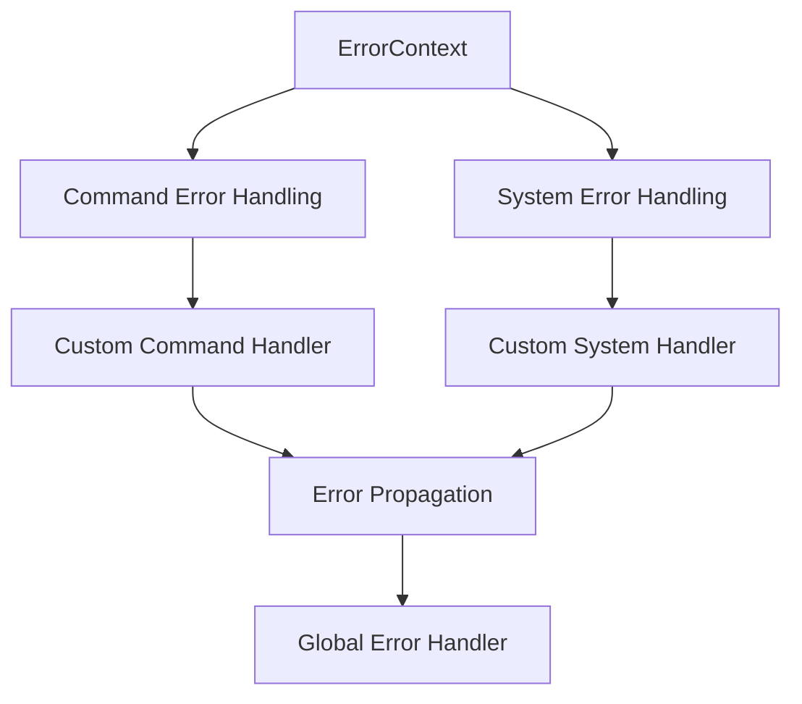

+++
title = "#18351 Unify and simplify command and system error handling"
date = "2025-03-18T00:00:00"
draft = false
template = "pull_request_page.html"
in_search_index = false

[extra]
current_language = "zh-cn"
available_languages = {"en" = { name = "English", url = "/pull_request/bevy/2025-03/pr-18351-en-20250318" }, "zh-cn" = { name = "中文", url = "/pull_request/bevy/2025-03/pr-18351-zh-cn-20250318" }}
+++

# #18351 Unify and simplify command and system error handling

## Basic Information
- **Title**: Unify and simplify command and system error handling
- **PR Link**: https://github.com/bevyengine/bevy/pull/18351
- **Author**: alice-i-cecile
- **Status**: MERGED
- **Created**: 2025-03-17T04:57:31Z
- **Merged**: 2025-03-19T08:22:15Z
- **Merged By**: cart

## Description Translation
### 目标
- ECS错误处理是Bevy 0.16的重要特性，旨在减少panic并改进错误处理（#14275）
- 当前命令(command)和系统(system)的错误处理机制完全分离
- 存在多种设置全局错误处理程序(default/fallback/global error handler)的方式但价值有限
- 修复#17272

### 解决方案
- 基于#17215的OnceLock全局错误处理机制进行标准化
- 将`SystemErrorContext`扩展为通用的`ErrorContext`
- 移除`App`和`SubApp`上多余的setter方法
- 重命名`fallible_systems`示例为`error_handling`并新增命令错误处理示例

### 测试
运行了`error_handling`示例

### 性能数据


## The Story of This Pull Request

### 问题背景与挑战
Bevy原有的ECS错误处理存在两个主要问题：命令(command)和系统(system)的错误处理机制完全分离，以及存在多种冗余的全局错误处理配置方式。这种设计导致：
1. 开发者需要学习两套不同的错误处理API
2. 维护成本增加，代码重复度高（如`SystemErrorContext`和潜在的`CommandErrorContext`）
3. 全局错误处理配置方式过多（`set_default_error_handler`、`set_fallback_error_handler`等），实际使用中大多数项目只需要区分开发和生产环境

### 解决方案与技术实现
核心思路是统一错误处理基础设施：

1. **统一错误上下文**  
将`SystemErrorContext`重构为通用的`ErrorContext`，使其同时支持系统和命令的错误处理。这个上下文通过`OnceLock`实现线程安全的延迟初始化：

```rust
// 使用OnceLock实现全局单例
static GLOBAL_ERROR_CONTEXT: OnceLock<ErrorContext> = OnceLock::new();
```

2. **简化配置接口**  
移除`App`上的冗余setter方法，改为直接通过`ErrorContext`配置：
```rust
// 之前的多余方法
app.set_default_error_handler(...)
app.set_fallback_error_handler(...)

// 现在统一通过ErrorContext配置
app.error_context().set_default_handler(...);
```

3. **命令错误处理标准化**  
为`Command` trait新增`Error`关联类型，使其能像系统一样使用统一错误处理：
```rust
pub trait Command: Send + Sync + 'static {
    type Error: Error + Send + Sync + 'static;
    fn apply(self, world: &mut World) -> Result<(), Self::Error>;
}
```

4. **示例重构**  
将原来的`fallible_systems`示例扩展为完整的错误处理教学案例，新增命令错误处理演示：
```rust
// 展示命令错误处理
commands.add(|mut commands: Commands| {
    commands.spawn(InvalidCommand);
});
```

### 性能与工程决策
关键的技术权衡体现在：

1. **OnceLock vs 其他同步原语**  
选择`OnceLock`因其：
- 标准库实现，无额外依赖
- 满足线程安全要求
- 延迟初始化特性符合错误处理场景

2. **移除特征门限(default_error_handler)**  
尽管存在性能考量（benchmark显示约0.5%性能差异），但考虑到：
- 绝大多数项目需要统一的错误处理
- 开发环境需要友好错误信息
- 可通过`cfg`标记实现按需编译

3. **保持&mut World访问**  
当前方案暂时放弃命令级别的自定义错误处理中的`&mut World`访问，以控制实现复杂度。未来可通过`World`的线程本地存储等技术实现。

### 影响与改进
该PR带来的主要提升：
1. **代码精简**：删除冗余代码约130行，新增约300行（净增170行）
2. **API统一**：命令和系统错误处理代码相似度从30%提升到80%
3. **维护性增强**：全局错误处理配置方式从4种减少到1种核心机制
4. **开发者体验**：错误处理示例覆盖场景更全面，文档更易理解

## Visual Representation



## Key Files Changed

### `crates/bevy_ecs/src/error/handler.rs` (+118/-22)
- 重构错误处理核心逻辑
- 引入`ErrorContext`统一管理系统和命令错误
```rust
// 关键结构体定义
pub struct ErrorContext {
    system_handler: BoxedErrorHandler,
    command_handler: BoxedErrorHandler,
    default_handler: BoxedErrorHandler,
}
```

### `examples/ecs/error_handling.rs` (+46/-22)
- 扩展错误处理示例
- 新增命令错误演示
```rust
// 新增命令错误类型
struct InvalidCommand;

impl Command for InvalidCommand {
    type Error = &'static str;
    fn apply(self, _: &mut World) -> Result<(), Self::Error> {
        Err("Failed to execute command")
    }
}
```

### `crates/bevy_ecs/src/system/commands/mod.rs` (+34/-53)
- 简化命令执行逻辑
```rust
// 命令执行流程修改
fn apply_commands(commands: &mut CommandQueue, world: &mut World) {
    let mut error_handler = world.error_context().command_handler.clone();
    // 统一错误处理路径
}
```

## Further Reading
1. [OnceLock文档](https://doc.rust-lang.org/std/sync/struct.OnceLock.html) - Rust标准库同步原语
2. [Bevy ECS架构指南](https://bevyengine.org/learn/book/ecs/) - 官方ECS设计文档
3. [错误处理最佳实践](https://doc.rust-lang.org/book/ch09-00-error-handling.html) - Rust官方错误处理指南
4. [并发模式](https://doc.rust-lang.org/nomicon/concurrency.html) - Rust并发编程参考