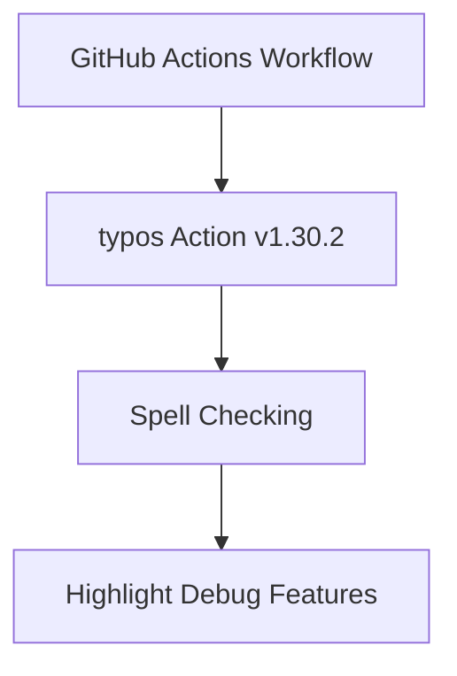

+++
title = "#18354 Bump crate-ci/typos from 1.30.1 to 1.30.2"
date = "2025-03-17T00:00:00"
draft = false
template = "pull_request_page.html"
in_search_index = true

[taxonomies]
list_display = ["show"]

[extra]
current_language = "en"
available_languages = {"zh-cn" = { name = "中文", url = "/pull_request/bevy/2025-03/pr-18354-zh-cn-20250317" }, "en" = { name = "English", url = "/pull_request/bevy/2025-03/pr-18354-en-20250317" }}
+++

# #18354 Bump crate-ci/typos from 1.30.1 to 1.30.2

## Basic Information
- **Title**: Bump crate-ci/typos from 1.30.1 to 1.30.2
- **PR Link**: https://github.com/bevyengine/bevy/pull/18354
- **Author**: app/dependabot
- **Status**: MERGED
- **Created**: 2025-03-17T06:17:32Z
- **Merged**: 2025-03-17T07:15:44Z
- **Merged By**: cart

## Description Translation
Bumps [crate-ci/typos](https://github.com/crate-ci/typos) from 1.30.1 to 1.30.2.
<details>
<summary>Release notes</summary>
<p><em>Sourced from <a href="https://github.com/crate-ci/typos/releases">crate-ci/typos's releases</a>.</em></p>
<blockquote>
<h2>v1.30.2</h2>
<h2>[1.30.2] - 2025-03-10</h2>
<h3>Features</h3>
<ul>
<li>Add <code>--highlight-words</code> and <code>--highlight-identifiers</code> for easier debugging of config</li>
</ul>
</blockquote>
</details>
<details>
<summary>Changelog</summary>
<p><em>Sourced from <a href="https://github.com/crate-ci/typos/blob/master/CHANGELOG.md">crate-ci/typos's changelog</a>.</em></p>
<blockquote>
<h2>[1.30.2] - 2025-03-10</h2>
<h3>Features</h3>
<ul>
<li>Add <code>--highlight-words</code> and <code>--highlight-identifiers</code> for easier debugging of config</li>
</ul>
</blockquote>
</details>
<details>
<summary>Commits</summary>
<ul>
<li><a href="https://github.com/crate-ci/typos/commit/7bc041cbb7ca9167c9e0e4ccbb26f48eb0f9d4e0"><code>7bc041c</code></a> chore: Release</li>
<li><a href="https://github.com/crate-ci/typos/commit/4af8a5a1fbfa8534227a9f8c5404b065179448f9"><code>4af8a5a</code></a> docs: Update changelog</li>
<li><a href="https://github.com/crate-ci/typos/commit/ec626a1e534129beb0af521bc3116a4040c56dcd"><code>ec626a1</code></a> Merge pull request <a href="https://redirect.github.com/crate-ci/typos/issues/1257">#1257</a> from epage/highlight</li>
<li><a href="https://github.com/crate-ci/typos/commit/d06a1dd728d2920754dfa206cbf5722050d252ec"><code>d06a1dd</code></a> feat(cli): Add '--highlight-&lt;identifiers|words&gt;' flags</li>
<li>See full diff in <a href="https://github.com/crate-ci/typos/compare/v1.30.1...v1.30.2">compare view</a></li>
</ul>
</details>
<br />


[](https://docs.github.com/en/github/managing-security-vulnerabilities/about-dependabot-security-updates#about-compatibility-scores)

Dependabot will resolve any conflicts with this PR as long as you don't alter it yourself. You can also trigger a rebase manually by commenting `@dependabot rebase`.

[//]: # (dependabot-automerge-start)
[//]: # (dependabot-automerge-end)

---

<details>
<summary>Dependabot commands and options</summary>
<br />

You can trigger Dependabot actions by commenting on this PR:
- `@dependabot rebase` will rebase this PR
- `@dependabot recreate` will recreate this PR, overwriting any edits that have been made to it
- `@dependabot merge` will merge this PR after your CI passes on it
- `@dependabot squash and merge` will squash and merge this PR after your CI passes on it
- `@dependabot cancel merge` will cancel a previously requested merge and block automerging
- `@dependabot reopen` will reopen this PR if it is closed
- `@dependabot close` will close this PR and stop Dependabot recreating it. You can achieve the same result by closing it manually
- `@dependabot show <dependency name> ignore conditions` will show all of the ignore conditions of the specified dependency
- `@dependabot ignore this major version` will close this PR and stop Dependabot creating any more for this major version (unless you reopen the PR or upgrade to it yourself)
- `@dependabot ignore this minor version` will close this PR and stop Dependabot creating any more for this minor version (unless you reopen the PR or upgrade to it yourself)
- `@dependabot ignore this dependency` will close this PR and stop Dependabot creating any more for this dependency (unless you reopen the PR or upgrade to it yourself)


</details>

## The Story of This Pull Request

This dependency update addresses the routine maintenance of CI tooling in the Bevy engine project. The primary motivation was to incorporate improvements from the typos checker tool that helps maintain code quality by catching spelling mistakes in the codebase.

The typos crate-ci tool received a minor version update (1.30.1 → 1.30.2) introducing new debugging features. The key addition was the `--highlight-words` and `--highlight-identifiers` flags, which help developers visualize how the tool processes words and identifiers during spell checking. This improves maintainers' ability to debug false positives or configure exceptions in the typos configuration.

As an automated dependabot PR, the implementation required minimal changes - specifically updating the version reference in the GitHub Actions workflow file. The compatibility score of 100 indicated low risk of breaking changes, allowing for straightforward integration. The update process followed standard dependency management practices, where non-breaking minor versions can be safely adopted without extensive testing beyond existing CI checks.

The single-line change in the CI configuration ensures that all subsequent Bevy PRs will benefit from the enhanced debugging capabilities when the typos check runs. This maintains the project's code quality standards while improving maintainer ergonomics for handling typos configuration.

## Visual Representation



## Key Files Changed

**.github/workflows/ci.yml**  
Updated the typos action version to leverage new debugging features:

```yaml
# Before:
- name: Typos
  uses: crate-ci/typos@v1.30.1

# After:
- name: Typos
  uses: crate-ci/typos@v1.30.2
```

This change ensures the CI pipeline uses the latest typos checker version with enhanced debugging capabilities.

## Further Reading

1. [typos documentation](https://github.com/crate-ci/typos) - Official docs for configuration and usage
2. [GitHub Actions workflow syntax](https://docs.github.com/en/actions/using-workflows) - Reference for CI pipeline configuration
3. [Semantic Versioning](https://semver.org/) - Understanding version number significance
4. [Dependabot documentation](https://docs.github.com/en/code-security/dependabot) - Automated dependency management overview