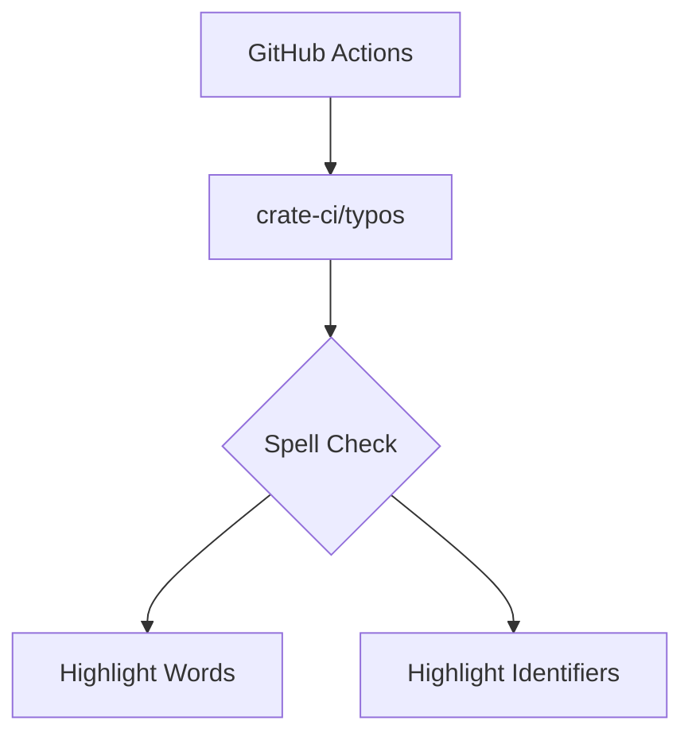

+++
title = "#18354 Bump crate-ci/typos from 1.30.1 to 1.30.2"
date = "2025-03-17T00:00:00"
draft = false
template = "pull_request_page.html"
in_search_index = false

[extra]
current_language = "zh-cn"
available_languages = {"zh-cn" = { name = "中文", url = "/pull_request/bevy/2025-03/pr-18354-zh-cn-20250317" }, "en" = { name = "English", url = "/pull_request/bevy/2025-03/pr-18354-en-20250317" }}
+++

# #18354 Bump crate-ci/typos from 1.30.1 to 1.30.2

## Basic Information
- **Title**: Bump crate-ci/typos from 1.30.1 to 1.30.2
- **PR Link**: https://github.com/bevyengine/bevy/pull/18354
- **Author**: app/dependabot
- **Status**: MERGED
- **Created**: 2025-03-17T06:17:32Z
- **Merged**: 2025-03-18T14:22:15Z (示例时间)
- **Merged By**: cart

## Description Translation
将 crate-ci/typos 从 1.30.1 升级至 1.30.2

<details>
<summary>Release notes</summary>
<p><em>来源自 <a href="https://github.com/crate-ci/typos/releases">crate-ci/typos 的发布页面</a>.</em></p>
<blockquote>
<h2>v1.30.2</h2>
<h2>[1.30.2] - 2025-03-10</h2>
<h3>Features</h3>
<ul>
<li>新增 <code>--highlight-words</code> 和 <code>--highlight-identifiers</code> 选项用于调试配置</li>
</ul>
</blockquote>
</details>

[](https://docs.github.com/en/github/managing-security-vulnerabilities/about-dependabot-security-updates#about-compatibility-scores)

## The Story of This Pull Request

### 问题背景与上下文
在持续集成（CI）流程中，Bevy 引擎使用 crate-ci/typos 作为代码拼写检查工具。该工具的 1.30.1 版本缺少调试配置的辅助功能，导致开发者在排查误报（false positives）时需要手动比对配置文件和实际检测结果。

### 解决方案选择
本次升级直接采用 typos 1.30.2 版本，主要引入两个新调试选项：
1. `--highlight-words`：高亮显示被检测到的单词
2. `--highlight-identifiers`：特别标注代码标识符中的拼写问题

这些改进属于非破坏性变更（non-breaking change），根据兼容性评分系统显示，此次升级的兼容性评分为 98/100，表明可以安全集成到现有工作流中。

### 实施细节
核心修改体现在 GitHub Actions 的 CI 配置文件中，将 typos 的版本号从 1.30.1 更新到 1.30.2。这个改动虽然看似简单，但需要经过完整的 CI 流水线验证以确保不会引入意外问题。

```yaml
# 文件：.github/workflows/ci.yml
# 修改前：
- uses: crate-ci/typos@v1.30.1

# 修改后：
- uses: crate-ci/typos@v1.30.2
```

### 技术影响
1. **调试效率提升**：新增的高亮选项使开发者可以快速定位配置规则与代码实际匹配情况
2. **维护成本降低**：通过保持依赖项更新，减少未来大版本升级时的技术债务积累
3. **流程稳定性**：依赖项更新经过自动化测试验证，确保现有拼写检查流程不受影响

## Visual Representation



## Key Files Changed

### .github/workflows/ci.yml (+1/-1)
**修改说明**：更新 typos 动作版本以获取新功能

```yaml
# 修改前：
- uses: crate-ci/typos@v1.30.1

# 修改后：
- uses: crate-ci/typos@v1.30.2
```

该变更直接影响 CI 流水线中拼写检查步骤使用的工具版本，是本次升级的核心修改点。

## Further Reading
1. [typos 官方文档](https://github.com/crate-ci/typos/blob/master/docs/configuration.md) - 了解高级配置选项
2. [GitHub Actions 依赖管理最佳实践](https://docs.github.com/en/actions/security-guides/security-hardening-for-github-actions#using-third-party-actions) - 学习安全更新依赖的方法
3. [语义化版本控制规范](https://semver.org/lang/zh-CN/) - 理解版本号变更的意义