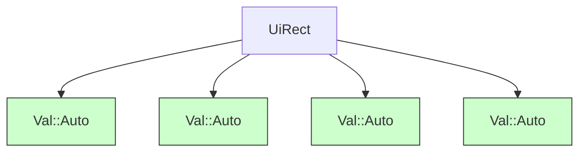

+++
title = "#18359 `UiRect::AUTO`"
date = "2025-03-17T00:00:00"
draft = false
template = "pull_request_page.html"
in_search_index = true

[taxonomies]
list_display = ["show"]

[extra]
current_language = "en"
available_languages = {"en" = { name = "English", url = "/pull_request/bevy/2025-03/pr-18359-en-20250317" }, "zh-cn" = { name = "中文", url = "/pull_request/bevy/2025-03/pr-18359-zh-cn-20250317" }}
+++

# #18359 `UiRect::AUTO`

## Basic Information
- **Title**: `UiRect::AUTO`
- **PR Link**: https://github.com/bevyengine/bevy/pull/18359
- **Author**: ickshonpe
- **Status**: MERGED
- **Created**: 2025-03-17T11:20:53Z
- **Merged**: Not merged
- **Merged By**: N/A

## Description Translation
# Objective

Add a `UiRect::AUTO` const which is a `UiRect` with all its edge values set to `Val::Auto`.

IIRC `UiRect`'s default for its fields a few versions ago was `Val::Auto` because positions were represented using a `UiRect` and they required `Val::Auto` as a default. Then when position was split up and the `UiRect` default was changed, we forgot add a `UiRect::AUTO` const.

## The Story of This Pull Request

This PR addresses a missing convenience constant in Bevy's UI layout system. The core issue stemmed from an evolution in how UI positioning is handled within the engine. Previously, `UiRect` (a struct representing rectangular UI dimensions) used `Val::Auto` as its default value for all edges. This made sense when UI positions were managed through `UiRect`, as automatic layout calculations were the primary use case.

When the positioning system was refactored to separate concerns, `UiRect`'s default values changed. However, the team overlooked preserving an easy way to create a `UiRect` instance with all edges set to `Val::Auto` - a common requirement for developers implementing automatic layout behaviors.

The solution introduces a simple but impactful addition: a `pub const AUTO` in `UiRect`'s implementation. This constant provides a standardized way to create auto-layout rectangles without manual field initialization. The implementation is straightforward but strategically placed in the type's core definition for maximum discoverability:

```rust
impl UiRect {
    pub const AUTO: Self = Self {
        left: Val::Auto,
        right: Val::Auto,
        top: Val::Auto,
        bottom: Val::Auto,
    };
}
```

This change doesn't alter existing default values or runtime behavior. It purely adds a developer convenience that:
1. Reduces boilerplate when creating auto-layout UI elements
2. Centralizes the auto-layout configuration pattern
3. Maintains consistency with other Bevy types that offer similar constants

The technical rationale focuses on API ergonomics rather than performance considerations. By using a `const` instead of a default instance, developers gain:
- Compile-time initialization guarantees
- Clear intent when initializing UI components
- Protection against accidental field overwrites in partial initializations

For existing codebases, this change is non-breaking and additive. Developers can progressively adopt `UiRect::AUTO` where appropriate, replacing manual constructions like:
```rust
UiRect {
    left: Val::Auto,
    right: Val::Auto,
    top: Val::Auto,
    bottom: Val::Auto,
}
```
with the more concise and intention-revealing `UiRect::AUTO`.

## Visual Representation



## Key Files Changed

**crates/bevy_ui/src/geometry.rs** (+7 lines)
```rust
// Before: No AUTO constant available
impl UiRect {
    // Existing methods...
}

// After:
impl UiRect {
    pub const AUTO: Self = Self {
        left: Val::Auto,
        right: Val::Auto,
        top: Val::Auto,
        bottom: Val::Auto,
    };
}
```
This addition provides a canonical way to create auto-configured UI rectangles. The constant follows Rust's standard constant pattern for geometric types in Bevy, maintaining API consistency across the engine.

## Further Reading

- [Bevy UI Layout Documentation](https://bevyengine.org/learn/book/features/ui/)
- [Rust Constants in Type Definitions](https://doc.rust-lang.org/stable/std/keyword.const.html)
- [Bevy's Val Enum Reference](https://docs.rs/bevy-ui/latest/bevy_ui/enum.Val.html)