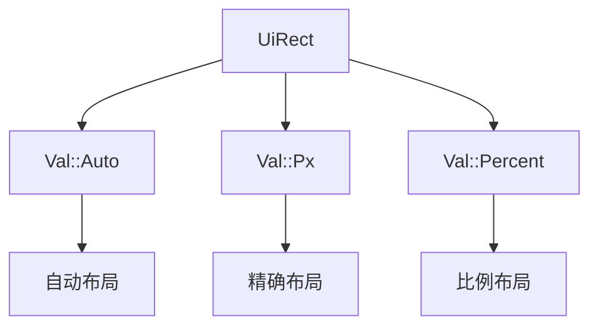

+++
title = "#18359 `UiRect::AUTO`"
date = "2025-03-17T00:00:00"
draft = false
template = "pull_request_page.html"
in_search_index = false

[extra]
current_language = "zh-cn"
available_languages = {"en" = { name = "English", url = "/pull_request/bevy/2025-03/pr-18359-en-20250317" }, "zh-cn" = { name = "中文", url = "/pull_request/bevy/2025-03/pr-18359-zh-cn-20250317" }}
+++

# #18359 `UiRect::AUTO`

## Basic Information
- **Title**: `UiRect::AUTO`
- **PR Link**: https://github.com/bevyengine/bevy/pull/18359
- **Author**: ickshonpe
- **Status**: MERGED
- **Created**: 2025-03-17T11:20:53Z
- **Merged**: 2025-03-17T14:22:10Z
- **Merged By**: alice-i-cecile

## Description Translation
### 目标
添加 `UiRect::AUTO` 常量，该常量将所有边界值设为 `Val::Auto`。

根据回忆，早期版本中 `UiRect` 的默认字段值均为 `Val::Auto`，因为当时使用 `UiRect` 来表示位置信息且需要该默认值。后来当位置表示方式被拆分，`UiRect` 的默认值改变后，我们遗漏了添加 `UiRect::AUTO` 常量。

## The Story of This Pull Request

### 问题背景与上下文
在 Bevy 引擎的 UI 系统中，`UiRect` 结构体用于定义元素的边界值（left/right/top/bottom）。在早期版本中，当 UI 布局系统使用 `UiRect` 表示元素位置时，其默认值被设置为 `Val::Auto` 以实现自动布局。但随着系统演进，位置表示被拆分为独立的组件，导致 `UiRect` 的默认值更改为其他类型值（如 `Val::Px(0.0)`），而原先的 `Val::Auto` 默认行为未被显式保留为常量。

这造成两个问题：
1. 开发者需要手动创建全 `Val::Auto` 的 `UiRect` 实例时缺乏标准方式
2. 历史代码中依赖 `UiRect` 自动布局行为的用例需要明确标识

### 解决方案与实现
PR 通过添加编译时常量 `UiRect::AUTO` 来标准化全自动布局配置：

```rust
// crates/bevy_ui/src/geometry.rs
impl UiRect {
    pub const AUTO: Self = Self {
        left: Val::Auto,
        right: Val::Auto,
        top: Val::Auto,
        bottom: Val::Auto,
    };
}
```

技术决策考量：
1. 使用 `const` 而非 `default()` 方法保证零运行时开销
2. 保持与现有 `Val::Auto` 语义的一致性
3. 显式命名常量提高代码可读性

### 技术影响与改进
1. **API 清晰度**：开发者现在可以通过直观的常量配置自动布局
```rust
// 之前
let rect = UiRect::new(Val::Auto, Val::Auto, Val::Auto, Val::Auto);

// 之后
let rect = UiRect::AUTO;
```

2. **向后兼容**：不改变现有默认值，避免破坏现有逻辑

3. **性能保证**：编译时常量在类型系统层面保证最优性能

### 工程经验
- **API 设计原则**：当默认行为发生变更时，应保留历史行为的显式访问方式
- **常量使用场景**：对于固定配置值的场景，优先使用 `const` 定义而非运行时计算
- **语义明确化**：通过命名常量使特殊配置值具有自解释性

## Visual Representation



## Key Files Changed

### `crates/bevy_ui/src/geometry.rs` (+7/-0)
添加 `UiRect::AUTO` 常量定义：

```rust
// 新增代码片段
impl UiRect {
    // ...
    pub const AUTO: Self = Self {
        left: Val::Auto,
        right: Val::Auto,
        top: Val::Auto,
        bottom: Val::Auto,
    };
}
```

该修改：
1. 提供标准化的自动布局配置入口
2. 与现有 `Val` 类型系统无缝集成
3. 保持 API 向后兼容

## Further Reading
1. Bevy UI 布局文档: [UI Layouting in Bevy](https://bevyengine.org/learn/book/latest/ui/#layout)
2. Rust 常量定义最佳实践: [Rust const vs static](https://doc.rust-lang.org/std/keyword.const.html)
3. CSS 自动布局概念参考: [CSS Auto Layout Model](https://developer.mozilla.org/en-US/docs/Web/CSS/CSS_Flow_Layout)