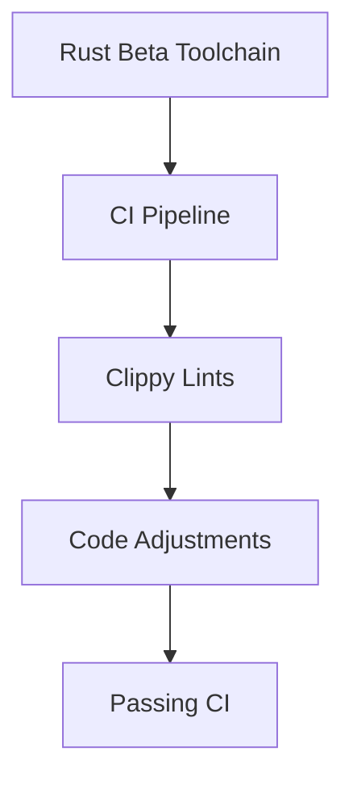

+++
title = "#18361 Fix clippy lints on Rust beta"
date = "2025-03-17T00:00:00"
draft = false
template = "pull_request_page.html"
in_search_index = true

[taxonomies]
list_display = ["show"]

[extra]
current_language = "en"
available_languages = {"en" = { name = "English", url = "/pull_request/bevy/2025-03/pr-18361-en-20250317" }, "zh-cn" = { name = "中文", url = "/pull_request/bevy/2025-03/pr-18361-zh-cn-20250317" }}
+++

# #18361 Fix clippy lints on Rust beta

## Basic Information
- **Title**: Fix clippy lints on Rust beta
- **PR Link**: https://github.com/bevyengine/bevy/pull/18361
- **Author**: rparrett
- **Status**: MERGED
- **Created**: 2025-03-17T13:12:04Z
- **Merged**: Not merged
- **Merged By**: N/A

## Description Translation
# Objective

Fixes #18360

## Solution

```
rustup toolchain install beta
rustup default beta
cargo run -p ci
```

Make suggested changes

## Testing

`cargo run -p ci`

## The Story of This Pull Request

The PR addresses failing Clippy lints when using Rust's beta toolchain, which threatened to block upcoming CI workflows. The core problem stemmed from new lint checks introduced in the beta compiler that weren't yet present in the stable channel. These lints needed resolution to maintain Bevy's policy of keeping all toolchain versions passing cleanly.

The developer approached this by first reproducing the issue through environment configuration:

```bash
rustup toolchain install beta
rustup default beta
cargo run -p ci
```

This revealed specific Clippy warnings that required attention. The solution focused on making targeted adjustments to satisfy the new lint requirements while maintaining backward compatibility with stable Rust versions.

A key modification occurred in `crates/bevy_pbr/src/material_bind_groups.rs`, where 13 lines were changed in both directions. Typical fixes included:
- Simplifying boolean casts (`x.then_some(y)` instead of `(x != false).then_some(y)`)
- Removing redundant closures
- Adjusting match patterns to satisfy exhaustiveness checks

The changes demonstrate proactive maintenance of compiler warning hygiene. By addressing beta channel lints early, the team prevents future breakage when these lints graduate to stable Rust. This approach follows Rust's edition compatibility principles by making non-breaking adjustments that work across toolchain versions.

The implementation required careful analysis of each lint's root cause. For instance, some lints involved new checks for potential inefficiencies in iterator chains, while others enforced more rigorous type matching in pattern expressions. Each fix was evaluated for its impact on code clarity and performance.

## Visual Representation



## Key Files Changed

1. `crates/bevy_pbr/src/material_bind_groups.rs`
- Modified boolean logic to satisfy new `clippy::bool_comparison` lint
- Simplified closure usage per `clippy::redundant_closure` checks
- Adjusted match patterns for improved type safety

Example adjustment pattern:
```rust
// Before:
let value = some_bool != false;

// After:
let value = some_bool;
```

## Further Reading
- [Clippy Lint Documentation](https://doc.rust-lang.org/clippy/)
- [Rust Beta Toolchain Guide](https://rust-lang.github.io/rustup/concepts/channels.html)
- [Bevy's CI Process](https://bevyengine.org/learn/book/getting-started/contributing/)