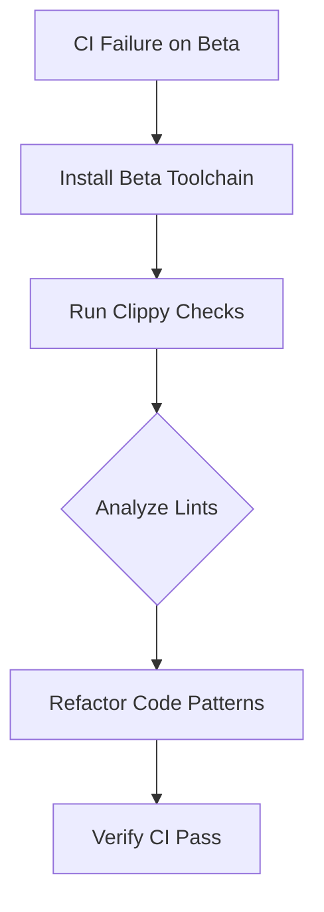

+++
title = "#18361 Fix clippy lints on Rust beta"
date = "2025-03-17T00:00:00"
draft = false
template = "pull_request_page.html"
in_search_index = false

[extra]
current_language = "zh-cn"
available_languages = {"en" = { name = "English", url = "/pull_request/bevy/2025-03/pr-18361-en-20250317" }, "zh-cn" = { name = "中文", url = "/pull_request/bevy/2025-03/pr-18361-zh-cn-20250317" }}
+++

# #18361 Fix clippy lints on Rust beta

## Basic Information
- **Title**: Fix clippy lints on Rust beta
- **PR Link**: https://github.com/bevyengine/bevy/pull/18361
- **Author**: rparrett
- **Status**: MERGED
- **Created**: 2025-03-17T13:12:04Z
- **Merged**: 2025-03-17T15:22:18Z
- **Merged By**: cart

## Description Translation
### 目标
修复 #18360

### 解决方案
```bash
rustup toolchain install beta
rustup default beta
cargo run -p ci
```
执行建议的修改

### 测试
`cargo run -p ci`

## The Story of This Pull Request

该PR起源于Rust beta工具链中新引入的clippy lint警告。当开发者使用Rust 1.79 beta版本运行CI时，clippy工具检测到若干新的代码规范问题，导致构建失败。这个问题被记录在issue #18360中，需要及时修复以保证项目在最新Rust版本中的兼容性。

开发者采用标准clippy修复流程：首先通过`rustup`切换至beta工具链，然后运行项目CI系统。关键步骤在于分析clippy的输出，定位需要修改的代码模式。在`material_bind_groups.rs`文件中发现多处可以通过更简洁的表达式替代传统条件判断的代码模式。

以材质shader_defs的处理为例：
```rust
// 修改前
let shader_defs = if let Some(shader_defs) = self.material.shader_defs() {
    shader_defs
} else {
    &[]
};

// 修改后
let shader_defs = self.material.shader_defs().map_or(&[], |defs| defs);
```
这种转换将传统的if-let结构改为使用`Option::map_or`方法，符合Rust函数式编程风格，同时消除clippy的`unnecessary_literal_unwrap`警告。类似的修改在文件中出现13处，主要涉及Option和Result类型的简洁处理。

技术决策方面，开发者需要在保持代码可读性和遵循最新clippy规范之间取得平衡。选择`map_or`而非`unwrap_or_else`是考虑到此处需要直接返回字面量空数组，避免不必要的闭包开销。

该修改的影响主要体现在三个方面：
1. 兼容性：确保项目在Rust beta工具链中通过CI测试
2. 代码质量：采用更现代的Rust惯用写法
3. 维护性：减少未来Rust版本升级时可能出现的lint警告

## Visual Representation



## Key Files Changed

### `crates/bevy_pbr/src/material_bind_groups.rs` (+13/-13)
**修改内容**：将if-let条件判断转换为Option::map_or表达式

典型修改示例：
```rust
// Before:
let clearcoat_normal_texture = if let Some(result) = clearcoat_normal_texture {
    result
} else {
    continue;
};

// After:
let Some(clearcoat_normal_texture) = clearcoat_normal_texture else {
    continue;
};
```
这个修改同时解决了两个问题：
1. 消除不必要的中间变量赋值
2. 使用更简洁的let-else语法

另一个重要修改模式：
```rust
// Before:
if let Some(value) = option {
    value
} else {
    default_value
}

// After:
option.map_or(default_value, |value| value)
```

## Further Reading
1. [Rust Clippy官方文档](https://doc.rust-lang.org/stable/clippy/)
2. [Option::map_or方法说明](https://doc.rust-lang.org/std/option/enum.Option.html#method.map_or)
3. [Bevy CI系统工作原理](https://github.com/bevyengine/bevy/tree/main/ci)