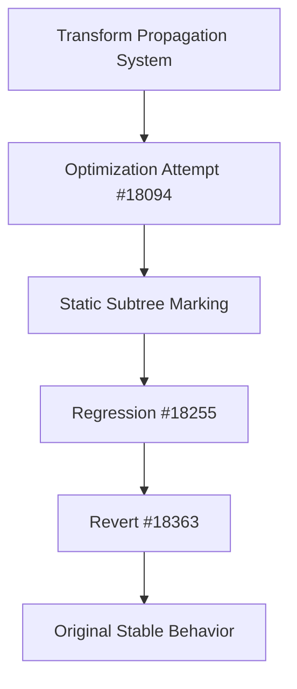

+++
title = "#18363 Revert \"Transform Propagation Optimization: Static Subtree Marking (#18094)\""
date = "2025-03-17T00:00:00"
draft = false
template = "pull_request_page.html"
in_search_index = true

[taxonomies]
list_display = ["show"]

[extra]
current_language = "en"
available_languages = {"en" = { name = "English", url = "/pull_request/bevy/2025-03/pr-18363-en-20250317" }, "zh-cn" = { name = "中文", url = "/pull_request/bevy/2025-03/pr-18363-zh-cn-20250317" }}
+++

# #18363 Revert "Transform Propagation Optimization: Static Subtree Marking (#18094)"

## Basic Information
- **Title**: Revert "Transform Propagation Optimization: Static Subtree Marking (#18094)"
- **PR Link**: https://github.com/bevyengine/bevy/pull/18363
- **Author**: mockersf
- **Status**: MERGED
- **Created**: 2025-03-17T17:56:04Z
- **Merged**: Not merged
- **Merged By**: N/A

## Description Translation
# Objective

- Fixes #18255
- Transform propagation is broken in some cases

## Solution

- Revert #18093 

## The Story of This Pull Request

This PR addresses a regression in Bevy's transform propagation system introduced by optimization attempts in PR #18094. The core issue manifested as broken transform updates in certain scenarios, particularly affecting entities with complex parent-child relationships.

The original optimization (#18094) attempted to improve performance by marking static subtrees - portions of the entity hierarchy that don't require frequent transform updates. This was achieved through:

1. A `StaticTransform` component flag
2. Optimized system scheduling
3. Early-exit conditions in propagation logic

While these changes showed performance benefits in specific cases, they introduced subtle bugs in transform synchronization. The regression became apparent through user reports (#18255) where entities would:
- Fail to update their world transforms after parent changes
- Exhibit incorrect spatial relationships
- Show delayed or missing updates in animated systems

The revert decision followed several key observations:
1. The optimization's early-exit conditions sometimes skipped necessary updates
2. Static/dynamic state tracking proved difficult to maintain correctly
3. Edge cases in hierarchy recombination weren't fully handled

By reverting to the pre-optimization state, the Bevy team prioritized correctness over potential performance gains. This maintains predictable behavior for all users while allowing time to develop a more robust optimization strategy.

The technical impact of this revert includes:
- Removal of `StaticTransform` component logic
- Restoration of full transform propagation checks
- Simplified system execution order
- Guaranteed update correctness across all hierarchy configurations

This situation highlights the challenges of optimizing ECS-based engine systems, particularly those dealing with spatial hierarchies. It demonstrates the importance of comprehensive test coverage for transform operations and the value of community bug reports in maintaining engine stability.

## Visual Representation

## Key Files Changed

1. `crates/bevy_transform/src/systems.rs` (+75/-87)
- Removed static transform checking logic
- Restored full hierarchy traversal in propagation
- Key change: Elimination of early-exit conditions based on static flags

2. `crates/bevy_transform/src/components/transform.rs` (+1/-22)
- Removed `StaticTransform` component implementation
- Simplified transform storage structure

3. `crates/bevy_transform/src/plugins.rs` (+7/-7)
- Reverted system scheduling changes
- Restored original execution order for transform systems

4. `crates/bevy_ui/src/layout/mod.rs` (+2/-3)
- Adjusted UI layout systems to match restored transform behavior
- Ensured proper synchronization with transform changes

## Further Reading

1. Original optimization PR: [#18094](https://github.com/bevyengine/bevy/pull/18094)
2. Regression issue: [#18255](https://github.com/bevyengine/bevy/issues/18255)
3. Bevy Transform System Documentation: [Bevy Transform Guide](https://bevyengine.org/learn/book/transform-properties/)