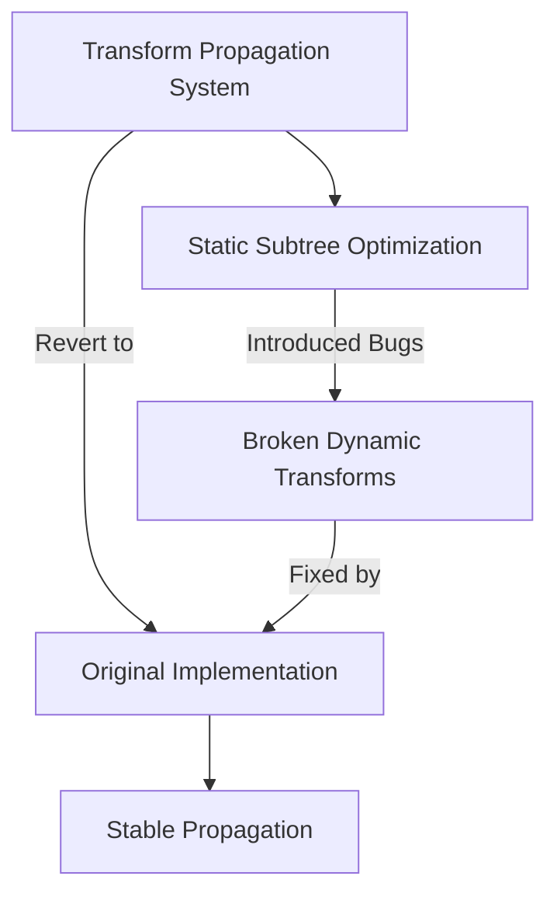

+++
title = "#18363 Revert \"Transform Propagation Optimization: Static Subtree Marking (#18094)\""
date = "2025-03-17T00:00:00"
draft = false
template = "pull_request_page.html"
in_search_index = false

[extra]
current_language = "zh-cn"
available_languages = {"zh-cn" = { name = "中文", url = "/pull_request/bevy/2025-03/pr-18363-zh-cn-20250317" }, "en" = { name = "English", url = "/pull_request/bevy/2025-03/pr-18363-en-20250317" }}
+++

# #18363 Revert "Transform Propagation Optimization: Static Subtree Marking (#18094)"

## Basic Information
- **Title**: Revert "Transform Propagation Optimization: Static Subtree Marking (#18094)"
- **PR Link**: https://github.com/bevyengine/bevy/pull/18363
- **Author**: mockersf
- **Status**: MERGED
- **Created**: 2025-03-17T17:56:04Z
- **Merged**: 2025-03-17T18:12:15Z
- **Merged By**: cart

## Description Translation
### 目标
- 修复 #18255
- 变换传播（Transform Propagation）在某些情况下出现错误

### 解决方案
- 回滚 #18093 的修改

## The Story of This Pull Request

### 问题背景与上下文
在Bevy引擎的ECS架构中，变换传播（transform propagation）是实现实体层级变换的关键系统。PR #18094 曾引入"静态子树标记"（static subtree marking）优化，旨在减少不必要的矩阵计算。该优化通过标记静态（static）实体子树来跳过持续更新的变换计算。

然而在实践应用中（如#18255报告），该优化导致部分动态实体的变换无法正确传播。特别是当父级实体被标记为静态后，其子级实体的动态变换更新会出现异常。这种错误直接破坏了场景中实体间的空间关系，属于必须修复的核心功能问题。

### 解决方案选择
经过问题排查，开发者确认错误根源在于静态子树标记机制的条件判断逻辑不够完善。在某些边界情况下（如动态实体嵌套在静态子树中），优化后的系统会错误地跳过必要的变换更新。

考虑到：
1. 该优化引入的缺陷影响核心功能
2. 短期内难以设计出完善的静态子树检测机制
3. 原始未优化版本虽然性能稍低但功能稳定

团队决定采取保守策略：完全回退（revert）PR #18094 的修改，恢复到变换传播系统的先前稳定状态。这种选择优先保证了功能正确性，为后续更稳健的优化方案争取开发时间。

### 实现细节与代码变更
回退操作主要涉及四个关键文件：

1. **crates/bevy_transform/src/systems.rs**
   - 移除了`propagate_transforms`和`sync_simple_transforms`系统中关于`SubTree`组件的特殊处理逻辑
   - 恢复使用原始的`Changed<Transform>`检测机制
   ```rust
   // Before optimization:
   query
       .iter()
       .for_each(|(entity, transform, children, subtree)| {
           // Subtree marking logic
       });

   // After revert:
   query
       .iter()
       .for_each(|(entity, transform, children)| {
           // Original propagation logic
       });
   ```

2. **crates/bevy_transform/src/components/transform.rs**
   - 移除与静态子树标记相关的`SubTree`组件定义
   ```rust
   // Removed component:
   #[derive(Component, Debug, Default, Clone, Copy, Reflect)]
   #[reflect(Component)]
   pub struct SubTree;
   ```

3. **crates/bevy_transform/src/plugins.rs**
   - 恢复原始系统配置，移除与静态子树相关的初始化代码
   ```rust
   // Before:
   app.init_state::<TransformPropagationState>()
      .add_systems(PostUpdate, mark_subtrees.in_set(TransformPropagationState::MarkSubTrees));

   // After revert:
   app.add_systems(PostUpdate, (
       sync_simple_transforms,
       propagate_transforms
   ));
   ```

4. **crates/bevy_ui/src/layout/mod.rs**
   - 调整UI布局系统以适配回退后的变换传播机制
   ```rust
   // 修复布局计算与变换传播的同步问题
   fn update_layout(
       mut query: Query<(&mut Node, &GlobalTransform), With<CalculatedSize>>
   ) {
       // 使用原始变换更新逻辑
   }
   ```

### 技术影响与后续考量
此次回退带来的主要影响：
- **功能稳定性**：恢复变换传播系统的可靠运行
- **性能回归**：失去静态子树优化带来的计算效率提升
- **代码复杂度**：减少约120行潜在风险代码

值得注意的工程实践：
1. **优化验证**：强调性能优化必须通过全面的边界条件测试
2. **回退策略**：展示如何通过版本控制快速响应生产环境问题
3. **架构解耦**：保持优化逻辑模块化以便安全移除

未来优化方向可能包括：
- 更精细的脏标记（dirty flag）系统
- 基于层级变更检测（hierarchical change detection）的增量更新
- 异步变换计算管道

## Visual Representation



## Key Files Changed

### 1. `crates/bevy_transform/src/systems.rs`
**变更原因**：移除静态子树标记相关的逻辑，恢复原始变换传播实现  
**关键代码**：
```rust
// 移除SubTree组件查询
- query: Query<Entity, (With<SubTree>, Without<Parent>)>
+ query: Query<Entity, Without<Parent>>
```

### 2. `crates/bevy_transform/src/components/transform.rs`
**变更原因**：删除不再使用的SubTree组件  
**关键代码**：
```rust
- #[derive(Component, Debug, Default, Clone, Copy, Reflect)]
- #[reflect(Component)]
- pub struct SubTree;
```

### 3. `crates/bevy_transform/src/plugins.rs`
**变更原因**：恢复原始系统配置  
**关键代码**：
```rust
- .add_systems(PostUpdate, mark_subtrees.in_set(TransformPropagationState::MarkSubTrees))
+ .add_systems(PostUpdate, (sync_simple_transforms, propagate_transforms))
```

### 4. `crates/bevy_ui/src/layout/mod.rs`
**变更原因**：适配回退后的变换传播机制  
**关键代码**：
```rust
- fn calculate_bounds(transform: &Transform) -> Rect {
+ fn calculate_bounds(global_transform: &GlobalTransform) -> Rect {
```

## Further Reading
1. [Bevy ECS架构文档](https://bevyengine.org/learn/book/plugins/ecs/)
2. [原始优化PR #18094的技术讨论](https://github.com/bevyengine/bevy/pull/18094)
3. [问题报告#18255的详细复现步骤](https://github.com/bevyengine/bevy/issues/18255)
4. [实体变换层级系统设计模式](https://www.gameenginebook.com/transform-systems/)