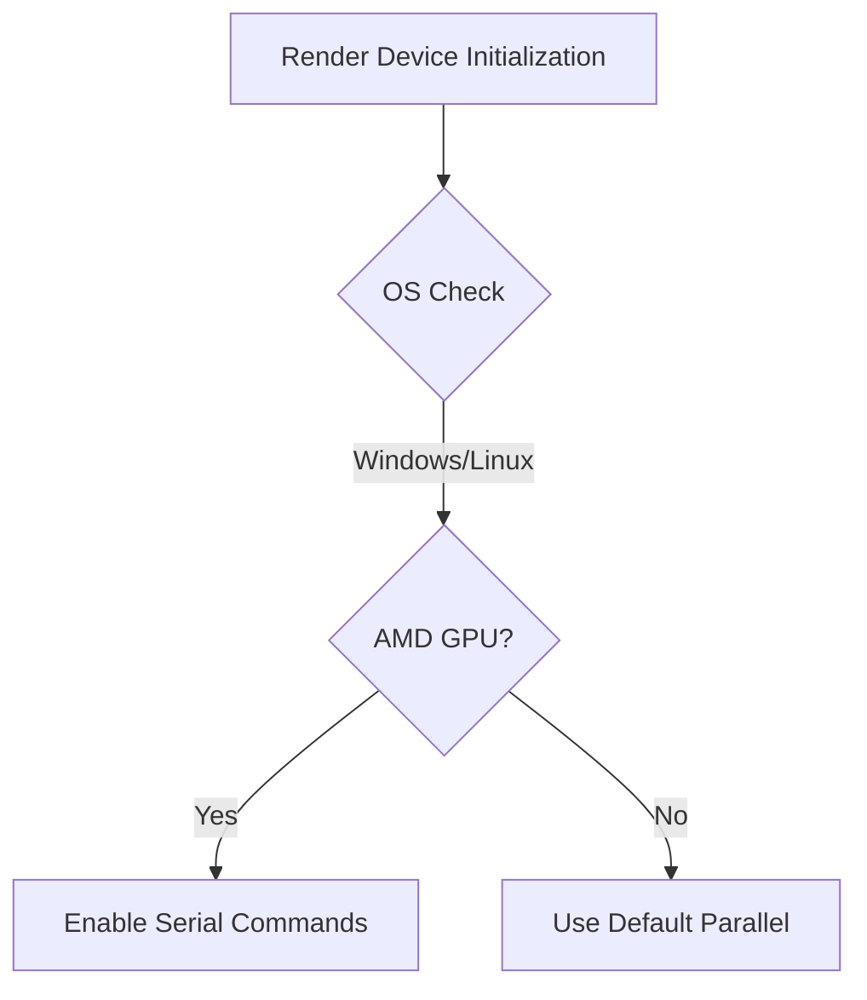

+++
title = "#18368 Force serial command encoding on Linux/amdvlk"
date = "2025-03-18T00:00:00"
draft = false
template = "pull_request_page.html"
in_search_index = true

[taxonomies]
list_display = ["show"]

[extra]
current_language = "en"
available_languages = {"zh-cn" = { name = "中文", url = "/pull_request/bevy/2025-03/pr-18368-zh-cn-20250318" }, "en" = { name = "English", url = "/pull_request/bevy/2025-03/pr-18368-en-20250318" }}
+++

# #18368 Force serial command encoding on Linux/amdvlk

## Basic Information
- **Title**: Force serial command encoding on Linux/amdvlk
- **PR Link**: https://github.com/bevyengine/bevy/pull/18368
- **Author**: fatho
- **Status**: MERGED
- **Created**: 2025-03-17T19:51:38Z
- **Merged**: Not merged
- **Merged By**: N/A

## Description Translation
# Objective

Fixes https://github.com/bevyengine/bevy/issues/18366 which seems to have a similar underlying cause than the already closed (but not fixed) https://github.com/bevyengine/bevy/issues/16185.

## Solution

For Windows with the AMD vulkan driver, there was already a hack to force serial command encoding, which prevented these issues. The Linux version of the AMD vulkan driver seems to have similar issues than its Windows counterpart, so I extended the hack to also cover AMD on Linux.

I also removed the mention of `wgpu` since it was already outdated, and doesn't seem to be relevant to the core issue (the AMD driver being buggy).

## Testing

- Did you test these changes? If so, how?
  - I ran the `3d_scene` example, which on `main` produced the flickering shadows on Linux with the amdvlk driver, while it no longer does with the workaround applied.
- Are there any parts that need more testing?
  - Not sure.
- How can other people (reviewers) test your changes? Is there anything specific they need to know?
  - Requires a Linux system with an AMD card and the AMDVLK driver.
- If relevant, what platforms did you test these changes on, and are there any important ones you can't test?
  - My change should only affect Linux, where I did test it.

## The Story of This Pull Request

The problem stemmed from AMD's Vulkan drivers (amdvlk) exhibiting rendering artifacts in Bevy applications. Users reported flickering shadows on Linux systems (#18366), mirroring a previously closed but unresolved Windows issue (#16185). The root cause was identified as faulty parallel command buffer execution in AMD's driver implementation.

Bevy already contained a platform-specific workaround for Windows AMD systems:

```rust
// Original Windows-specific check
#[cfg(target_os = "windows")]
if vendor_id == VendorId::AMD {
    features |= Features::MULTI_DRAW_INDIRECT;
    features |= Features::MULTI_DRAW_INDIRECT_COUNT;
    features |= Features::PARTIALLY_BOUND_BINDING_ARRAY;
    features |= Features::SAMPLED_TEXTURE_AND_STORAGE_BUFFER_ARRAY_NON_UNIFORM_INDEXING;
    features |= Features::CLEAR_COMMANDS;
}
```

The solution extended this workaround to Linux systems by modifying the conditional check:

```rust
// Updated check covering both Windows and Linux
if (cfg!(target_os = "windows") || (cfg!(target_os = "linux")) {
    if vendor_id == VendorId::AMD {
        // Apply serial command encoding workaround
    }
}
```

This change forces serial command queue execution on affected AMD systems, sacrificing potential parallelization gains to avoid driver-level corruption. The implementation preserves existing Windows handling while adding Linux coverage through a simple OS check expansion.

Key technical considerations:
1. Driver-specific workarounds are common in graphics programming
2. Serial command encoding reduces concurrency but ensures correct execution order
3. The fix targets specific vendor/driver combinations without impacting other configurations

Testing confirmed the 3D scene example no longer exhibited shadow flickering on Linux/AMD systems. The change maintains compatibility with other drivers and platforms by keeping the workaround narrowly scoped.

## Visual Representation



## Key Files Changed

**crates/bevy_render/src/renderer/mod.rs** (+3/-2)
```rust
// Before (Windows-specific)
#[cfg(target_os = "windows")]
if vendor_id == VendorId::AMD {
    // Workaround code
}

// After (Windows + Linux)
if (cfg!(target_os = "windows") || cfg!(target_os = "linux")) {
    if vendor_id == VendorId::AMD {
        // Workaround code
    }
}
```
- Expanded OS check to include Linux
- Maintained same workaround logic for AMD GPUs
- Removed outdated wgpu references from comments

## Further Reading
1. [Vulkan Command Buffers Documentation](https://vulkan.lunarg.com/doc/view/1.3.275.0/windows/command_buffers.html)
2. [AMDVLK Driver Issues](https://github.com/GPUOpen-Drivers/AMDVLK/issues)
3. [Bevy Render Architecture Overview](https://bevyengine.org/learn/book/getting-started/rendering/)