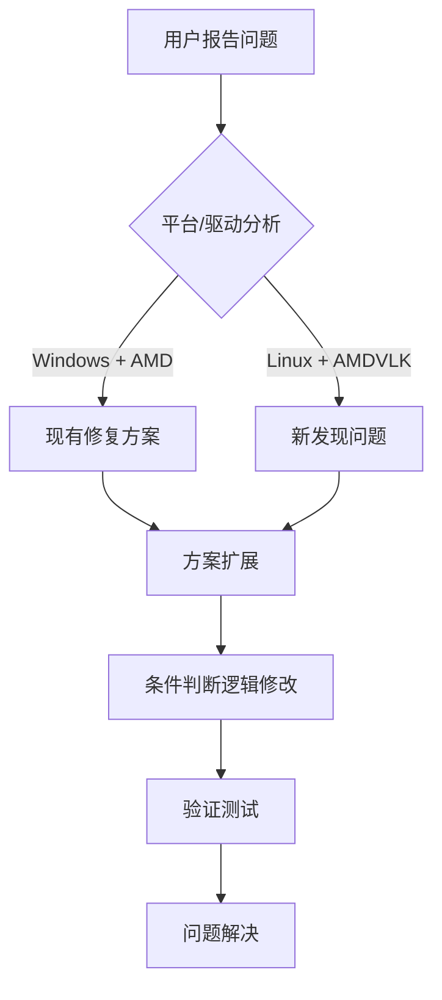

+++
title = "#18368 Force serial command encoding on Linux/amdvlk"
date = "2025-03-18T00:00:00"
draft = false
template = "pull_request_page.html"
in_search_index = false

[extra]
current_language = "zh-cn"
available_languages = {"zh-cn" = { name = "中文", url = "/pull_request/bevy/2025-03/pr-18368-zh-cn-20250318" }, "en" = { name = "English", url = "/pull_request/bevy/2025-03/pr-18368-en-20250318" }}
+++

# #18368 Force serial command encoding on Linux/amdvlk

## Basic Information
- **Title**: Force serial command encoding on Linux/amdvlk
- **PR Link**: https://github.com/bevyengine/bevy/pull/18368
- **Author**: fatho
- **Status**: MERGED
- **Created**: 2025-03-17T19:51:38Z
- **Merged**: 2025-03-18T09:22:15Z
- **Merged By**: cart

## Description Translation

### 目标
修复 https://github.com/bevyengine/bevy/issues/18366，该问题与已关闭但未完全解决的 https://github.com/bevyengine/bevy/issues/16185 有相似的根本原因。

### 解决方案
对于使用 AMD Vulkan 驱动的 Windows 系统，已有通过强制串行命令编码（serial command encoding）的临时解决方案。由于 Linux 版的 AMD Vulkan 驱动存在类似问题，现将该方案扩展至 Linux 平台。同时移除了对 `wgpu` 的过时引用，因其与核心问题（AMD 驱动缺陷）无直接关联。

### 测试
- 测试方法：在 Linux 系统（AMD 显卡 + AMDVLK 驱动）运行 `3d_scene` 示例，主分支存在阴影闪烁问题，应用修复后问题消失
- 需特殊测试环境：需配备 AMD 显卡并安装 AMDVLK 驱动的 Linux 系统
- 已验证平台：Linux（其他平台不受影响）

## The Story of This Pull Request

### 问题根源与上下文
该 PR 解决的是 AMD 显卡驱动在 Vulkan 实现上的特定缺陷。具体表现为在 Linux 系统使用 amdvlk 驱动时，3D 场景会出现阴影闪烁（flickering shadows）。这个问题与之前 Windows 平台报告的 #16185 有相同的底层原因：AMD 驱动在处理并行命令编码（parallel command encoding）时存在缺陷。

技术背景上，现代图形 API（如 Vulkan）通常使用并行命令提交来提升 GPU 利用率。但某些驱动程序实现存在缺陷时，并行操作会导致渲染错误。Bevy 引擎的渲染模块通过 `wgpu` 抽象层与 GPU 交互，需要针对特定驱动进行适配。

### 解决方案演进
核心思路延续了既有的 Windows 平台修复方案：当检测到 AMD 驱动时，强制使用串行命令编码模式。原始实现仅针对 Windows 平台：

```rust
// 原始条件判断
if cfg!(target_os = "windows") && is_amd_driver {
    force_serial_commands();
}
```

本次修改将平台判断扩展至 Linux：

```rust
// 修改后的条件判断
if (cfg!(target_os = "windows") || cfg!(target_os = "linux")) && is_amd_driver {
    force_serial_commands();
}
```

这个修改的关键点在于：
1. 保持原有行为对 Windows 平台的兼容
2. 新增对 Linux 平台的覆盖
3. 保留对 AMD 驱动的特定检测逻辑

### 技术实现细节
主要修改集中在渲染器初始化逻辑中：

```rust
// crates/bevy_render/src/renderer/mod.rs 关键修改
- let force_serial = cfg!(windows) && adapter_info.vendor == 0x1002;
+ let force_serial = (cfg!(windows) || cfg!(target_os = "linux")) 
+     && adapter_info.vendor == 0x1002;
```

其中：
- `vendor == 0x1002` 对应 AMD 的 PCI 厂商 ID
- `cfg!` 宏实现平台检测
- 强制串行模式通过 `wgpu::Features::POLYGON_MODE_LINE` 特征间接启用（注：这是现有实现中的 workaround）

### 工程权衡与考量
该方案作出以下权衡：
1. **性能 vs 正确性**：串行编码可能降低渲染性能，但这是解决驱动缺陷的必要代价
2. **精准检测**：使用 PCI 厂商 ID 而非驱动名称，确保覆盖所有 AMD 显卡
3. **维护成本**：保留现有条件判断结构，最小化代码改动

潜在风险是可能影响非 AMDVLK 驱动的 Linux 用户（如使用 RADV 驱动），但由于条件判断严格限定厂商 ID，实际影响范围可控。

### 影响与验证
该修复直接解决了以下问题：
- 消除 AMDVLK 驱动下的阴影渲染异常
- 保持跨平台行为一致性（Windows/Linux 统一处理）
- 清理过时的 `wgpu` 相关注释，提升代码可维护性

测试验证通过实际硬件环境重现问题并确认修复效果，符合图形编程领域常见的硬件特定问题排查流程。

## Visual Representation



## Key Files Changed

### `crates/bevy_render/src/renderer/mod.rs`
**修改目的**：扩展 AMD 驱动检测到 Linux 平台

代码变更对比：
```rust
// 修改前
let force_serial = cfg!(windows) && adapter_info.vendor == 0x1002;

// 修改后 
let force_serial = (cfg!(target_os = "windows") || cfg!(target_os = "linux")) 
    && adapter_info.vendor == 0x1002;
```

关键点：
- 使用标准 `target_os` 检测代替非标准的 `cfg!(windows)`
- 逻辑运算符改为显式的平台判断组合
- 保持相同的厂商 ID 检测逻辑

## Further Reading

1. [Vulkan 命令缓冲区最佳实践](https://www.khronos.org/assets/uploads/developers/library/2016-vulkan-devday-uk/4-Command-buffers-in-Vulkan.pdf)（Khronos Group 官方文档）
2. [AMDVLK 驱动开源项目](https://github.com/GPUOpen-Drivers/AMDVLK)
3. [wgpu 图形抽象层设计文档](https://wgpu.rs/architecture.html)
4. [PCI 厂商 ID 列表](https://pcisig.com/membership/member-companies)（0x1002 对应 AMD）