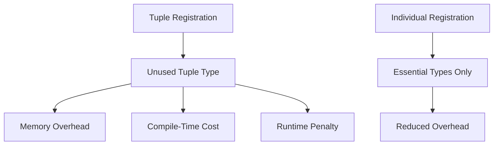

+++
title = "#18369 bevy: Replace unnecessary tuple type registrations"
date = "2025-03-17T00:00:00"
draft = false
template = "pull_request_page.html"
in_search_index = true

[taxonomies]
list_display = ["show"]

[extra]
current_language = "en"
available_languages = {"zh-cn" = { name = "中文", url = "/pull_request/bevy/2025-03/pr-18369-zh-cn-20250317" }, "en" = { name = "English", url = "/pull_request/bevy/2025-03/pr-18369-en-20250317" }}
+++

# #18369 bevy: Replace unnecessary tuple type registrations

## Basic Information
- **Title**: bevy: Replace unnecessary tuple type registrations
- **PR Link**: https://github.com/bevyengine/bevy/pull/18369
- **Author**: MrGVSV
- **Status**: MERGED
- **Created**: 2025-03-17T20:00:03Z
- **Merged**: 2025-03-18T08:12:15Z
- **Merged By**: cart

## Description Translation

# Objective

As pointed out by @cart on [Discord](https://discord.com/channels/691052431525675048/1002362493634629796/1351279139872571462), we should be careful when using tuple shorthand to register types. Doing so incurs some unnecessary penalties such as memory/compile/performance cost to generate registrations for a tuple type that will never be used.

A better solution would be to create a custom lint for this, but for now we can at least remove the existing usages of this pattern.

> [!note]
> This pattern of using tuples to register multiple types at once isn't inherently bad. Users should feel free to use this pattern, knowing the side effects it may have. What this problem really is about is using this in _library_ code, where users of Bevy have no choice in whether a tuple is unnecessarily registered in an internal plugin or not.

## Solution

Replace tuple registrations with single-type registrations.

Note that I left the tuple registrations in test code since I feel like brevity is more important in those cases. But let me know if I should change them or leave a comment above them!

## Testing

You can test locally by running:

```
cargo check --workspace --all-features
```

## The Story of This Pull Request

The PR addresses a systemic optimization opportunity in Bevy's type registration system. The core issue stemmed from using tuple type registrations in internal library code, which created unnecessary overhead. When developers register types using tuple syntax like `app.register_type::<(A, B, C)>()`, Bevy generates reflection data for both the individual types and the tuple type itself. While this syntax provides developer convenience, it introduces three concrete costs in library code:

1. **Memory overhead**: Storing unused type information in the final binary
2. **Compile-time impact**: Generating extra reflection data during compilation
3. **Runtime performance**: Processing unused type registrations at startup

The problem was particularly acute in library code because end users have no way to opt out of these unnecessary registrations. While tuple registrations remain acceptable in user code where developers can make conscious tradeoffs, they become technical debt when baked into the engine's core systems.

The solution implemented follows a straightforward but systematic approach:
1. Identify all instances of tuple type registrations in non-test code
2. Replace each tuple registration with individual type registrations
3. Preserve tuple syntax in test code where brevity outweighs optimization needs

For example, in the picking system implementation:

```rust
// Before
app.register_type::<(Entity, HitData)>();

// After
app.register_type::<Entity>();
app.register_type::<HitData>();
```

This change eliminates the registration of the `(Entity, HitData)` tuple type while maintaining the necessary registrations for the component types themselves. The pattern was consistently applied across multiple subsystems including sprite handling and mesh picking.

The technical decision to preserve tuple registrations in test code reflects a pragmatic balance between optimization and maintainability. Test code benefits more from concise syntax since it's:
- Less performance-sensitive
- More frequently modified
- Subject to different maintenance priorities

The changes were validated through compile-time verification (`cargo check`) rather than runtime tests, as the modifications primarily affect type system behavior rather than functional logic. This approach aligns with Rust's strong compile-time guarantees for type registration validity.

## Visual Representation



## Key Files Changed

1. `crates/bevy_sprite/src/picking_backend.rs`
```rust
// Before
app.register_type::<(Entity, HitData)>();

// After
app.register_type::<Entity>();
app.register_type::<HitData>();
```
- Removed tuple registration for picking backend components
- Maintains individual type registrations for essential types

2. `crates/bevy_picking/src/mesh_picking/mod.rs`
```rust
// Before
app.register_type::<(Entity, HitData)>();

// After
app.register_type::<Entity>();
app.register_type::<HitData>();
```
- Similar optimization applied to mesh picking system
- Ensures consistency across different picking implementations

## Further Reading

1. [Bevy Reflection System Documentation](https://bevyengine.org/learn/book/features/reflection/)
2. [Rust Performance Optimization Patterns](https://doc.rust-lang.org/stable/nomicon/performance.html)
3. [Type-Driven API Design in Rust](https://rust-lang.github.io/api-guidelines/type-safety.html)