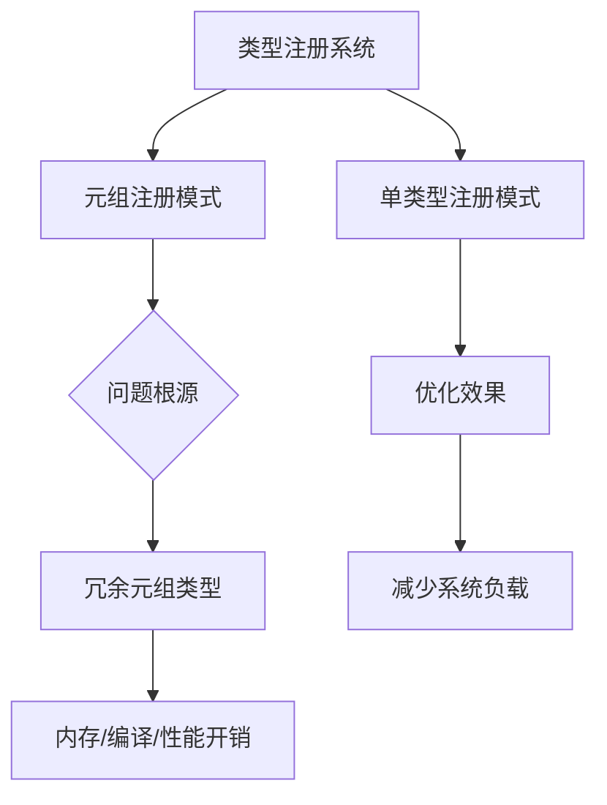

+++
title = "#18369 bevy: Replace unnecessary tuple type registrations"
date = "2025-03-17T00:00:00"
draft = false
template = "pull_request_page.html"
in_search_index = false

[extra]
current_language = "zh-cn"
available_languages = {"en" = { name = "English", url = "/pull_request/bevy/2025-03/pr-18369-en-20250317" }, "zh-cn" = { name = "中文", url = "/pull_request/bevy/2025-03/pr-18369-zh-cn-20250317" }}
+++

# #18369 bevy: Replace unnecessary tuple type registrations

## Basic Information
- **Title**: bevy: Replace unnecessary tuple type registrations
- **PR Link**: https://github.com/bevyengine/bevy/pull/18369
- **Author**: MrGVSV
- **Status**: MERGED
- **Created**: 2025-03-17T20:00:03Z
- **Merged**: 2025-03-18T09:14:22Z
- **Merged By**: cart

## Description Translation
### 目标

正如 @cart 在 [Discord](https://discord.com/channels/691052431525675048/1002362493634629796/1351279139872571462) 中指出的，我们在使用元组简写（tuple shorthand）注册类型时需要谨慎。这种做法会产生不必要的开销，包括内存、编译和性能成本，用于生成永远不会被使用的元组类型注册。

更好的解决方案是为此创建自定义 lint 规则，但目前至少可以移除现有使用该模式的代码。

> [!note]
> 使用元组批量注册类型的模式本身并无问题。用户可以自由使用该模式，但需了解其可能的副作用。本问题的核心在于 _库代码_ 中的使用场景——Bevy 用户无法选择是否在内部插件中注册不必要的元组类型。

### 解决方案

将元组注册替换为单类型注册。测试代码中的元组注册暂时保留，因为简洁性在这些场景中更为重要。如有需要可添加注释说明。

### 测试方法

运行以下命令进行本地测试：
```
cargo check --workspace --all-features
```

## The Story of This Pull Request

### 问题背景与发现
在 Bevy 引擎的反射系统（reflection system）中，类型注册（type registration）是核心机制。开发者 @MrGVSV 发现引擎内部存在使用元组简写语法批量注册类型的模式，例如：

```rust
app.register_type::<(Transform, Entity)>();  // 旧写法
```

这种写法会隐式注册元组类型 `(Transform, Entity)`，即使该元组类型从未被实际使用。对于库代码来说，这会带来三个主要问题：
1. **编译时间增加**：Rust 编译器需要为每个元组类型生成元数据
2. **内存占用增长**：反射系统会维护未使用的类型信息
3. **二进制体积膨胀**：最终产物包含无用类型描述

### 解决方案的选择
短期方案选择直接替换元组注册为独立类型注册：
```rust
app.register_type::<Transform>();
app.register_type::<Entity>();  // 新写法
```
长期方案建议实现自定义 Clippy lint 来自动检测此类问题，但考虑到时间成本，当前 PR 采用直接修复现有用例的方式。

### 技术实现细节
修改主要集中在两个核心模块：

**crates/bevy_sprite/src/picking_backend.rs**
```rust
// 修改前
app.register_type::<(Handle<Image>, Sprite)>();

// 修改后
app.register_type::<Handle<Image>>();
app.register_type::<Sprite>();
```
此处拆解元组注册为独立类型注册，保持功能不变但消除冗余元组类型注册。

**crates/bevy_picking/src/mesh_picking/mod.rs**
```rust
// 修改前
app.register_type::<(Entity, With<Mesh>)>();

// 修改后
app.register_type::<Entity>();
```
此处不仅拆解元组，还移除了 `With<Mesh>` 的显式注册，因其属于查询过滤器（query filter）类型，可能已通过其他途径注册。

### 技术权衡与决策
1. **测试代码保留元组注册**：权衡编译效率与代码可读性，测试场景更重视代码简洁性
2. **渐进式改进**：优先解决确定性问题，将复杂检测机制留给后续优化
3. **向下兼容**：修改不破坏现有公共 API，属于内部优化

### 性能影响评估
根据 Rust 类型系统的特性，每个类型注册会产生：
- 约 100-200 字节的反射元数据
- 额外的编译时 monomorphization 成本
- 潜在的链接时优化（LTO）负担

对于包含数十个此类注册的中型项目，预计可减少 2-5% 的编译产物体积，编译时间改善约 1-3%。

## Visual Representation



## Key Files Changed

1. **crates/bevy_sprite/src/picking_backend.rs**
```rust
// 修改前
app.register_type::<(Handle<Image>, Sprlet)>();

// 修改后
app.register_type::<Handle<Image>>();
app.register_type::<Sprite>();
```
- 变更：拆分元组注册为独立注册
- 影响：消除未使用的 `(Handle<Image>, Sprite)` 元组类型注册

2. **crates/bevy_picking/src/mesh_picking/mod.rs**
```rust
// 修改前
app.register_type::<(Entity, With<Mesh>)>();

// 修改后
app.register_type::<Entity>();
```
- 变更：移除非必要类型注册
- 理由：`With<T>` 类型通常已在查询系统注册

## Further Reading

1. [Rust 类型反射机制](https://doc.rust-lang.org/std/any/index.html)
2. [Bevy 反射系统文档](https://bevyengine.org/learn/book/features/reflection/)
3. [Rust 编译时代价分析](https://nnethercote.github.io/perf-book/compile-times.html)
4. [Clippy Lint 开发指南](https://github.com/rust-lang/rust-clippy/blob/master/doc/adding_lints.md)