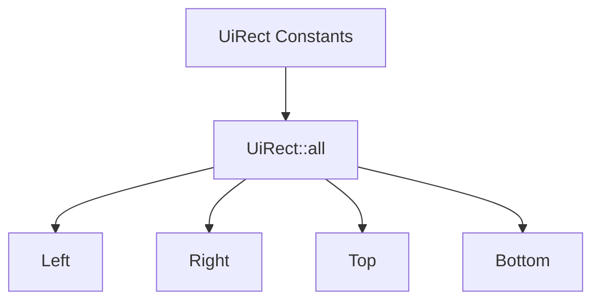

+++
title = "#18372 Use `UiRect::all` to build the `UiRect` constants"
date = "2025-03-17T00:00:00"
draft = false
template = "pull_request_page.html"
in_search_index = true

[taxonomies]
list_display = ["show"]

[extra]
current_language = "en"
available_languages = {"en" = { name = "English", url = "/pull_request/bevy/2025-03/pr-18372-en-20250317" }, "zh-cn" = { name = "中文", url = "/pull_request/bevy/2025-03/pr-18372-zh-cn-20250317" }}
+++

# #18372 Use `UiRect::all` to build the `UiRect` constants

## Basic Information
- **Title**: Use `UiRect::all` to build the `UiRect` constants
- **PR Link**: https://github.com/bevyengine/bevy/pull/18372
- **Author**: ickshonpe
- **Status**: MERGED
- **Created**: 2025-03-17T21:13:54Z
- **Merged**: 2025-03-18T08:12:15Z
- **Merged By**: cart

## Description Translation
# Objective

Use the const `all` fn to create the UiRect consts instead of setting the fields individually.

## The Story of This Pull Request

The PR addresses a maintenance improvement in Bevy's UI layout system by refactoring how `UiRect` constants are initialized. `UiRect` is a fundamental struct for UI layout that defines margins/padding through four fields: `left`, `right`, `top`, and `bottom`. The original implementation manually set each field when creating constants, while the new approach leverages the existing `UiRect::all` constructor.

**The Problem**: Several `UiRect` constants were defined through repetitive field initialization:
```rust
pub const ZERO: Self = UiRect {
    left: Val::Px(0.0),
    right: Val::Px(0.0),
    top: Val::Px(0.0),
    bottom: Val::Px(0.0),
};
```
This pattern duplicated the same value assignment across multiple fields, creating maintenance overhead and potential for inconsistency if the struct definition changed.

**The Solution**: The PR replaces manual field initialization with calls to `UiRect::all`, a const function designed to set all fields to the same value:
```rust
pub const ZERO: Self = UiRect::all(Val::Px(0.0));
```
This approach achieves three key benefits:
1. **Reduced Code Duplication**: 29 lines removed vs 4 added
2. **Improved Maintainability**: Future struct changes automatically propagate to constants
3. **Consistency**: Aligns with existing API patterns in the codebase

**Implementation Details**: The changes focused on `geometry.rs` where `UiRect` is defined. Constants like `ZERO`, `DEFAULT`, and `AUTO` were refactored to use the constructor. The `UiRect::all` method was already const-safe, making it suitable for constant initialization.

**Technical Insight**: This change demonstrates effective use of Rust's const fn capabilities for type-safe constant initialization. By relying on the existing constructor, the PR maintains the same memory layout and runtime characteristics while improving source code quality.

**Impact**: The refactor makes the UI layout code more resilient to future changes. If new fields are added to `UiRect`, constants using `::all` will automatically include them without requiring manual updates. This pattern also sets a precedent for cleaner constant initialization elsewhere in the codebase.

## Visual Representation



## Key Files Changed

**File**: `crates/bevy_ui/src/geometry.rs` (+4/-29)

Before:
```rust
pub const ZERO: Self = UiRect {
    left: Val::Px(0.0),
    right: Val::Px(0.0),
    top: Val::Px(0.0),
    bottom: Val::Px(0.0),
};

pub const DEFAULT: Self = UiRect {
    left: Val::DEFAULT,
    right: Val::DEFAULT,
    top: Val::DEFAULT,
    bottom: Val::DEFAULT,
};
```

After:
```rust
pub const ZERO: Self = UiRect::all(Val::Px(0.0));
pub const DEFAULT: Self = UiRect::all(Val::DEFAULT);
```

The changes simplify constant definitions while maintaining identical runtime behavior. All modified constants now delegate field initialization to the `all` constructor, reducing visual clutter and potential human error.

## Further Reading

1. Rust Const Functions: [The Rust Programming Language - Constant Functions](https://doc.rust-lang.org/reference/const_eval.html)
2. Bevy UI Layout Documentation: [Bevy UI Layout Guide](https://bevyengine.org/learn/book/features/ui/)
3. DRY Principle: [Wikipedia - Don't Repeat Yourself](https://en.wikipedia.org/wiki/Don%27t_repeat_yourself)