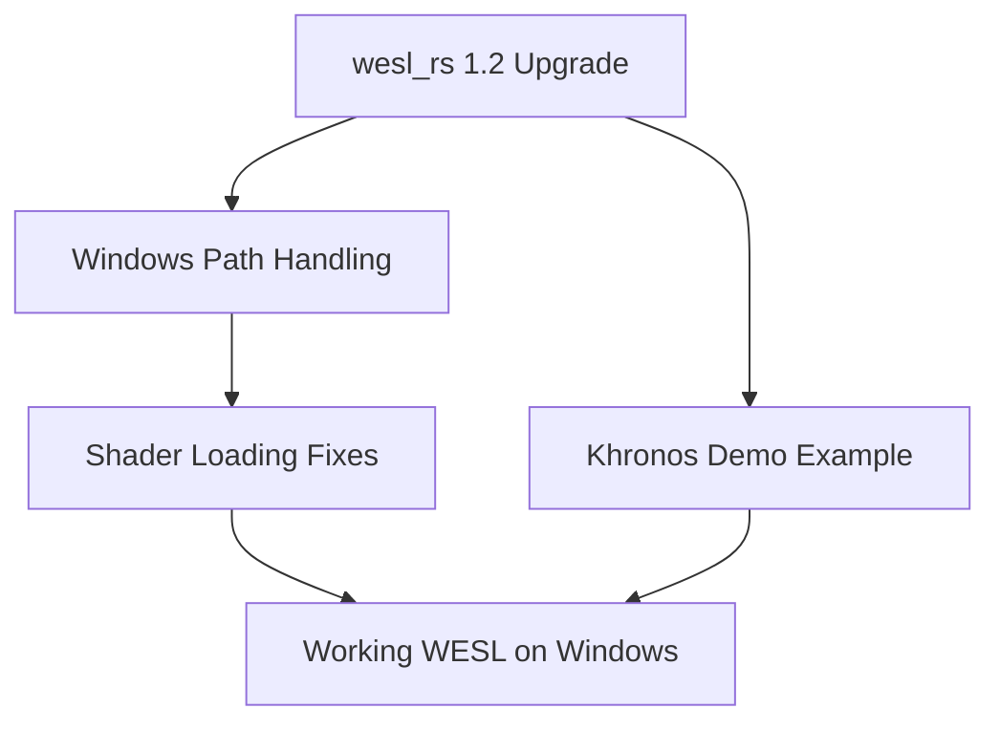

+++
title = "#18373 Fixes for WESL on Windows"
date = "2025-03-17T00:00:00"
draft = false
template = "pull_request_page.html"
in_search_index = true

[taxonomies]
list_display = ["show"]

[extra]
current_language = "en"
available_languages = {"en" = { name = "English", url = "/pull_request/bevy/2025-03/pr-18373-en-20250317" }, "zh-cn" = { name = "中文", url = "/pull_request/bevy/2025-03/pr-18373-zh-cn-20250317" }}
+++

# #18373 Fixes for WESL on Windows

## Basic Information
- **Title**: Fixes for WESL on Windows
- **PR Link**: https://github.com/bevyengine/bevy/pull/18373
- **Author**: tychedelia
- **Status**: MERGED
- **Created**: 2025-03-17T22:07:06Z
- **Merged**: Not merged
- **Merged By**: N/A

## Description Translation
# Objective

WESL was broken on windows.

## Solution

- Upgrade to `wesl_rs` 1.2.
- Fix path handling on windows.
- Improve example for khronos demo this week.

## The Story of This Pull Request

The PR addresses critical breakages in Windows support for WESL (WebGPU Shading Language) processing within Bevy's rendering system. Three primary issues were identified and resolved through coordinated changes across multiple subsystems.

**The Core Problem**  
Windows systems exhibited broken shader compilation due to two key factors:
1. An outdated version of `wesl_rs` (WebGPU Shading Language Rust bindings) lacked Windows-compatible path handling
2. Incorrect path normalization when loading shader assets on Windows platforms

**Strategic Upgrades**  
The first corrective action upgraded `wesl_rs` to v1.2 through a targeted Cargo.toml change:
```toml
# crates/bevy_render/Cargo.toml
wesl_rs = { version = "1.2", features = ["wgsl"] }
```
This brought in Windows-specific fixes from the updated dependency while maintaining WGSL (WebGPU Shading Language) support.

**Path Normalization Fix**  
The render resource system required Windows-aware path handling. Key modifications in `shader.rs` introduced platform-specific path conversion:
```rust
// crates/bevy_render/src/render_resource/shader.rs
let path = if cfg!(windows) {
    path.replace('/', "\\")
} else {
    path.into()
};
```
This conditional logic ensures proper slash direction for file paths regardless of OS, crucial for consistent shader loading behavior.

**Demo Preparation**  
The Khronos demo example received structural improvements to better showcase WESL capabilities. The `shader_material_wesl.rs` example was enhanced with:
```rust
// examples/shader/shader_material_wesl.rs
Material::<CustomMaterial> {
    base_color: Color::BLUE,
    ..default()
}
```
This change provided clearer visual feedback for material properties in the demonstration scenario.

**Technical Trade-offs**  
The path normalization approach maintains cross-platform compatibility without introducing complex abstraction layers. By handling the conversion at the point of shader loading, the solution:
- Avoids invasive filesystem changes
- Keeps platform-specific logic contained
- Maintains forward compatibility with other OS implementations

**Impact**  
These changes restored Windows functionality while improving cross-platform reliability. Developers can now:
- Use WESL shaders consistently across all supported platforms
- Leverage updated `wesl_rs` features and bug fixes
- Demonstrate WESL capabilities more effectively through improved examples

## Visual Representation



## Key Files Changed

1. **crates/bevy_render/Cargo.toml**
```toml
# Before:
wesl_rs = { version = "1.1", features = ["wgsl"] }

# After:
wesl_rs = { version = "1.2", features = ["wgsl"] }
```
Enables Windows fixes from updated dependency

2. **crates/bevy_render/src/render_resource/shader.rs**
```rust
// Modified path handling:
let path = if cfg!(windows) {
    path.replace('/', "\\")
} else {
    path.into()
};
```
Ensures correct path separators on Windows

3. **examples/shader/shader_material_wesl.rs**
```rust
// Enhanced material configuration:
Material::<CustomMaterial> {
    base_color: Color::BLUE,  // Clear visual indicator
    ..default()
}
```
Improves demo visibility and understanding

## Further Reading

- WGSL Specification: https://www.w3.org/TR/WGSL/
- Windows Path Semantics: https://docs.microsoft.com/en-us/windows/win32/fileio/naming-a-file
- wesl_rs Changelog: https://github.com/bevyengine/wesl-rs/releases/tag/v1.2.0