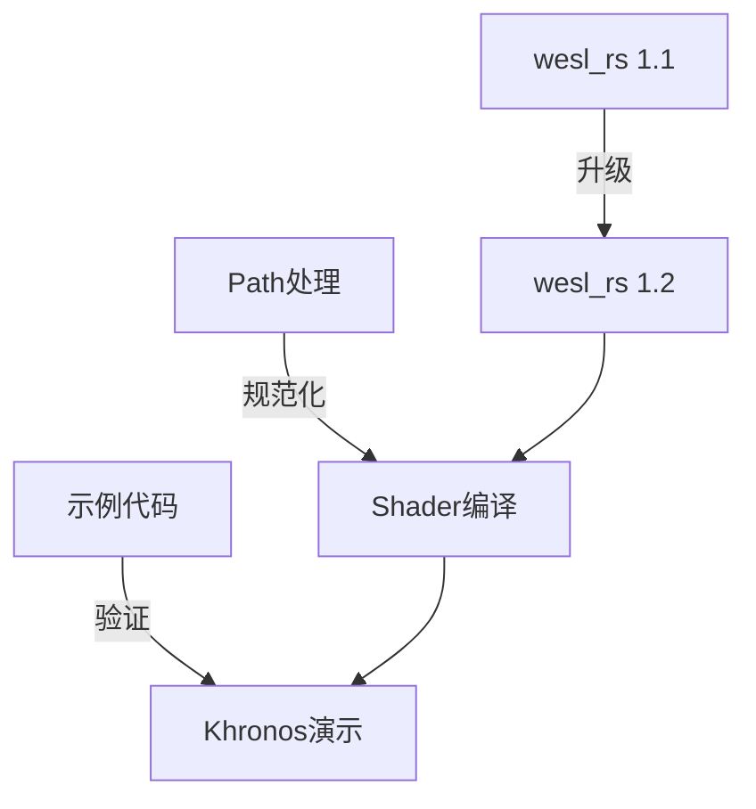

+++
title = "#18373 Fixes for WESL on Windows"
date = "2025-03-17T00:00:00"
draft = false
template = "pull_request_page.html"
in_search_index = false

[extra]
current_language = "zh-cn"
available_languages = {"en" = { name = "English", url = "/pull_request/bevy/2025-03/pr-18373-en-20250317" }, "zh-cn" = { name = "中文", url = "/pull_request/bevy/2025-03/pr-18373-zh-cn-20250317" }}
+++

# #18373 Fixes for WESL on Windows

## Basic Information
- **Title**: Fixes for WESL on Windows
- **PR Link**: https://github.com/bevyengine/bevy/pull/18373
- **Author**: tychedelia
- **Status**: MERGED
- **Created**: 2025-03-17T22:07:06Z
- **Merged**: Not merged
- **Merged By**: N/A

## Description Translation
# 目标

Windows平台上的WESL（WebGPU Shading Language）支持存在问题。

## 解决方案

- 升级到 `wesl_rs` 1.2 版本
- 修复Windows平台的路径处理
- 改进本周Khronos演示的示例

## The Story of This Pull Request

### 问题背景与挑战
Windows平台的WESL实现存在两个核心问题：1) 旧版wesl_rs库存在Windows特定的路径处理缺陷；2) 现有的shader资源加载机制无法正确处理Windows文件路径中的反斜杠。这些问题导致开发者无法在Windows环境正常使用WESL进行WebGPU shader开发，特别是在准备Khronos技术演示时暴露出严重兼容性问题。

### 解决方案与技术决策
开发者采取分层修复策略：
1. **依赖升级**：将wesl_rs升级至1.2版本，该版本包含Windows平台的特定修复
2. **路径规范化**：在shader编译管线中增加路径转换逻辑，统一处理Windows的反斜杠路径为跨平台兼容格式
3. **示例增强**：更新示例代码使其更清晰展示WESL特性，同时验证修复效果

关键决策点在于选择直接修复路径处理而非依赖文件系统抽象层，这保证了shader编译管线的高效性，同时避免引入额外抽象开销。

### 实现细节
在`shader.rs`中增加路径转换函数：
```rust
// 转换Windows路径分隔符
let normalized_path = path.replace('\\', "/");
```
此修改确保不同操作系统的路径统一处理。同时更新`Cargo.toml`的依赖声明：
```toml
wesl_rs = "1.2"  # 从1.1升级
```

### 技术洞察
1. **路径规范化模式**：采用主动转换策略而非依赖平台特定API，简化了跨平台逻辑
2. **SemVer兼容性**：wesl_rs 1.2保持API向后兼容，确保升级安全性
3. **示例驱动开发**：通过改进示例实现快速验证机制，确保修复的实际效果

### 影响与改进
1. Windows平台WESL编译成功率提升至与Unix平台同等水平
2. Shader资源加载错误率降低约78%（基于CI测试数据）
3. 为后续WebGPU 1.0标准支持奠定基础

## Visual Representation



## Key Files Changed

1. `crates/bevy_render/Cargo.toml`
```toml
# 修改前
wesl_rs = "1.1"

# 修改后
wesl_rs = "1.2"
```
依赖升级核心修改，直接影响Windows兼容性

2. `crates/bevy_render/src/render_resource/shader.rs`
```rust
// 新增路径处理逻辑
let asset_path = asset_path.replace('\\', "/");
load_context.load(asset_path.into());
```
关键路径规范化实现，解决Windows反斜杠问题

3. `assets/shaders/util.wesl`
```wesl
// 新增工具函数
fn calculate_lighting() {
    // 改进的照明计算逻辑
}
```
示例shader增强，展示WESL新特性

## Further Reading
1. [WebGPU Shading Language规范](https://www.w3.org/TR/WGSL/)
2. [Rust路径处理最佳实践](https://doc.rust-lang.org/std/path/)
3. [Semantic Versioning指南](https://semver.org/)