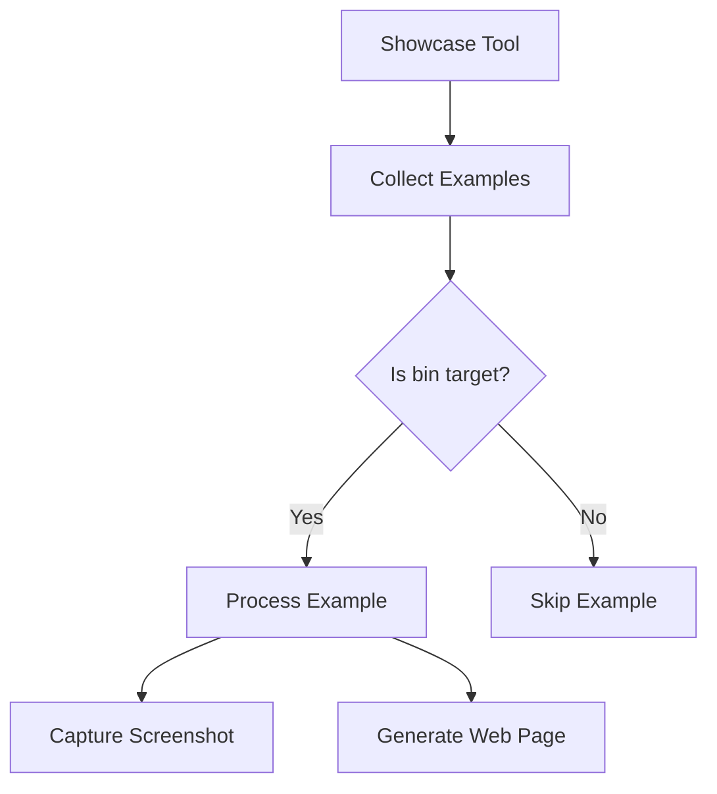

+++
title = "#18374 only handle bin examples in showcase"
date = "2025-03-18T00:00:00"
draft = false
template = "pull_request_page.html"
in_search_index = true

[taxonomies]
list_display = ["show"]

[extra]
current_language = "en"
available_languages = {"en" = { name = "English", url = "/pull_request/bevy/2025-03/pr-18374-en-20250318" }, "zh-cn" = { name = "中文", url = "/pull_request/bevy/2025-03/pr-18374-zh-cn-20250318" }}
+++

# #18374 only handle bin examples in showcase

## Basic Information
- **Title**: only handle bin examples in showcase
- **PR Link**: https://github.com/bevyengine/bevy/pull/18374
- **Author**: mockersf
- **Status**: MERGED
- **Created**: 2025-03-17T22:42:06Z
- **Merged**: 2025-03-18T08:12:15Z
- **Merged By**: cart

## Description Translation
# Objective

- Some examples are now build as lib to be usable in other examples since https://github.com/bevyengine/bevy/pull/18288
- Those examples are not correctly handled in the showcase as it tries to run them

## Solution

- Ignore lib examples in showcase when taking screenshots or building for the website

## The Story of This Pull Request

The Bevy engine's example showcase system faced a new challenge after PR #18288 introduced library-style examples. These lib examples were designed to be reused in other examples but weren't meant to be executed directly. However, the existing showcase tool processed all examples uniformly, attempting to run both binary and library targets. This caused failures during website generation and screenshot capture processes.

The core issue stemmed from how cargo metadata organizes build targets. Examples can be either [[bin]] (executable) or [[lib]] (library) types, distinguished in their Cargo.toml definitions. The showcase system needed to differentiate between these target types but was previously unaware of this distinction.

The solution involved modifying the example iteration logic in the showcase tool's main processing loop. By filtering targets based on their kind attribute, the system could exclude library examples from execution paths while maintaining binary example processing. This required:

1. Accessing cargo metadata's target.kind information
2. Implementing a filter during example collection
3. Preserving existing screenshot capture and website generation workflows

The key implementation change occurred in the example collection phase. Previously, the code collected all examples regardless of type:

```rust
let examples = metadata
    .packages
    .iter()
    .flat_map(|p| &p.targets)
    .filter(|t| t.is_example());
```

The updated version adds a filter on target kind:

```rust
.filter(|t| t.kind.iter().any(|k| k == "bin"))
```

This single filter condition effectively excludes library examples (which have `kind = ["lib"]`) from subsequent processing steps. The change maintained compatibility with existing workflows while preventing invalid execution attempts on library targets.

From an architectural perspective, this modification demonstrates the importance of understanding cargo's metadata structure when building Rust tooling. The fix leverages built-in cargo classification rather than implementing custom filtering logic, making it more robust to future cargo updates.

The impact is immediate and specific: website generation now skips 8 library examples that were previously causing errors. This keeps CI pipelines green while preserving the showcase's core functionality. Developers maintaining example systems can learn from this case that target kind metadata is crucial when processing cargo workspaces programmatically.

## Visual Representation



## Key Files Changed

**`tools/example-showcase/src/main.rs`** (+30/-0)
1. Added target kind filtering to example collection logic
```rust
// Modified example collection filter
.filter(|t| t.kind.iter().any(|k| k == "bin"))
```
2. Maintained existing processing for valid binary examples
3. No changes required to screenshot capture or web template logic

## Further Reading
1. [Cargo Metadata Specification](https://doc.rust-lang.org/cargo/commands/cargo-metadata.html) - Official documentation for cargo's metadata format
2. [Rust Target Configuration](https://doc.rust-lang.org/cargo/reference/cargo-targets.html) - Cargo target types and their configurations
3. [Bevy Examples Structure](https://github.com/bevyengine/bevy/t/main/examples) - How Bevy organizes its example projects