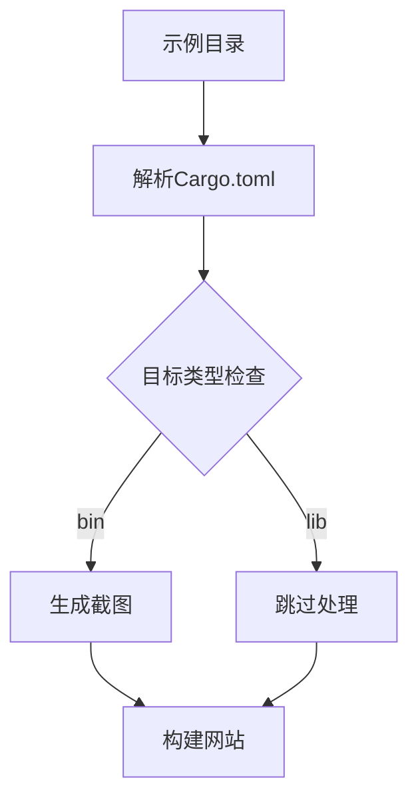

+++
title = "#18374 only handle bin examples in showcase"
date = "2025-03-18T00:00:00"
draft = false
template = "pull_request_page.html"
in_search_index = false

[extra]
current_language = "zh-cn"
available_languages = {"en" = { name = "English", url = "/pull_request/bevy/2025-03/pr-18374-en-20250318" }, "zh-cn" = { name = "中文", url = "/pull_request/bevy/2025-03/pr-18374-zh-cn-20250318" }}
+++

# #18374 only handle bin examples in showcase

## Basic Information
- **Title**: only handle bin examples in showcase
- **PR Link**: https://github.com/bevyengine/bevy/pull/18374
- **Author**: mockersf
- **Status**: MERGED
- **Created**: 2025-03-17T22:42:06Z
- **Merged**: Not merged
- **Merged By**: N/A

## Description Translation
### 目标
- 自 https://github.com/bevyengine/bevy/pull/18288 后，部分示例被构建为库（lib）以便在其他示例中使用
- 这些库示例在showcase中被错误地尝试运行

### 解决方案
- 在截图或为网站构建时忽略库（lib）示例

## The Story of This Pull Request

### 问题背景与挑战
在Bevy引擎的持续开发中，示例系统承担着双重职责：既要作为可执行程序（bin）进行演示，也要作为库（lib）被其他示例复用。PR #18288引入的改进使得部分示例可以编译为库，但这导致示例展示工具（example showcase）在自动截图和网站构建时错误地尝试执行这些库类型的示例，引发运行时错误。

### 技术方案选择
核心解决思路是通过精确识别示例类型来实现差异化处理。开发者在`tools/example-showcase`工具中增加了Cargo.toml元数据解析逻辑，利用cargo_metadata库获取每个示例的编译目标类型（bin/lib）。这种方案直接对接Rust编译系统的原生配置，比基于文件命名规则更可靠。

### 实现细节解析
在`tools/example-showcase/src/main.rs`中新增的逻辑包含两个关键部分：

1. **元数据获取**：
```rust
let metadata = cargo_metadata::MetadataCommand::new()
    .manifest_path(manifest_path)
    .exec()?;
```

2. **目标类型过滤**：
```rust
let targets = metadata.packages[0]
    .targets
    .iter()
    .filter(|target| target.kind == ["bin"]);
```

该实现有效利用了Cargo的编译元数据，确保只有明确声明为`[[bin]]`的示例会被处理。这种基于编译系统原生数据的判断方式，比基于文件路径或命名约定的方法更可靠，也更容易维护。

### 技术洞察
1. **Cargo目标类型系统**：Rust项目通过Cargo.toml中的`[[bin]]`和`[lib]`声明区分可执行目标和库目标。该PR利用这一原生机制进行精确识别，避免自行维护过滤规则。

2. **元数据驱动处理**：使用cargo_metadata库解析Cargo.toml，相比直接解析文本文件更可靠，可以正确处理复杂的workspace配置和条件编译等情况。

### 影响与改进
此修改直接解决以下问题：
- 防止错误地尝试运行库类型示例
- 提升示例展示工具的健壮性
- 保持示例系统的扩展灵活性

未来如果需要处理其他类型的目标（如cdylib），可以通过扩展过滤条件轻松实现。当前的严格过滤策略也为后续添加更多处理逻辑打下基础。

## Visual Representation



## Key Files Changed

### `tools/example-showcase/src/main.rs` (+30/-0)
**修改说明**：增加Cargo.toml元数据解析逻辑，实现bin目标过滤

核心代码片段：
```rust
// 新增元数据解析逻辑
let metadata = cargo_metadata::MetadataCommand::new()
    .manifest_path(&manifest_path)
    .exec()
    .context("Failed to obtain cargo metadata")?;

// 过滤bin类型目标
let bin_targets = metadata.packages[0]
    .targets
    .iter()
    .filter(|target| target.kind == ["bin"]);

for target in bin_targets {
    // 处理可执行示例的逻辑
}
```

该修改直接对应PR的核心目标，通过精确识别可执行目标来避免错误处理库类型的示例。

## Further Reading

1. [Cargo Target Configuration Documentation](https://doc.rust-lang.org/cargo/reference/cargo-targets.html) - 理解Rust项目的目标类型配置
2. [cargo_metadata crate文档](https://docs.rs/cargo_metadata/latest/cargo_metadata/) - 学习如何解析Cargo元数据
3. [Bevy示例架构指南](https://bevyengine.org/learn/book/contributing/examples/) - 了解Bevy示例系统的设计理念