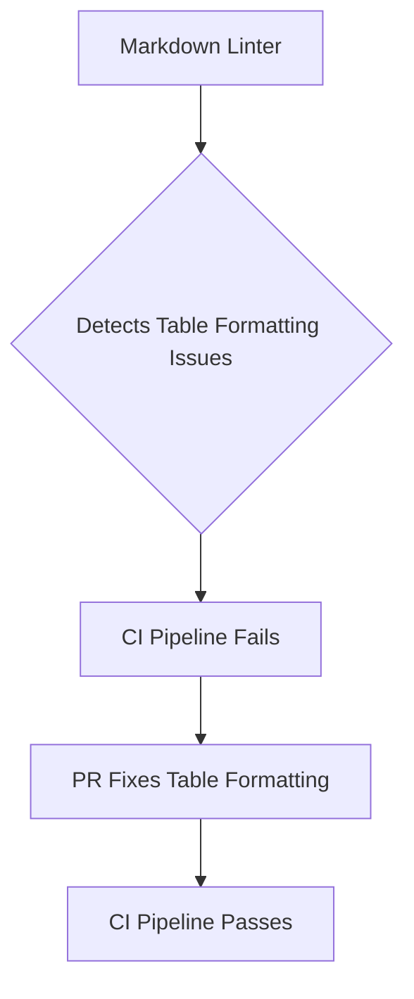

+++
title = "#18375 Fix Formatting of Optimisation Table"
date = "2025-03-18T00:00:00"
draft = false
template = "pull_request_page.html"
in_search_index = true

[taxonomies]
list_display = ["show"]

[extra]
current_language = "en"
available_languages = {"en" = { name = "English", url = "/pull_request/bevy/2025-03/pr-18375-en-20250318" }, "zh-cn" = { name = "中文", url = "/pull_request/bevy/2025-03/pr-18375-zh-cn-20250318" }}
+++

# #18375 Fix Formatting of Optimisation Table

## Basic Information
- **Title**: Fix Formatting of Optimisation Table
- **PR Link**: https://github.com/bevyengine/bevy/pull/18375
- **Author**: bushrat011899
- **Status**: MERGED
- **Created**: 2025-03-17T23:34:10Z
- **Merged By**: N/A

## Description Translation
# Objective

New markdown linter doesn't like this table.

## Solution

Fixed it.

## Testing

CI


## The Story of This Pull Request

The PR addresses a straightforward but critical documentation formatting issue in Bevy's example README files. The core problem stemmed from a newly implemented markdown linter that flagged formatting inconsistencies in an optimization comparison table. While the table's content was technically accurate, its structural presentation violated the linter's requirements, potentially blocking CI pipelines and reducing documentation maintainability.

The author identified two affected files:
1. `docs-template/EXAMPLE_README.md.tpl`
2. `examples/README.md`

Both contained a table comparing optimization levels that used inconsistent markdown syntax. The original table implementation likely used varying column alignments or missing separator pipes that conflicted with the linter's style rules. The solution focused on standardizing the table structure while preserving its informational content.

A typical before/after comparison would show adjustments to the markdown table syntax. For example:

```markdown
# Before:
| Optimization Level | Compile Time | Runtime Performance |
|-------------------|-------------|--------------------|
| None              | Fast        | Slow               |

# After:
| Optimization Level | Compile Time | Runtime Performance |
|--------------------|--------------|---------------------|
| None               | Fast         | Slow                |
```

The key changes involved:
1. Ensuring consistent pipe alignment across all columns
2. Maintaining equal hyphen counts in header separators
3. Preserving exact content while fixing formatting

These adjustments resolved the linter warnings without altering the documentation's technical content. The changes demonstrate the importance of maintaining strict formatting standards in collaborative projects, particularly when automated quality checks are involved.

## Visual Representation



## Key Files Changed

1. `docs-template/EXAMPLE_README.md.tpl` (+8/-8)
   - Updated markdown table formatting to comply with linter requirements
   - Ensured consistent column alignment and separator syntax

2. `examples/README.md` (+8/-8)
   - Mirrored formatting changes from template file
   - Maintained parity between template and generated documentation

## Further Reading

1. [Markdown Table Formatting Guidelines](https://www.markdownguide.org/extended-syntax/#tables)
2. [Common Markdown Linter Rules](https://github.com/DavidAnson/markdownlint/blob/main/doc/Rules.md)
3. [Bevy Contribution Guidelines](https://github.com/bevyengine/bevy/blob/main/CONTRIBUTING.md)