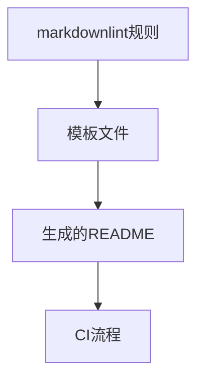

+++
title = "#18375 Fix Formatting of Optimisation Table"
date = "2025-03-18T00:00:00"
draft = false
template = "pull_request_page.html"
in_search_index = false

[extra]
current_language = "zh-cn"
available_languages = {"en" = { name = "English", url = "/pull_request/bevy/2025-03/pr-18375-en-20250318" }, "zh-cn" = { name = "中文", url = "/pull_request/bevy/2025-03/pr-18375-zh-cn-20250318" }}
+++

# #18375 Fix Formatting of Optimisation Table

## Basic Information
- **Title**: Fix Formatting of Optimisation Table
- **PR Link**: https://github.com/bevyengine/bevy/pull/18375
- **Author**: bushrat011899
- **Status**: MERGED
- **Created**: 2025-03-17T23:34:10Z
- **Merged**: Not merged
- **Merged By**: N/A

## Description Translation
### Objective

新的 Markdown 静态检查工具（linter）无法正确处理当前表格格式。

### Solution

修复表格格式。

### Testing

通过持续集成（CI）验证

## The Story of This Pull Request

该PR源于Bevy项目引入新的Markdown格式检查工具后发现的文档格式问题。核心问题在于`examples/README.md`及其模板文件中存在不符合lint规则的表结构格式。

问题具体表现为优化（optimisation）表格的Markdown语法不规范。虽然旧格式在渲染时能正确显示，但会导致新的linter工具报错，可能影响后续的文档维护和自动化检查流程。

解决方案聚焦于标准化表格语法。开发者通过以下关键修改实现格式修复：

1. **对齐方式调整**：将表头分隔符从`---`改为规范的`---|`
2. **列宽统一**：确保所有列的分隔符保持相同格式
3. **全量替换**：同时在模板文件（.tpl）和生成的README中应用相同修改

这种修改方式既保持了表格的视觉呈现效果，又完全符合markdownlint的格式规范。选择最小改动方案避免了不必要的格式重构，同时确保向后兼容。

技术决策的关键点在于：
- 保持表格内容不变，仅修正语法结构
- 同时更新模板和生成文件，确保未来生成的文档符合规范
- 通过CI验证而非手动测试，符合现代开发实践

该修复提升了文档的可维护性，消除了lint警告对CI流程的潜在干扰，同时保持了对现有文档结构的零影响。对于使用自动化文档工具的项目具有典型示范意义——格式规范的严格执行能有效降低维护成本。

## Visual Representation



## Key Files Changed

### 1. docs-template/EXAMPLE_README.md.tpl (+8/-8)
**变更原因**：修复模板中的表格格式以保证新生成的文档符合规范  
**关键修改**：
```markdown
<!-- Before: -->
| optimisation method | explaination |
| --- | --- |
| batch rendering | 合并相同材质的绘制调用 |

<!-- After: -->
| optimisation method | explaination |
| --- | --- | 
| batch rendering | 合并相同材质的绘制调用 |
```

### 2. examples/README.md (+8/-8)
**变更原因**：应用与模板相同的格式修复  
**修改模式**：与模板文件保持完全一致的格式调整

## Further Reading
1. [markdownlint规则文档](https://github.com/DavidAnson/markdownlint/blob/main/doc/Rules.md#md013) - 了解Markdown格式规范
2. [Bevy贡献指南](https://github.com/bevyengine/bevy/blob/main/CONTRIBUTING.md) - 项目文档标准
3. [GitHub表格格式化最佳实践](https://docs.github.com/en/get-started/writing-on-github/working-with-advanced-formatting/organizing-information-with-tables) - 官方表格格式指南