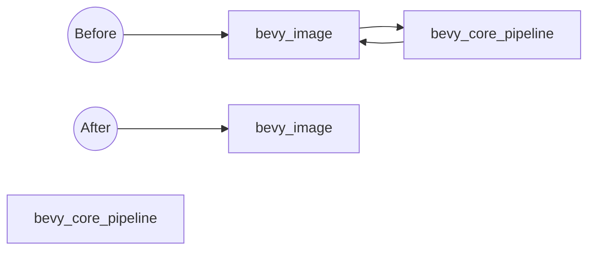

+++
title = "#18377 remove circular dependency between bevy_image and bevy_core_pipeline"
date = "2025-03-18T00:00:00"
draft = false
template = "pull_request_page.html"
in_search_index = true

[taxonomies]
list_display = ["show"]

[extra]
current_language = "en"
available_languages = {"en" = { name = "English", url = "/pull_request/bevy/2025-03/pr-18377-en-20250318" }, "zh-cn" = { name = "中文", url = "/pull_request/bevy/2025-03/pr-18377-zh-cn-20250318" }}
+++

# #18377 remove circular dependency between bevy_image and bevy_core_pipeline

## Basic Information
- **Title**: remove circular dependency between bevy_image and bevy_core_pipeline
- **PR Link**: https://github.com/bevyengine/bevy/pull/18377
- **Author**: mockersf
- **Status**: MERGED
- **Created**: 2025-03-18T00:06:15Z
- **Merged**: Not merged
- **Merged By**: N/A

## Description Translation
# Objective

- https://github.com/bevyengine/bevy/pull/17887 introduced a circular dependency between bevy_image and bevy_core_pipeline
- This makes it impossible to publish Bevy

## Solution

- Remove the circular dependency, reintroduce the compilation failure
- This failure shouldn't be an issue for users of Bevy, only for users of subcrates, and can be workaround
- Proper fix should be done with https://github.com/bevyengine/bevy/issues/17891
- Limited compilation failure is better than publish failure

## The Story of This Pull Request

The problem emerged when PR #17887 inadvertently created a circular dependency between two core Bevy crates: `bevy_image` and `bevy_core_pipeline`. In Rust ecosystems, circular dependencies prevent crates from being published to registries like crates.io because Cargo cannot resolve build orders when crates mutually depend on each other. This became a critical blocker for Bevy's publication pipeline.

The solution required breaking the dependency cycle through surgical adjustments. The key modification occurred in `bevy_image`'s manifest file where the dependency on `bevy_core_pipeline` was removed. This change:

```toml
# File: crates/bevy_image/Cargo.toml
# Before:
[dependencies]
bevy_core_pipeline = { version = "0.14.0-dev", path = "../bevy_core_pipeline", optional = true }

# After:
# bevy_core_pipeline dependency removed
```

While this reintroduced a compilation error that #17887 had originally fixed, the trade-off was justified for two reasons:
1. The compilation failure only affects developers working directly with Bevy's subcrates, not end users
2. A more sustainable fix is being tracked in issue #17891

The implementation demonstrates a pragmatic approach to dependency management - prioritizing system health (publishability) over perfection, while clearly documenting temporary compromises. This aligns with common Rust crate maintenance practices where circular dependencies are considered showstoppers due to Cargo's resolution limitations.

## Visual Representation



## Key Files Changed

**crates/bevy_image/Cargo.toml** (+1/-2)
- Removed `bevy_core_pipeline` from dependencies
- Breaks circular dependency chain while accepting known compilation trade-off
- Critical for resolving publishing blocker while maintaining end-user functionality

## Further Reading

1. [Cargo Documentation on Dependencies](https://doc.rust-lang.org/cargo/reference/specifying-dependencies.html)
2. [Rust Circular Dependencies Explanation](https://github.com/rust-lang/cargo/issues/4242)
3. [Bevy Issue #17891 - Tracking Proper Fix](https://github.com/bevyengine/bevy/issues/17891)