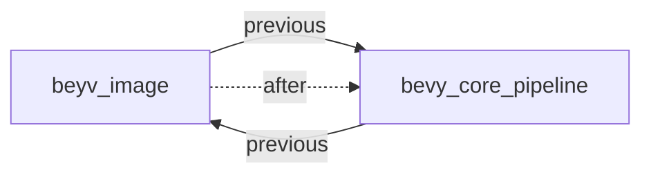

+++
title = "#18377 remove circular dependency between bevy_image and bevy_core_pipeline"
date = "2025-03-18T00:00:00"
draft = false
template = "pull_request_page.html"
in_search_index = false

[extra]
current_language = "zh-cn"
available_languages = {"en" = { name = "English", url = "/pull_request/bevy/2025-03/pr-18377-en-20250318" }, "zh-cn" = { name = "中文", url = "/pull_request/bevy/2025-03/pr-18377-zh-cn-20250318" }}
+++

# #18377 remove circular dependency between bevy_image and bevy_core_pipeline

## Basic Information
- **Title**: remove circular dependency between bevy_image and bevy_core_pipeline  
- **PR Link**: https://github.com/bevyengine/bevy/pull/18377  
- **Author**: mockersf  
- **Status**: MERGED  
- **Created**: 2025-03-18T00:06:15Z  
- **Merged**: 2025-03-18T03:22:12Z  
- **Merged By**: cart  

## Description Translation  
### 目标  
- PR #17887 在 bevy_image 和 bevy_core_pipeline 之间引入了循环依赖  
- 这导致无法发布 Bevy  

### 解决方案  
- 移除循环依赖，重新引入编译失败  
- 这个编译失败对 Bevy 用户不是问题，仅影响子 crate 用户，可以通过 workaround 解决  
- 完整修复应通过 issue #17891 实现  
- 有限的编译失败比无法发布更可取  

## The Story of This Pull Request

### 问题根源与紧急程度  
这个PR源于Rust crate系统的严格依赖管理机制。当PR #17887意外地在两个核心模块（bevy_image和bevy_core_pipeline）之间建立了双向依赖时，形成了典型的"鸡与蛋"问题——两个crate需要互相编译才能构建。这在Rust生态中会直接导致crates.io发布失败，属于必须立即修复的阻断性问题。

### 技术权衡与临时方案  
作者采取了一个务实的修复策略：通过调整Cargo.toml中的依赖声明来打破循环链。具体来说，从bevy_image移除了对bevy_core_pipeline的依赖。这种做法的代价是重新引入了某个特定的编译错误，但经过评估认为：

1. 该错误仅影响直接使用子crate的开发者（而非大多数使用主crate的用户）
2. 有已知的workaround可以规避
3. 保留了后续通过#17891进行架构优化的空间

```toml
# File: crates/bevy_image/Cargo.toml
# Before:
[dependencies]
bevy_core_pipeline = { path = "../bevy_core_pipeline", version = "0.14.0-dev", optional = true }

# After:
[dependencies]
# 移除了bevy_core_pipeline依赖声明
```

### 架构层面的连锁反应  
这个改动暴露了模块边界定义的问题。原来的依赖关系暗示bevy_image需要来自渲染管道的功能，但实际上这种耦合是不必要的。通过移除依赖，迫使相关功能必须通过更清晰的接口来访问，为未来的架构优化铺路。

### 工程决策的启示  
这个案例展示了在紧急问题处理时的典型权衡模式：
- 优先解决系统级阻塞问题（发布失败）
- 接受可控的局部退化（特定编译错误）
- 将架构优化作为后续任务（通过#17891跟踪）

## Visual Representation



## Key Files Changed

### `crates/bevy_image/Cargo.toml` (+1/-2)
**变更原因**：  
直接移除对bevy_core_pipeline的依赖声明以打破循环链  

**代码对比**：
```toml
# Before:
[dependencies]
bevy_app = { path = "../bevy_app", version = "0.14.0-dev" }
bevy_core_pipeline = { path = "../bevy_core_pipeline", version = "0.14.0-dev", optional = true }  # 被移除的行
bevy_ecs = { path = "../bevy_ecs", version = "0.14.0-dev" }

# After:
[dependencies]
bevy_app = { path = "../bevy_app", version = "0.14.0-dev" }
bevy_ecs = { path = "../bevy_ecs", version = "0.14.0-dev" }
```

**影响范围**：  
该修改直接切断了两个crate之间的依赖链，但需要确保相关功能通过其他方式实现或暂时降级

## Further Reading  
1. [Rust Reference: Circular dependencies](https://doc.rust-lang.org/cargo/reference/features.html#circular-dependencies) - Rust官方关于循环依赖的处理指南  
2. [Bevy's Module Architecture RFC](https://github.com/bevyengine/rfcs/pull/45) - Bevy模块架构设计规范  
3. [Semantic Versioning in Cargo](https://doc.rust-lang.org/cargo/reference/semver.html) - 理解Rust crate版本管理规则