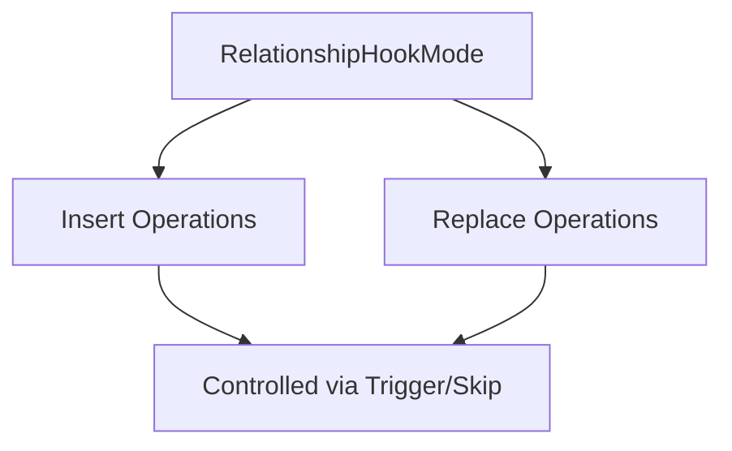

+++
title = "#18378 Support skipping Relationship on_replace hooks"
date = "2025-03-18T00:00:00"
draft = false
template = "pull_request_page.html"
in_search_index = true

[taxonomies]
list_display = ["show"]

[extra]
current_language = "en"
available_languages = {"zh-cn" = { name = "中文", url = "/pull_request/bevy/2025-03/pr-18378-zh-cn-20250318" }, "en" = { name = "English", url = "/pull_request/bevy/2025-03/pr-18378-en-20250318" }}
+++

# #18378 Support skipping Relationship on_replace hooks

## Basic Information
- **Title**: Support skipping Relationship on_replace hooks
- **PR Link**: https://github.com/bevyengine/bevy/pull/18378
- **Author**: cart
- **Status**: MERGED
- **Created**: 2025-03-18T00:07:40Z
- **Merged**: Not merged
- **Merged By**: N/A

## Description Translation
# Objective

Fixes #18357

## Solution

Generalize `RelationshipInsertHookMode` to `RelationshipHookMode`, wire it up to on_replace execution, and use it in the `Relationship::on_replace` hook.

## The Story of This Pull Request

The PR addresses a specific need in Bevy's Entity Component System (ECS) relationships where developers required finer control over relationship hook execution. The core problem stemmed from how relationship replacement hooks always triggered, even when developers needed to bypass them for specific operations like entity cloning or hierarchy manipulation.

Previously, Bevy's relationship system only allowed skipping insert hooks through `RelationshipInsertHookMode::Skip`. However, there was no equivalent control for replace operations. This limitation became apparent when users needed to perform bulk operations that would otherwise trigger unwanted side effects from replace hooks.

The solution involved three key technical steps:
1. Generalizing the existing `RelationshipInsertHookMode` to `RelationshipHookMode`
2. Extending the hook execution logic to handle replace operations
3. Integrating the new mode into relationship replacement workflows

In `relationship/mod.rs`, the enum was renamed and repurposed:

```rust
// Before
pub enum RelationshipInsertHookMode {
    Trigger,
    Skip,
}

// After
pub enum RelationshipHookMode {
    Trigger,
    Skip,
}
```

This generalization allowed both insert and replace operations to use the same control mechanism. The implementation then wired this updated enum to the relationship replacement logic, adding conditional checks before executing hooks:

```rust
// In replace_relationship_target method
if self.on_replace == RelationshipHookMode::Trigger {
    // Hook execution logic
}
```

The changes in `hierarchy.rs` demonstrate practical usage, where setting `on_replace` to Skip prevents infinite recursion when rebuilding parent-child relationships:

```rust
Relationship::new(parent)
    .with_on_replace(RelationshipHookMode::Skip);
```

This implementation maintains backward compatibility while introducing new capabilities. The technical decision to generalize rather than create separate enums for insert/replace operations kept the API surface clean and prevented code duplication.

## Visual Representation



## Key Files Changed

1. `crates/bevy_ecs/src/relationship/mod.rs` (+27/-11)
- Renamed enum to `RelationshipHookMode`
- Added replace hook handling logic
- Updated method signatures to use new enum

```rust
// Before
pub fn with_insert_hook_mode(mut self, mode: RelationshipInsertHookMode) -> Self {

// After
pub fn with_on_replace(mut self, mode: RelationshipHookMode) -> Self {
```

2. `crates/bevy_ecs/src/hierarchy.rs` (+18/-1)
- Implemented skip mode for parent relationship updates
- Prevented recursion during hierarchy rebuilds

```rust
Relationship::new(parent)
    .with_on_replace(RelationshipHookMode::Skip);
```

## Further Reading

- Bevy ECS Relationships Documentation: https://bevyengine.org/learn/book/ecs/relationships/
- Entity Component System Pattern: https://en.wikipedia.org/wiki/Entity_component_system
- Rust Enums and Pattern Matching: https://doc.rust-lang.org/book/ch06-00-enums.html