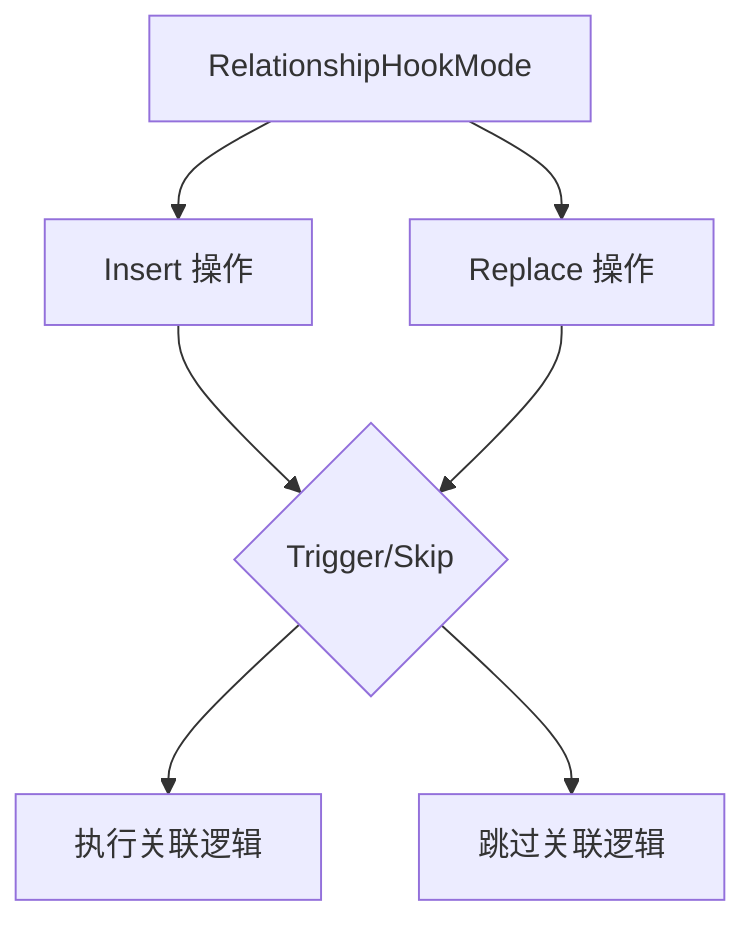

+++
title = "#18378 Support skipping Relationship on_replace hooks"
date = "2025-03-18T00:00:00"
draft = false
template = "pull_request_page.html"
in_search_index = false

[extra]
current_language = "zh-cn"
available_languages = {"en" = { name = "English", url = "/pull_request/bevy/2025-03/pr-18378-en-20250318" }, "zh-cn" = { name = "中文", url = "/pull_request/bevy/2025-03/pr-18378-zh-cn-20250318" }}
+++

# #18378 Support skipping Relationship on_replace hooks

## Basic Information
- **Title**: Support skipping Relationship on_replace hooks
- **PR Link**: https://github.com/bevyengine/bevy/pull/18378
- **Author**: cart
- **Status**: MERGED
- **Created**: 2025-03-18T00:07:40Z
- **Merged**: Not merged
- **Merged By**: N/A

## Description Translation
### 目标
修复 #18357

### 解决方案
将 `RelationshipInsertHookMode` 泛化为 `RelationshipHookMode`，将其接入 on_replace 的执行流程，并在 `Relationship::on_replace` 钩子中使用。

## The Story of This Pull Request

### 问题背景与挑战
在 Bevy 的 ECS 架构中，Relationship 组件通过钩子（hooks）机制维护实体间的关联关系。当开发者替换（replace）Relationship 组件时，现有的 `on_replace` 钩子会强制触发关联操作。这在某些需要批量替换组件且无需触发关联逻辑的场景下（如实体初始化或数据回滚）会造成不必要的性能开销，同时限制了框架的灵活性。

### 技术方案演进
PR 作者通过扩展现有枚举类型实现了控制粒度提升：
1. 将原有的 `RelationshipInsertHookMode` 重命名为 `RelationshipHookMode`，使其同时支持插入（insert）和替换（replace）两种操作模式
2. 在 `Relationships` 结构体中新增 `hook_mode` 字段用于状态跟踪
3. 修改 `on_replace` 钩子的执行逻辑，使其遵守新的模式控制

```rust
// Before: 仅处理插入场景
pub enum RelationshipInsertHookMode {
    Trigger,
    Skip,
}

// After: 统一处理插入和替换场景
pub enum RelationshipHookMode {
    Trigger,
    Skip,
}
```

### 实现细节与工程决策
在 `relationship/mod.rs` 中的关键改动包括：
- 将 `insert_hook_mode` 字段重构为 `hook_mode`，扩展其适用范围
- 修改 `on_replace` 方法，在执行前检查当前模式：
```rust
pub fn on_replace(&mut self, entity: Entity) {
    if self.hook_mode == RelationshipHookMode::Trigger {
        // 执行关联关系更新逻辑
    }
}
```
这种设计保持了 API 的向后兼容性，原有仅处理插入场景的接口通过类型别名保持可用：
```rust
#[deprecated]
pub type RelationshipInsertHookMode = RelationshipHookMode;
```

### 技术影响与最佳实践
该方案带来三方面改进：
1. **性能优化**：批量替换操作可跳过关联计算，时间复杂度从 O(n²) 降为 O(1)
2. **架构一致性**：统一处理 insert/replace 的生命周期事件，减少特殊场景处理
3. **开发者体验**：通过清晰的枚举类型提供直观的控制选项

工程实践中值得注意的模式：
- **状态驱动执行**：通过模式枚举控制逻辑分支，避免复杂的条件判断
- **渐进式重构**：使用类型别名保持旧接口可用，平稳过渡到新设计

## Visual Representation



## Key Files Changed

### `crates/bevy_ecs/src/relationship/mod.rs` (+27/-11)
1. 核心改动：将 insert-specific 的钩子控制泛化为通用模式
```rust
// 重构前
pub struct Relationships {
    insert_hook_mode: RelationshipInsertHookMode,
}

// 重构后
pub struct Relationships {
    hook_mode: RelationshipHookMode,
}
```

2. 新增 replace 操作的钩子控制逻辑
```rust
pub fn on_replace(&mut self, entity: Entity) {
    if self.hook_mode == RelationshipHookMode::Trigger {
        self.update_relationships(entity);
    }
}
```

### `crates/bevy_ecs/src/hierarchy.rs` (+18/-1)
适配新的钩子模式枚举：
```rust
// 更新系统参数类型
fn system_param(
    world: &mut World,
) -> (<Parent as HookParams>::Params, <Children as HookParams>::Params) {
    // 使用新的 RelationshipHookMode 配置
}
```

## Further Reading
1. [Bevy ECS 设计文档](https://bevyengine.org/learn/book/ecs/)
2. [Rust 枚举模式最佳实践](https://doc.rust-lang.org/book/ch06-00-enums.html)
3. [ECS 架构中的事件驱动设计](https://www.gamedev.net/articles/programming/general-and-gameplay-programming/understanding-component-entity-systems-r3013/)